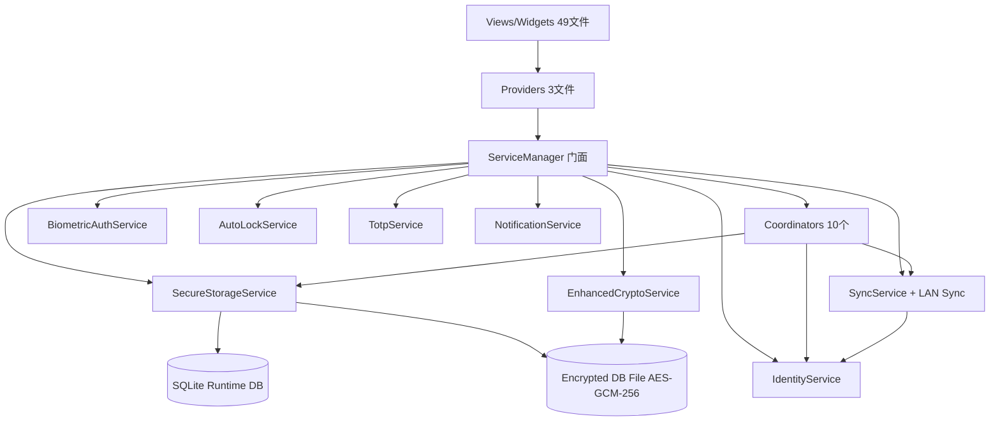

# SecretRoy 客户端 — 技术基线总览（阶段1完整汇总）

> 生成时间：2026-05-16
> 覆盖范围：lib/ 115个Dart文件，test/ 74个测试文件，integration_test/ 3个文件，docs/ ~118个文件
> 扫描Agent：8/8全部完成

---

## 一、项目规模统计

| 维度 | 数量 |
|------|------|
| lib/ Dart文件总数 | 115 |
| 服务层文件 | 18 |
| 同步核心文件 | 12 |
| 数据模型文件 | 8 |
| 视图层文件 | 24 |
| 组件层文件 | 25 |
| 基础设施文件 | 23 (core2 + theme4 + utils4 + system10 + providers3) |
| 测试文件 | 74 (test/) + 3 (integration_test/) |
| 测试用例总数 | **540** |
| 国际化keys | 75 (zh/en 完全对齐) |
| 文档文件 | ~118 (docs/) |
| 整体行覆盖率 | **58.3%** (7,892/13,541行) |

---

## 二、模块健康度评分

| 模块 | 代码结构 | 测试覆盖 | 文档完整 | 技术债务 | 文档同步 |
|------|---------|---------|---------|---------|---------|
| 服务层 (18文件) | ⭐⭐⭐⭐⭐ | ⭐⭐⭐⭐ | ⭐⭐⭐ | ⭐⭐⭐⭐⭐ | ⭐⭐⭐ |
| 同步核心 (12文件) | ⭐⭐⭐⭐⭐ | ⭐⭐⭐⭐⭐ | ⭐⭐⭐⭐ | ⭐⭐⭐⭐⭐ | ⭐⭐⭐ |
| 数据模型 (8文件) | ⭐⭐⭐⭐⭐ | ⭐⭐⭐⭐ | ⭐⭐⭐⭐ | ⭐⭐⭐⭐⭐ | ⭐⭐⭐⭐ |
| 视图层 (24文件) | ⭐⭐⭐⭐⭐ | ⭐⭐⭐ | ⭐⭐⭐⭐ | ⭐⭐⭐⭐⭐ | ⭐⭐⭐⭐ |
| 组件层 (25文件) | ⭐⭐⭐⭐⭐ | ⭐⭐⭐ | ⭐⭐⭐⭐ | ⭐⭐⭐⭐⭐ | ⭐⭐⭐⭐ |
| 基础设施 (23文件) | ⭐⭐⭐⭐⭐ | ⭐⭐⭐⭐ | ⭐⭐⭐⭐ | ⭐⭐⭐⭐⭐ | ⭐⭐⭐⭐ |
| 测试体系 (74文件) | ⭐⭐⭐⭐⭐ | — | ⭐⭐⭐⭐ | ⭐⭐⭐⭐⭐ | ⭐⭐⭐⭐ |
| 文档体系 (118文件) | — | — | ⭐⭐⭐⭐ | ⭐⭐⭐⭐⭐ | ⭐⭐⭐ |

**说明：**
- **代码结构**：所有模块职责清晰，ServiceManager已拆分10个Coordinator，无 God Class
- **测试覆盖**：模型/同步/核心服务最完善（部分100%）；视图层widget测试缺口大；整体58.3%
- **文档完整**：模型和视图相对好；服务层18个公共类中仅 SensitiveClipboardService 有完整dartdoc
- **技术债务**：**全项目零 TODO/FIXME/HACK/XXX**，代码整洁度极高
- **文档同步**：现有 docs/ 与代码存在明显漂移

---

## 三、关键发现汇总

### 3.1 文档漂移（高优先级）

| 文档 | 问题 | 严重程度 |
|------|------|---------|
| `docs/guides/technical-documentation.md` | 遗漏10个服务文件、ServiceManager内部服务列表过时、解锁流程描述错误、system/service_manager/目录结构不全 | 🔴 高 |
| `docs/sync/sync-protocol.md` | 伪代码/数据模型/加密术语与代码实现存在实质性偏差；未提及LAN同步；HLC比较逻辑描述错误 | 🔴 高 |
| `docs/architecture/02-runtime-and-sync.md` | 安全评估段落低估当前实现（称"非标准AEAD"，实际已是标准AES-256-GCM+HKDF）；序列图未覆盖TOTP合并；未提及批准制推送 | 🔴 高 |
| `docs/architecture/01-system-architecture.md` | 容器图整体一致，但模块边界未反映Coordinator拆分 | 🟡 中 |
| `docs/wiki/testing-guide.md` | 测试数量过时（声称38个，实际74个） | 🟡 中 |
| `docs/wiki/development-setup.md` | 测试命令和文件路径可能过期 | 🟡 中 |
| `docs/wiki/api-reference.md` | 缺少 DeviceAliasService、NotificationService、TotpImportService 等 | 🟡 中 |

### 3.2 代码质量风险（中优先级）

| 位置 | 问题 | 风险 |
|------|------|------|
| `AccountItem.toJson/fromJson` | `template`与`templateId`双字段输出，fromJson优先读旧字段 | 未来淘汰旧字段时兼容性问题 |
| `AccountTemplate.fromJson` | `category`依赖智能推断（含中英文关键词），推断逻辑变更影响旧数据 | 反序列化分类不一致 |
| `TemplateConflictLog.fromJson` | **零容错**，字段缺失即抛异常，与其他模型宽容策略不一致 | 数据损坏时无法恢复 |
| `AccountItem/Template/TotpCredential` | `isDeleted`布尔值解析策略不一致（有的支持`1`，有的仅`true`） | SQLite存储兼容性问题 |
| `AccountFieldMeta/AccountFieldAttributes/TemplateConflictLog` | 缺少`copyWith`方法 | UI状态更新或CRDT合并时HLC易丢失 |
| `green_add_button.dart` | 硬编码品牌色 `Color(0xFF1FA463)`，未走Design Token | 主题一致性风险 |
| `account_list_tile.dart` | 1321行含10个class，单文件过大 | 维护成本上升 |
| `AccountFieldRow/AccountFieldRowBody` | Legacy兼容层，标注"backward compatibility" | 技术债 |

### 3.3 测试缺口（按优先级）

#### P0 — 完全无测试（19个文件）
- `lib/main.dart` — 应用入口
- `lib/views/home/home_view.dart` + `home_view_desktop.dart` + `home_view_mobile.dart` — 主页核心
- `lib/views/settings_view.dart` — 设置中心
- `lib/views/accounts/totp_qr_scanner_view.dart` — TOTP扫码
- `lib/views/accounts/totp_credential_edit_view.dart` — TOTP编辑
- `lib/views/accounts/account_edit_utils.dart` — 账号编辑工具

#### P1 — 覆盖率极低（<30%）
- `template_list_view.dart` **0.2%** (598行仅命中1行)
- `vault_pairing_service.dart` **1.0%**
- `vault_import_export_coordinator.dart` **1.3%**
- `vault_pairing_coordinator.dart` **5.3%**
- `lan_sync_client.dart` **21.7%**
- `lan_sync_host_handler.dart` **22.1%**
- `account_edit_widgets.dart` **27.1%**

#### 集成测试缺口
- 仅7个用例，全为桌面端尺寸
- 未覆盖：生物识别解锁、同步设置/配对、模板冲突处理、通知中心、暗色主题切换、数据导入导出、LAN同步、TOTP扫码
- 缺少移动端布局验证

### 3.4 Dartdoc缺口

- **18个公共类/枚举**完全无类级dartdoc：ServiceManager、SecureStorageService、EnhancedCryptoService、IdentityService、AutoLockService、BiometricAuthService、DatabaseFileCipher、DatabaseFileKeyManager、DeviceAliasService、LanPairingService、NotificationService、TotpService、TotpConfig、TotpCode、TotpImportService、TotpQrImageImportService、VaultHealthCalculator、VaultPairingCrypto、VaultPairingService
- 组件层5个文件无dartdoc：AdaptivePage、AppPageHeader、EditMetadataRow、GreenAddButton、PasswordGeneratorSheet
- **门面方法**（ServiceManager.saveAccount、syncNow、unlockWithPassword等）无dartdoc

### 3.5 覆盖率亮点（TOP 10）

| 文件 | 覆盖率 |
|------|--------|
| `utils/field_presets.dart` | 100.0% |
| `models/template_conflict_log.dart` | 100.0% |
| `widgets/inbox/inbox_action_card.dart` | 100.0% |
| `providers/theme_provider.dart` | 100.0% |
| `widgets/app_option_tile.dart` | 100.0% |
| `core/crypto_random.dart` | 100.0% |
| `sync/lan_sync_session.dart` | 100.0% |
| `system/service_manager/sync_server_url_store.dart` | 100.0% |
| `widgets/app_page_header.dart` | 97.2% |
| `system/service_manager/sync_coordinator.dart` | 97.1% |

---

## 四、跨模块依赖关系

---

## 五、已确认的优势

1. **零显性技术债务**：全项目无 TODO/FIXME/HACK/XXX
2. **零裸print/debugPrint**：日志统一走 AppLogger
3. **国际化完整**：中英文75个key完全对齐，无缺失
4. **样式Token规范**：视图层未发现硬编码 BorderRadius.circular / withAlpha 违规（widgets目录豁免）
5. **安全实践严格**：无硬编码密钥，PBKDF2 100k轮次，AES-GCM-256标准实现
6. **架构演化健康**：ServiceManager已拆分10个Coordinator，职责边界清晰
7. **模型测试全覆盖**：8个模型全部有对应测试
8. **核心同步测试充分**：CRDT合并、Payload编解码、状态机、冲突恢复均有深度测试

---

## 六、阶段1产出物清单

| 文件 | 内容 |
|------|------|
| `00_tech_baseline_overview.md` | 本文件：技术基线总览 |
| `01_services_api_scan.md` | 服务层API目录 + 依赖图 + 文档diff |
| `02_sync_core_scan.md` | 同步协议规范 + 状态机 + CRDT + Payload |
| `03_models_scan.md` | 数据模型Schema + JSON兼容性矩阵 |
| `04_views_scan.md` | 视图层功能映射 + 用户旅程 |
| `05_widgets_scan.md` | 组件库目录 + 测试缺口 |
| `06_infrastructure_scan.md` | 基础设施速查 + 主题系统 + 状态拓扑 |
| `07_test_audit.md` | 测试覆盖映射 + 540用例分析 + lcov数据 |
| `08_docs_audit.md` | 文档一致性报告 + 118文件审计 |
