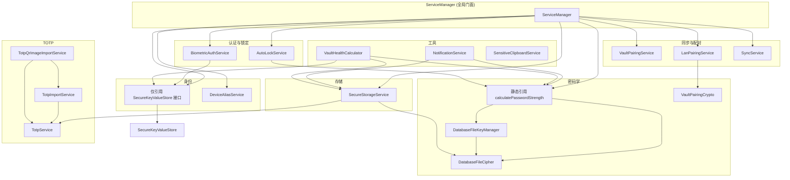

[stage] runner_started
[stage] agent_built
[stage] context_restored
[stage] context_ready
[stage] run_soul_start
[tool] Glob
[tool] Glob
[tool_result] success
[tool] Glob
[tool_result] success
[tool_result] success
[tool] ReadFile
[tool] ReadFile
[tool_result] success
[tool] ReadFile
[tool_result] success
[tool] ReadFile
[tool_result] success
[tool] ReadFile
[tool_result] success
[tool] ReadFile
[tool_result] success
[tool] ReadFile
[tool_result] success
[tool] ReadFile
[tool_result] success
[tool] ReadFile
[tool_result] success
[tool] ReadFile
[tool_result] success
[tool] ReadFile
[tool_result] success
[tool] ReadFile
[tool_result] success
[tool] ReadFile
[tool_result] success
[tool] ReadFile
[tool_result] success
[tool] ReadFile
[tool_result] success
[tool] ReadFile
[tool_result] success
[tool] ReadFile
[tool_result] success
[tool] ReadFile
[tool_result] success
[tool] ReadFile
[tool_result] success
[tool] ReadFile
[tool_result] success
[tool_result] success
[tool] Grep
[tool] ReadFile
[tool_result] success
[tool_result] success
以下是 `lib/services/` 目录的完整结构化扫描报告。

---

# SecretRoy 服务层 API 目录

> 扫描范围：`lib/services/*.dart`（18 个文件）  
> 扫描时间：2026-05-16

---

## 一、服务总览表

| 文件 | 公共类/枚举 | 核心职责 |
|---|---|---|
| `auto_lock_service.dart` | `AutoLockService`, `AutoLockObserver`, `AutoLockDuration`, `AutoLockState` | 应用生命周期监听与自动锁定策略管理 |
| `biometric_auth_service.dart` | `BiometricAuthService`, `BiometricSetupResult`, `BiometricAuthStatus` | 生物识别启用/禁用/解锁及主密码包装存储 |
| `database_file_cipher.dart` | `DatabaseFileCipher`, `DatabaseFileCipherException` | 本地数据库文件的 AES-GCM-256 二进制信封加密/解密 |
| `database_file_key_manager.dart` | `DatabaseFileKeyManager` | 主密码派生包装密钥，管理数据库文件密钥的 envelope 加解密与轮换 |
| `device_alias_service.dart` | `DeviceAliasService` | 设备别名的本地缓存、解析与国际化回退 |
| `enhanced_crypto_service.dart` | `EnhancedCryptoService` | 主密码 PBKDF2 验证、数据库密钥解锁、密码生成与强度计算 |
| `identity_service.dart` | `IdentityService`, `SecureKeyValueStore`, `FlutterSecureKeyValueStore`, `VaultIdentityImportPreview`, `IdentityCorruptedException`, `IdentityTransferCodeException` | 设备与 Vault 身份生成/校验/导出/导入，管理私钥与对称密钥 |
| `lan_pairing_service.dart` | `LanPairingService`, `LanPairingHostSession`, `LanPairingHostInfo`, `LanPairingServiceException` | LAN 局域网配对广播、配对码协商、HTTP  claim 与 X25519 加密传输 |
| `notification_service.dart` | `NotificationService` | 本地通知初始化、密码过期/弱密码通知生成、定时提醒调度 |
| `secure_storage_service.dart` | `SecureStorageService`, `StorageItemType`, `StorageOpenException` | 加密 SQLite 运行时管理、CRUD、Schema 升级、原子写与备份恢复 |
| `sensitive_clipboard_service.dart` | `SensitiveClipboardService`, `ClipboardRiskLevel` | 敏感内容剪贴板复制与 SHA-256 hash 防误删定时清理 |
| `service_manager.dart` | `ServiceManager`, `UnlockResult`, `ServiceManagerState` | 全局单例门面，编排所有服务生命周期、解锁/锁定/同步/配对 |
| `totp_import_service.dart` | `TotpImportService` | 从纯文本/URI/标签中提取并标准化 TOTP 配置字符串 |
| `totp_qr_image_import_service.dart` | `TotpQrImageImportService` | 从剪贴板图片或字节流解码 QR 码并转为 TOTP 配置 |
| `totp_service.dart` | `TotpService`, `TotpConfig`, `TotpCode`, `TotpAlgorithm`, `TotpException` | RFC 6238 TOTP 生成、otpauth URI 解析、Base32 编解码 |
| `vault_health_calculator.dart` | `VaultHealthCalculator` | 保险库健康评分计算（弱密码、重复密码、备份年龄、冲突等） |
| `vault_pairing_crypto.dart` | `VaultPairingCrypto`, `VaultPairingKeyPair`, `VaultPairingCryptoException` | X25519 + AES-GCM-256 配对 bundle 加密/解密 |
| `vault_pairing_service.dart` | `VaultPairingService`, `PairingSessionInfo`, `PairingJoinResult`, `PairingPendingRequest`, `PairingSessionStatus`, `PairingBundleResult`, `VaultPairingServiceException` | 服务端配对会话 HTTP API 封装（创建/加入/审批/拉取 bundle） |

---

## 二、每个服务的详细 API 清单

### 2.1 `auto_lock_service.dart`

| 类/枚举 | 说明 |
|---|---|
| `AutoLockDuration` | 枚举：锁定时间间隔（immediately / 5s / 30s / 1m / 5m / 10m / never） |
| `AutoLockState` | 枚举：unlocked / locked / backgroundTimer |
| `AutoLockService` | 自动锁定核心服务（继承 ChangeNotifier） |
| `AutoLockObserver` | WidgetsBindingObserver 适配器，将生命周期事件转发给 AutoLockService |

**`AutoLockService` 关键方法：**

| 方法 | 签名 | 返回值 | 职责 |
|---|---|---|---|
| `initialize` | `()` | `Future<void>` | 加载设置并检查是否需要锁定 |
| `setDuration` | `(AutoLockDuration duration)` | `Future<void>` | 设置并持久化自动锁定间隔 |
| `onAppLifecycleStateChanged` | `(AppLifecycleState state)` | `void` | 处理应用前后台生命周期切换 |
| `lock` | `()` | `void` | 立即锁定，清理 CryptoService 状态 |
| `unlock` | `()` | `void` | 标记为已解锁 |
| `state` | getter | `AutoLockState` | 当前锁定状态 |
| `duration` | getter | `AutoLockDuration` | 当前锁定间隔 |
| `isLocked` / `isUnlocked` | getter | `bool` | 状态快捷判断 |

**文档缺失：** 类 `AutoLockService` 无 dartdoc；`AutoLockObserver` 无 dartdoc。

---

### 2.2 `biometric_auth_service.dart`

| 类/枚举 | 说明 |
|---|---|
| `BiometricAuthStatus` | 枚举：enabled / available / notSupported / notEnrolled / disabled |
| `BiometricSetupResult` | 枚举：success / cancelled / invalidPassword / notSupported / notEnrolled / lockedOut / passcodeNotSet / noPasswordMode / error |
| `BiometricAuthService` | 生物识别认证服务 |

**关键方法：**

| 方法 | 签名 | 返回值 | 职责 |
|---|---|---|---|
| `getStatus` | `()` | `Future<BiometricAuthStatus>` | 查询生物识别可用状态 |
| `getAvailableTypes` | `()` | `Future<List<BiometricType>>` | 获取支持的生物识别类型列表 |
| `getBiometricName` | `()` | `Future<String>` | 获取友好名称（Face ID / Fingerprint 等） |
| `enableBiometric` | `(String masterPassword)` | `Future<BiometricSetupResult>` | 启用生物识别并加密存储主密码 |
| `unlockWithBiometric` | `()` | `Future<String?>` | 生物识别解锁并返回解密后的主密码 |
| `disableBiometric` | `()` | `Future<void>` | 禁用并删除所有生物识别相关密钥 |

**文档缺失：** 类 `BiometricAuthService` 无 dartdoc；`_FlutterSecureStorageAdapter` 内部类无文档（合理）。

---

### 2.3 `database_file_cipher.dart`

| 类/枚举 | 说明 |
|---|---|
| `DatabaseFileCipher` | 数据库文件 AES-GCM-256 信封加密器 |
| `DatabaseFileCipherException` | 加密/解密异常 |

**关键方法：**

| 方法 | 签名 | 返回值 | 职责 |
|---|---|---|---|
| `DatabaseFileCipher` | `({required List<int> keyBytes, AesGcm? algorithm, Random? random})` | — | 构造器，校验 256-bit 密钥 |
| `generateKeyBytes` | `()` (static) | `Uint8List` | 生成 32 字节随机密钥 |
| `looksEncrypted` | `(List<int> bytes)` (static) | `bool` | 判断字节流是否为加密数据库格式 |
| `encrypt` | `(Uint8List plaintext)` | `Future<Uint8List>` | 加密并附加 magic + version + nonce + mac 头 |
| `decrypt` | `(Uint8List encrypted)` | `Future<Uint8List>` | 解析头并解密，校验版本与长度 |

**文档缺失：** 类 `DatabaseFileCipher` 无 dartdoc。

---

### 2.4 `database_file_key_manager.dart`

| 类/枚举 | 说明 |
|---|---|
| `DatabaseFileKeyManager` | 数据库文件密钥的派生、envelope 加解密与密码轮换 |
| `SecureStorageReader` / `SecureStorageWriter` / `SecureStorageDeleter` | typedef：安全存储读写删抽象 |

**关键方法：**

| 方法 | 签名 | 返回值 | 职责 |
|---|---|---|---|
| `unlock` | `(String password)` | `Future<Uint8List>` | 派生包装密钥，解密 envelope 获取数据库文件密钥（或新建） |
| `rotateEnvelope` | `({required String newPassword, required Uint8List databaseKeyBytes})` | `Future<void>` | 使用新密码重新包装数据库文件密钥 |

**文档缺失：** 类 `DatabaseFileKeyManager` 无 dartdoc；typedef 无文档。

---

### 2.5 `device_alias_service.dart`

| 类/枚举 | 说明 |
|---|---|
| `DeviceAliasService` | 设备别名解析与缓存 |

**关键方法：**

| 方法 | 签名 | 返回值 | 职责 |
|---|---|---|---|
| `create` | `()` (static) | `Future<DeviceAliasService>` | 工厂方法，初始化 SharedPreferences |
| `resolve` | `(BuildContext context, String? deviceId, {String? currentDeviceId})` | `String` | 解析设备显示名称（优先缓存、回退 l10n） |
| `setAlias` | `(String deviceId, String alias)` | `Future<void>` | 为指定设备设置别名 |
| `setCurrentDeviceAlias` | `(String alias)` | `Future<void>` | 为当前设备设置别名 |

**文档：** `DeviceAliasService.testable()` 有 dartdoc；类本身无 dartdoc。

---

### 2.6 `enhanced_crypto_service.dart`

| 类/枚举 | 说明 |
|---|---|
| `EnhancedCryptoService` | 主密码学与密码工具服务 |

**关键方法：**

| 方法 | 签名 | 返回值 | 职责 |
|---|---|---|---|
| `initMasterKey` | `(String masterPassword)` | `Future<bool>` | 验证/初始化主密码，解锁数据库密钥 |
| `updateMasterPassword` | `(String oldPassword, String newPassword)` | `Future<bool>` | 修改主密码并轮换数据库密钥 envelope |
| `verifyMasterPassword` | `(String masterPassword)` | `Future<bool>` | 仅验证主密码，不解锁 |
| `logout` | `()` | `void` | 清除解锁状态与数据库密钥 |
| `createDatabaseFileCipher` | `()` | `DatabaseFileCipher` | 基于当前解锁密钥创建数据库加密器 |
| `generatePassword` | `({int length, bool includeUppercase, ...})` (static) | `String` | 安全随机密码生成 |
| `calculatePasswordStrength` | `(String password)` (static) | `int` | 密码强度评分（0-100） |
| `getPasswordStrengthLevel` | `(int score)` (static) | `String` | 将评分转换为文字等级 |

**文档缺失：** 类 `EnhancedCryptoService` 无 dartdoc。

---

### 2.7 `identity_service.dart`

| 类/枚举 | 说明 |
|---|---|
| `IdentityService` | Vault 与设备身份管理 |
| `SecureKeyValueStore` | 抽象接口：安全键值存储 |
| `FlutterSecureKeyValueStore` | `SecureKeyValueStore` 的 FlutterSecureStorage 实现 |
| `VaultIdentityImportPreview` | 身份导入预览数据结构 |
| `IdentityCorruptedException` | 身份损坏异常 |
| `IdentityTransferCodeException` | 传输码格式/解密异常 |

**关键方法：**

| 方法 | 签名 | 返回值 | 职责 |
|---|---|---|---|
| `initialize` | `({bool allowGenerateVaultIdentity = true})` | `Future<void>` | 加载或生成设备/Vault 身份 |
| `checkIdentityExists` | `()` | `Future<bool>` | 检查 Vault 身份是否完整存在于安全存储 |
| `deviceId` / `vaultId` / `privateKey` / `symmetricKey` | getter | `String` | 身份字段（未初始化时抛 StateError） |
| `hasIdentity` | getter | `bool` | 身份是否已完整加载 |
| `vaultApiToken` | getter | `String?` | Vault API token |
| `setVaultApiToken` | `(String? token)` | `Future<void>` | 设置/清除 API token |
| `exportTransferCode` | `({String? syncServerUrl, String? vaultDump})` | `String` | ⚠️ 已废弃：明文 base64 导出身份 |
| `exportSecureLinkCode` | `(String password, {...})` | `Future<String>` | PBKDF2+AES-GCM-256 加密导出恢复码 |
| `importSecureLinkCode` | `(String secureCode, String password)` | `Future<Map<String, String?>>` | 解密并导入加密恢复码 |
| `previewSecureLinkCode` | `(String secureCode, String password)` | `Future<VaultIdentityImportPreview>` | 预览恢复码内容（不解密应用） |
| `importTransferCode` / `previewTransferCode` | `(String rawCode)` | `Future<...>` | 导入/预览旧版明文 transfer code |
| `currentImportPreview` | `()` | `VaultIdentityImportPreview` | 将当前身份打包为预览对象 |
| `applyImportPreview` | `(VaultIdentityImportPreview preview)` | `Future<void>` | 应用预览的身份到本地存储 |

**文档：** `exportTransferCode` 有完整 WARNING dartdoc；`VaultIdentityImportPreview` 无类级 dartdoc。

---

### 2.8 `lan_pairing_service.dart`

| 类/枚举 | 说明 |
|---|---|
| `LanPairingService` | LAN 局域网配对服务 |
| `LanPairingHostSession` | 主机会话信息 |
| `LanPairingHostInfo` | 发现的主机信息 |
| `LanPairingServiceException` | 异常 |

**关键方法：**

| 方法 | 签名 | 返回值 | 职责 |
|---|---|---|---|
| `startHosting` | `({required String transferCode, Duration ttl})` | `Future<LanPairingHostSession>` | 启动 HTTP + UDP 广播配对主机 |
| `stopHosting` | `()` | `Future<void>` | 停止主机服务 |
| `claimTransferCodeByCode` | `({required String pairingCode, required String requesterDeviceId, ...})` | `Future<String>` | 客户端发现主机并 claim 传输码 |
| `discoverHost` | `({Duration timeout})` | `Future<LanPairingHostInfo?>` | 仅发现 LAN 主机（不 claim） |
| `attachSyncHandler` / `detachSyncHandler` | `(LanSyncHostHandler handler)` | `void` | 挂载/卸载 LAN 同步处理器 |
| `normalizePairingCode` | `(String rawValue)` (static) | `String` | 规范化并校验 8 位配对码 |
| `isHosting` | getter | `bool` | 是否正在广播 |

**文档缺失：** 类 `LanPairingService` 无 dartdoc（仅 `LanPairingHostInfo` 有简短注释）。

---

### 2.9 `notification_service.dart`

| 类/枚举 | 说明 |
|---|---|
| `NotificationService` | 本地推送通知服务 |

**关键方法：**

| 方法 | 签名 | 返回值 | 职责 |
|---|---|---|---|
| `init` | `()` | `Future<void>` | 初始化通知插件与时区 |
| `generatePasswordExpiryNotifications` | `({required List<AccountItem> accounts, required List<AccountTemplate> templates, int expiryDays})` | `Future<List<AppNotification>>` | 扫描并生成密码过期通知 |
| `generateWeakPasswordNotifications` | `({required List<AccountItem> accounts, ...})` | `Future<List<AppNotification>>` | 扫描并生成弱密码通知 |
| `scheduleDailyCheck` | `({int hour, int minute})` | `Future<void>` | 定时每日检查提醒 |
| `cancelAllScheduled` | `()` | `Future<void>` | 取消所有定时通知 |

**文档缺失：** 类 `NotificationService` 无 dartdoc。

---

### 2.10 `secure_storage_service.dart`

| 类/枚举 | 说明 |
|---|---|
| `SecureStorageService` | 加密 SQLite 数据库运行时管理 |
| `StorageItemType` | 枚举：account / template / totpCredential / setting / localSyncChange |
| `StorageOpenException` | 数据库打开异常（含备份路径） |

**关键方法（公共 API）：**

| 方法 | 签名 | 返回值 | 职责 |
|---|---|---|---|
| `initialize` | `({String deviceId = 'local'})` | `Future<void>` | 初始化/恢复运行时数据库、schema、原子写 |
| `close` | `({bool dispose = false})` | `Future<void>` | 关闭数据库、持久化加密、清理运行时文件 |
| `setDatabaseCipher` / `clearDatabaseCipher` / `rotateDatabaseCipher` | `(DatabaseFileCipher cipher)` | `void` / `Future<void>` | 配置/清除/轮换数据库加密器 |
| `isDatabaseInitialized` | `()` | `Future<bool>` | 加密数据库文件是否存在 |
| `deleteDatabaseFile` | `()` | `Future<void>` | 删除所有数据库相关文件 |
| `clearAllData` | `()` | `Future<void>` | 清空所有业务表数据 |
| `replaceAllDataForImport` | `({required List<AccountTemplate> templates, required List<AccountItem> accounts, ...})` | `Future<void>` | 导入覆盖：整体替换本地库（T14 规则） |
| `replaceDatabase` | `(Uint8List newDbBytes)` | `Future<void>` | 用新数据库字节整体替换加密文件 |
| `loadAccounts` / `loadPendingSyncAccounts` | `({bool includeDeleted})` | `Future<List<AccountItem>>` | 加载账号（全部或待同步） |
| `getAccountById` | `(String id, ...)` | `Future<AccountItem?>` | 按 ID 查询账号 |
| `saveAccount` | `(AccountItem account, {bool isSyncMerge})` | `Future<void>` | 保存/更新账号（自动 HLC 标记） |
| `deleteAccount` | `(String id, ...)` | `Future<void>` | 软删除账号 |
| `togglePin` | `(String id)` | `Future<void>` | 切换置顶状态 |
| `loadTotpCredentials` / `loadDirtyTotpCredentials` | `({bool includeDeleted})` | `Future<List<TotpCredential>>` | 加载 TOTP 凭证 |
| `getTotpCredentialById` | `(String id, ...)` | `Future<TotpCredential?>` | 按 ID 查询 TOTP |
| `saveTotpCredential` | `(TotpCredential credential, ...)` | `Future<void>` | 保存 TOTP 凭证 |
| `deleteTotpCredential` | `(String id, ...)` | `Future<void>` | 软删除 TOTP |
| `countAccountsByTemplate` | `(String templateId)` | `Future<int>` | 统计使用该模板的账号数 |
| `loadCustomTemplates` / `loadAllTemplates` / `loadDirtyTemplates` | `(...)` | `Future<List<AccountTemplate>>` | 加载模板 |
| `loadTemplateById` | `(String id, ...)` | `Future<AccountTemplate?>` | 按 ID 查询模板 |
| `saveTemplate` | `(AccountTemplate template, ...)` | `Future<void>` | 保存模板（含字段级 HLC） |
| `deleteTemplate` | `(String id, ...)` | `Future<void>` | 软删除模板（检查使用中则抛异常） |
| `saveConflictLogs` / `getConflictLogs` / `deleteConflictLog` | `(...)` | `Future<...>` | 账号冲突日志 CRUD |
| `saveTemplateConflictLogs` / `getTemplateConflictLogs` | `(...)` | `Future<...>` | 模板冲突日志 CRUD |
| `recordLocalSyncChange` / `loadOpenLocalSyncChanges` / ... | `(...)` | `Future<...>` | 本地同步变更箱 CRUD |
| `loadNotifications` / `saveNotification` / ... | `(...)` | `Future<...>` | 通知中心 CRUD |
| `getDatabaseFilePath` | `()` | `Future<String>` | 获取加密数据库文件路径 |

**文档：** `replaceAllDataForImport` 有详细 dartdoc（T14 规则）；类本身无 dartdoc。

---

### 2.11 `sensitive_clipboard_service.dart`

| 类/枚举 | 说明 |
|---|---|
| `SensitiveClipboardService` | 敏感剪贴板管理服务（全静态方法） |
| `ClipboardRiskLevel` | 枚举：high / medium / low |

**关键方法：**

| 方法 | 签名 | 返回值 | 职责 |
|---|---|---|---|
| `copy` | `({required String text, ClipboardRiskLevel level, Duration? clearAfter})` | `Future<void>` | 复制到剪贴板并启动定时清理 |
| `cancelPendingClear` | `()` | `void` | 取消待清理任务 |

**文档：** 类及 `ClipboardRiskLevel` 均有完整中文 dartdoc，是服务层文档最佳实践。

---

### 2.12 `service_manager.dart`

| 类/枚举 | 说明 |
|---|---|
| `ServiceManager` | 全局单例门面，编排所有服务 |
| `ServiceManagerState` | 枚举：uninitialized / locked / unlocking / unlocked / error |
| `UnlockResult` | 枚举：success / invalidPassword / biometricNotEnabled / biometricFailed / alreadyInProgress / error |

**关键方法：**

| 方法 | 签名 | 返回值 | 职责 |
|---|---|---|---|
| `instance` | getter (static) | `ServiceManager` | 全局单例访问 |
| `initialize` | `()` | `Future<void>` | 初始化自动锁定服务，进入 locked 状态 |
| `setupLifecycleObserver` / `disposeLifecycleObserver` | `()` | `void` | 挂载/卸载生命周期监听 |
| `unlockWithPassword` | `(String password)` | `Future<UnlockResult>` | 密码解锁门面 |
| `unlockWithBiometric` | `()` | `Future<UnlockResult>` | 生物识别解锁门面 |
| `lock` / `logout` | `()` | `void` / `Future<void>` | 锁定 / 登出 |
| `enableNoPasswordMode` / `isNoPasswordMode` / `disableNoPasswordMode` | `(...)` | `Future<...>` | 无密码模式管理 |
| `changeMasterPassword` | `(String old, String new)` | `Future<bool>` | 修改主密码 |
| `resetApplication` | `()` | `Future<void>` | 重置应用（删除所有数据与身份） |
| `saveAccount` / `deleteAccount` / `togglePin` / `getAccountById` | `(...)` | `Future<...>` | 账号操作门面 |
| `saveTemplate` / `deleteTemplate` | `(...)` | `Future<...>` | 模板操作门面 |
| `saveTotpCredential` / `deleteTotpCredential` | `(...)` | `Future<...>` | TOTP 操作门面 |
| `connectToSyncServer` / `disconnectFromSyncServer` / `syncNow` | `(...)` | `Future<...>` | 同步操作门面 |
| `loadOpenLocalSyncChanges` / `approveAndSyncLocalChanges` / `discardLocalSyncChange` | `(...)` | `Future<...>` | 本地同步变更箱门面 |
| `exportBackupPackage` / `testRecoverBackupPackage` | `(...)` | `Future<...>` | 备份包导出/验证 |
| `exportSecureVaultLinkCode` / `previewSecureVaultLinkCode` / `importVaultLinkCode` / `importSecureVaultLinkCode` | `(...)` | `Future<...>` | Vault 链接码导入导出 |
| `createVaultPairingSession` / `getVaultPairingSessionStatus` / `approveVaultPairingRequest` / `joinVaultPairingSession` / `fetchAndImportVaultPairingBundle` | `(...)` | `Future<...>` | 服务端配对门面 |
| `startLanVaultPairingHost` / `stopLanVaultPairingHost` / `joinLanVaultPairingWithCode` | `(...)` | `Future<...>` | LAN 配对门面 |
| `generatePassword` / `calculatePasswordStrength` / `getPasswordStrengthLevel` | `(...)` (static) | `String` / `int` | 密码工具静态代理 |

**文档缺失：** 类 `ServiceManager` 无 dartdoc；大量公共方法无 dartdoc（如 `saveAccount` 等门面方法）。

---

### 2.13 `totp_import_service.dart`

| 类/枚举 | 说明 |
|---|---|
| `TotpImportService` | TOTP 配置文本提取服务（全静态） |

**关键方法：**

| 方法 | 签名 | 返回值 | 职责 |
|---|---|---|---|
| `normalizeImportValue` | `(String raw)` | `String` | 提取并标准化为 JSON 配置字符串 |
| `extractCandidate` | `(String raw)` | `String?` | 从文本中提取首个可解析的 TOTP 候选 |

**文档缺失：** 类无 dartdoc。

---

### 2.14 `totp_qr_image_import_service.dart`

| 类/枚举 | 说明 |
|---|---|
| `TotpQrImageImportService` | TOTP QR 图片解码服务（全静态） |

**关键方法：**

| 方法 | 签名 | 返回值 | 职责 |
|---|---|---|---|
| `normalizeClipboardQrImage` | `({Future<Uint8List?> Function()? imageReader})` | `Future<String>` | 从剪贴板读取图片并解码为 TOTP 配置 |
| `normalizeImageBytes` | `(Uint8List bytes)` | `String` | 字节流解码为标准化 TOTP 配置 |
| `decodeQrImage` | `(Uint8List bytes)` | `String` | 使用 zxing2 解码 QR 图片为字符串 |

**文档缺失：** 类无 dartdoc；常量和静态消息字段无文档。

---

### 2.15 `totp_service.dart`

| 类/枚举 | 说明 |
|---|---|
| `TotpService` | RFC 6238 TOTP 生成与解析服务 |
| `TotpConfig` | TOTP 配置数据类 |
| `TotpCode` | TOTP 码生成结果 |
| `TotpAlgorithm` | 枚举：sha1 / sha256 / sha512 |
| `TotpException` | TOTP 相关异常 |

**关键方法：**

| 方法 | 签名 | 返回值 | 职责 |
|---|---|---|---|
| `parseConfig` | `(String raw)` (static) | `TotpConfig` | 解析 JSON / otpauth URI / 纯 secret |
| `encodeConfig` | `(String raw)` (static) | `String` | 解析并序列化为标准 JSON |
| `parseOtpAuthUri` | `(String rawUri)` (static) | `TotpConfig` | 解析 otpauth://totp/ URI |
| `generate` | `(TotpConfig config, {DateTime? at})` | `TotpCode` | 生成当前时刻 TOTP 码 |
| `hotp` | `({required String secret, required int counter, ...})` (static) | `String` | RFC 4226 HOTP 生成 |
| `decodeBase32` / `normalizeSecret` | `(String secret)` (static) | `List<int>` / `String` | Base32 解码与规范化 |
| `parseAlgorithm` / `algorithmName` | `(Object? raw)` / `(TotpAlgorithm)` (static) | `TotpAlgorithm` / `String` | 算法解析与命名 |

**文档缺失：** 类 `TotpService`、`TotpConfig`、`TotpCode` 均无 dartdoc。

---

### 2.16 `vault_health_calculator.dart`

| 类/枚举 | 说明 |
|---|---|
| `VaultHealthCalculator` | 保险库健康评分计算器 |

**关键方法：**

| 方法 | 签名 | 返回值 | 职责 |
|---|---|---|---|
| `calculate` | `()` | `Future<VaultHealthReport>` | 执行完整健康检查并生成报告 |
| `checkWeakPasswords` / `checkReusedPasswords` / `checkStaleRecords` / `checkIncompleteRecords` / `checkMissing2FA` | `(List<AccountItem> accounts, ...)` (static) | `VaultHealthItem` | 各项静态检查方法 |
| `calculateScore` | `(List<VaultHealthItem> items)` (static) | `int` | 根据风险等级扣分计算总分 |
| `scoreToGrade` | `(int score)` (static) | `VaultHealthGrade` | 分数转等级 |

**文档缺失：** 类无 dartdoc。

---

### 2.17 `vault_pairing_crypto.dart`

| 类/枚举 | 说明 |
|---|---|
| `VaultPairingCrypto` | X25519 + AES-GCM-256 配对加密（全静态） |
| `VaultPairingKeyPair` | 密钥对包装 |
| `VaultPairingCryptoException` | 异常 |

**关键方法：**

| 方法 | 签名 | 返回值 | 职责 |
|---|---|---|---|
| `createKeyPair` | `()` (static) | `Future<VaultPairingKeyPair>` | 生成 X25519 密钥对 |
| `encryptBundle` | `({required String plainBundle, required String requesterPublicKey})` (static) | `Future<String>` | 用请求方公钥加密 bundle |
| `decryptBundle` | `({required String wrappedBundle, required VaultPairingKeyPair keyPair})` (static) | `Future<String>` | 用本地密钥对解密 bundle |

**文档缺失：** 类无 dartdoc。

---

### 2.18 `vault_pairing_service.dart`

| 类/枚举 | 说明 |
|---|---|
| `VaultPairingService` | 服务端配对 HTTP API 客户端 |
| `PairingSessionInfo` / `PairingJoinResult` / `PairingPendingRequest` / `PairingSessionStatus` / `PairingBundleResult` | 配对响应数据类 |
| `VaultPairingServiceException` | 异常 |

**关键方法：**

| 方法 | 签名 | 返回值 | 职责 |
|---|---|---|---|
| `createSession` | `({required String serverUrl, required String vaultId, required String hostDeviceId, Duration ttl})` | `Future<PairingSessionInfo>` | POST /pairing/sessions |
| `joinSession` | `({required String serverUrl, required String pairingCode, ...})` | `Future<PairingJoinResult>` | POST /pairing/sessions/join |
| `getHostSessionStatus` | `({required String serverUrl, required String sessionId, ...})` | `Future<PairingSessionStatus>` | GET /pairing/sessions/:id |
| `approveSession` | `({required String serverUrl, required String sessionId, ...})` | `Future<void>` | POST /pairing/sessions/:id/approve |
| `getBundle` | `({required String serverUrl, ...})` | `Future<PairingBundleResult>` | GET /pairing/sessions/:id/bundle |

**文档缺失：** 类无 dartdoc；数据类无 dartdoc。

---

## 三、依赖关系图



### 注入方式说明

| 依赖方 | 被依赖方 | 注入方式 |
|---|---|---|
| `ServiceManager` | 全部服务 | 内部硬编码构造（单例模式） |
| `AutoLockService` | `EnhancedCryptoService`, `FlutterSecureStorage` | 构造函数注入 |
| `BiometricAuthService` | `SecureKeyValueStore`, `LocalAuthentication` | 构造函数注入（默认实现） |
| `DatabaseFileKeyManager` | `SecureStorageReader/Writer/Deleter` typedef | 构造函数注入（函数引用） |
| `EnhancedCryptoService` | `FlutterSecureStorage` | 构造函数注入 |
| `IdentityService` | `SecureKeyValueStore`, `Uuid` | 构造函数注入 |
| `LanPairingService` | `VaultPairingCrypto` | 直接静态方法调用（import） |
| `NotificationService` | `SecureStorageService` | 构造函数注入 |
| `SecureStorageService` | `DatabaseFileCipher` | 构造函数注入 / setter |
| `VaultHealthCalculator` | `SecureStorageService`, `IdentityService` | 构造函数注入 |

---

## 四、TODO / FIXME / HACK 清单

**扫描结果：零条。**

`lib/services/` 目录下 18 个 Dart 文件中**未发现**任何 `TODO`、`FIXME` 或 `HACK` 标记。这是工程纪律良好的表现，但也意味着潜在的技术债可能以普通注释形式存在而未显式标记。

---

## 五、Dartdoc 文档完整性检查

### 5.1 有 dartdoc 的类/方法（良好示例）

| 文件 | 元素 | 说明 |
|---|---|---|
| `device_alias_service.dart:15` | `DeviceAliasService.testable()` | 有 `/// Test-only constructor...` |
| `identity_service.dart:183-188` | `exportTransferCode` | 有完整 `@Deprecated` + `WARNING` dartdoc |
| `secure_storage_service.dart:268-273` | `replaceAllDataForImport` | 有中文 dartdoc（T14 规则说明） |
| `sensitive_clipboard_service.dart:7-17` | `ClipboardRiskLevel`, `SensitiveClipboardService` | 有完整中文 dartdoc |
| `sensitive_clipboard_service.dart:27-29` | `copy` | 有参数说明 dartdoc |
| `sensitive_clipboard_service.dart:60` | `cancelPendingClear` | 有 dartdoc |

### 5.2 缺失 dartdoc 的公共类（需补充）

以下 **18 个公共类/枚举** 完全没有类级 dartdoc：

1. `AutoLockService`
2. `AutoLockObserver`
3. `AutoLockDuration`
4. `BiometricAuthService`
5. `DatabaseFileCipher`
6. `DatabaseFileKeyManager`
7. `DeviceAliasService`
8. `EnhancedCryptoService`
9. `IdentityService`
10. `LanPairingService`
11. `NotificationService`
12. `SecureStorageService`
13. `ServiceManager`
14. `TotpImportService`
15. `TotpQrImageImportService`
16. `TotpService` / `TotpConfig` / `TotpCode`
17. `VaultHealthCalculator`
18. `VaultPairingCrypto` / `VaultPairingService`

### 5.3 缺失 dartdoc 的关键公共方法（高优先级）

以下方法是外部调用频繁的门面 API，缺失文档会增加接入成本：

- `ServiceManager.unlockWithPassword` / `unlockWithBiometric` / `lock`
- `ServiceManager.saveAccount` / `deleteAccount` / `getAccountById`
- `ServiceManager.syncNow` / `connectToSyncServer`
- `SecureStorageService.initialize` / `close` / `saveAccount` / `deleteAccount`
- `EnhancedCryptoService.initMasterKey` / `updateMasterPassword`
- `IdentityService.initialize` / `exportSecureLinkCode` / `importSecureLinkCode`
- `AutoLockService.initialize` / `onAppLifecycleStateChanged`

---

## 六、文档一致性 Diff

对比 `docs/guides/technical-documentation.md` 和 `docs/architecture/01-system-architecture.md` 与代码实际状态：

### 6.1 文件列表不一致

| 文档来源 | 声称存在的服务文件 | 实际状态 |
|---|---|---|
| `technical-documentation.md` §2 | `service_manager.dart`, `secure_storage_service.dart`, `enhanced_crypto_service.dart`, `identity_service.dart`, `biometric_auth_service.dart`, `auto_lock_service.dart`, `vault_pairing_service.dart`, `lan_pairing_service.dart` | ✅ 一致，但**遗漏了 10 个文件**：`database_file_cipher.dart`, `database_file_key_manager.dart`, `device_alias_service.dart`, `notification_service.dart`, `sensitive_clipboard_service.dart`, `totp_import_service.dart`, `totp_qr_image_import_service.dart`, `totp_service.dart`, `vault_health_calculator.dart`, `vault_pairing_crypto.dart` |

### 6.2 目录结构过时

`technical-documentation.md` §2 中 `system/service_manager/` 子目录列出的文件：

```text
system/service_manager/
├── default_sync_server_url.dart
├── password_tools.dart
├── sync_server_url_store.dart
└── vault_dump_coordinator.dart
```

**实际情况：** 该目录下还包含 `sync_coordinator.dart`, `vault_data_repository.dart`, `vault_import_export_coordinator.dart`, `vault_import_types.dart`, `vault_pairing_coordinator.dart`, `vault_unlock_coordinator.dart`, `lan_sync_coordinator.dart` 等，文档未列出。

### 6.3 `ServiceManager` 内部持有服务列表过时

`technical-documentation.md` §4 声称 `ServiceManager` 持有：
- `EnhancedCryptoService`
- `BiometricAuthService`
- `AutoLockService`
- `IdentityService`
- `SecureStorageService`
- `SyncService`
- `VaultPairingService`
- `LanPairingService`
- `SyncServerUrlStore`
- `VaultDumpCoordinator`

**实际情况：** 当前 `ServiceManager` 还持有（未在文档列出）：
- `DeviceAliasService`
- `LanSyncCoordinator`
- `VaultUnlockCoordinator`
- `VaultDataRepository`
- `SyncCoordinator`
- `VaultImportExportCoordinator`
- `VaultPairingCoordinator`

### 6.4 解锁流程描述与实现不一致

`technical-documentation.md` §4 描述的解锁流程：

```text
unlockWithPassword(password)
→ IdentityService.initialize()
→ EnhancedCryptoService.initMasterKey(password)
→ SecureStorageService.setDatabaseCipher(...)
→ SecureStorageService.initialize(deviceId)
→ AutoLockService.unlock()
→ SyncService.initialize()
→ 后台尝试 SyncService.connect()
→ state = unlocked
```

**实际实现差异：** 当前 `ServiceManager._performUnlock()` 中：
- 实际调用的是 `_vaultUnlockCoordinator.initializeAndUnlock(password)`（协调器内部完成 Identity + Crypto + Storage 的链式初始化），而不是文档描述的 `ServiceManager` 直接逐行调用。
- `SyncService.initialize()` 不再显式出现在解锁流程中，而是由 `SyncCoordinator` 在需要时惰性管理。
- `DeviceAliasService.create()` 在解锁成功后初始化，文档完全未提及。

### 6.5 同步服务器地址优先级描述不准确

`technical-documentation.md` §4 描述：

```text
SharedPreferences('sync_server_url')
→ SecureStorageService.getSetting('sync_server_url')  # 旧配置迁移
→ SyncConfig.serverUrl / ServiceManager.defaultSyncServerUrl
```

**实际实现：** 该逻辑已迁移到 `SyncCoordinator` / `SyncServerUrlStore` 中，且 `ServiceManager` 不再直接参与 URL 解析。文档中的数据流图仍指向旧实现。

### 6.6 数据模型描述不完整

`technical-documentation.md` §5 `AccountTemplate` 描述：

> 当前内置模板：ID=`generic_info`，标题=网站模板，字段=`website`, `username`, `password`, `notes`

**实际情况：** 代码中 `basicAccountTemplates` 包含多个内置模板（generic_info, email, social_media, bank_card, software_license 等），文档描述过于简化。

### 6.7 `SyncService` 状态机描述准确

`technical-documentation.md` §4 中 `SyncState` 枚举：

```dart
enum SyncState { offline, syncing, synced, error, conflictRecovery }
```

**与 `lib/sync/sync_service.dart` 实际代码一致。** ✅

### 6.8 架构图容器层级与代码一致

`01-system-architecture.md` §5 Container Diagram 中的模块边界（UI → Providers → ServiceManager → SecureStorageService / SyncService / Crypto / DB）与代码整体一致。✅

---

## 七、总结与建议

### 7.1 服务层健康度评估

| 维度 | 评分 | 说明 |
|---|---|---|
| 代码结构 | ⭐⭐⭐⭐⭐ | 18 个文件职责清晰，无 God Class 倾向（ServiceManager 虽大但已拆分协调器） |
| 测试覆盖 | ⭐⭐⭐⭐ | 加密、同步、CRDT、身份、TOTP、剪贴板、健康计算均有测试 |
| 文档完整度 | ⭐⭐⭐ | 仅 `SensitiveClipboardService` 和少量方法有 dartdoc，大部分公共 API 无文档 |
| 技术债标记 | ⭐⭐⭐⭐⭐ | 零 TODO/FIXME/HACK，但普通注释中存在中文/英文混合 |
| 文档同步 | ⭐⭐⭐ | `technical-documentation.md` 与代码存在明显漂移，需更新 |

### 7.2 高优先级建议

1. **补充核心类 dartdoc**：至少为 `ServiceManager`、`SecureStorageService`、`EnhancedCryptoService`、`IdentityService`、`AutoLockService` 添加类级说明。
2. **更新技术文档**：`technical-documentation.md` 中的 `ServiceManager` 内部服务列表、解锁流程、`system/service_manager/` 目录结构均需与代码同步。
3. **门面方法文档化**：`ServiceManager` 中所有公共业务方法（`saveAccount`, `syncNow`, `unlockWithPassword` 等）应补充 dartdoc，说明前置条件（如 `isUnlocked`）和异常行为。[stage] run_soul_finished

[summary]
以下是 `lib/services/` 目录的完整结构化扫描报告。

---

# SecretRoy 服务层 API 目录

> 扫描范围：`lib/services/*.dart`（18 个文件）  
> 扫描时间：2026-05-16

---

## 一、服务总览表

| 文件 | 公共类/枚举 | 核心职责 |
|---|---|---|
| `auto_lock_service.dart` | `AutoLockService`, `AutoLockObserver`, `AutoLockDuration`, `AutoLockState` | 应用生命周期监听与自动锁定策略管理 |
| `biometric_auth_service.dart` | `BiometricAuthService`, `BiometricSetupResult`, `BiometricAuthStatus` | 生物识别启用/禁用/解锁及主密码包装存储 |
| `database_file_cipher.dart` | `DatabaseFileCipher`, `DatabaseFileCipherException` | 本地数据库文件的 AES-GCM-256 二进制信封加密/解密 |
| `database_file_key_manager.dart` | `DatabaseFileKeyManager` | 主密码派生包装密钥，管理数据库文件密钥的 envelope 加解密与轮换 |
| `device_alias_service.dart` | `DeviceAliasService` | 设备别名的本地缓存、解析与国际化回退 |
| `enhanced_crypto_service.dart` | `EnhancedCryptoService` | 主密码 PBKDF2 验证、数据库密钥解锁、密码生成与强度计算 |
| `identity_service.dart` | `IdentityService`, `SecureKeyValueStore`, `FlutterSecureKeyValueStore`, `VaultIdentityImportPreview`, `IdentityCorruptedException`, `IdentityTransferCodeException` | 设备与 Vault 身份生成/校验/导出/导入，管理私钥与对称密钥 |
| `lan_pairing_service.dart` | `LanPairingService`, `LanPairingHostSession`, `LanPairingHostInfo`, `LanPairingServiceException` | LAN 局域网配对广播、配对码协商、HTTP  claim 与 X25519 加密传输 |
| `notification_service.dart` | `NotificationService` | 本地通知初始化、密码过期/弱密码通知生成、定时提醒调度 |
| `secure_storage_service.dart` | `SecureStorageService`, `StorageItemType`, `StorageOpenException` | 加密 SQLite 运行时管理、CRUD、Schema 升级、原子写与备份恢复 |
| `sensitive_clipboard_service.dart` | `SensitiveClipboardService`, `ClipboardRiskLevel` | 敏感内容剪贴板复制与 SHA-256 hash 防误删定时清理 |
| `service_manager.dart` | `ServiceManager`, `UnlockResult`, `ServiceManagerState` | 全局单例门面，编排所有服务生命周期、解锁/锁定/同步/配对 |
| `totp_import_service.dart` | `TotpImportService` | 从纯文本/URI/标签中提取并标准化 TOTP 配置字符串 |
| `totp_qr_image_import_service.dart` | `TotpQrImageImportService` | 从剪贴板图片或字节流解码 QR 码并转为 TOTP 配置 |
| `totp_service.dart` | `TotpService`, `TotpConfig`, `TotpCode`, `TotpAlgorithm`, `TotpException` | RFC 6238 TOTP 生成、otpauth URI 解析、Base32 编解码 |
| `vault_health_calculator.dart` | `VaultHealthCalculator` | 保险库健康评分计算（弱密码、重复密码、备份年龄、冲突等） |
| `vault_pairing_crypto.dart` | `VaultPairingCrypto`, `VaultPairingKeyPair`, `VaultPairingCryptoException` | X25519 + AES-GCM-256 配对 bundle 加密/解密 |
| `vault_pairing_service.dart` | `VaultPairingService`, `PairingSessionInfo`, `PairingJoinResult`, `PairingPendingRequest`, `PairingSessionStatus`, `PairingBundleResult`, `VaultPairingServiceException` | 服务端配对会话 HTTP API 封装（创建/加入/审批/拉取 bundle） |

---

## 二、每个服务的详细 API 清单

### 2.1 `auto_lock_service.dart`

| 类/枚举 | 说明 |
|---|---|
| `AutoLockDuration` | 枚举：锁定时间间隔（immediately / 5s / 30s / 1m / 5m / 10m / never） |
| `AutoLockState` | 枚举：unlocked / locked / backgroundTimer |
| `AutoLockService` | 自动锁定核心服务（继承 ChangeNotifier） |
| `AutoLockObserver` | WidgetsBindingObserver 适配器，将生命周期事件转发给 AutoLockService |

**`AutoLockService` 关键方法：**

| 方法 | 签名 | 返回值 | 职责 |
|---|---|---|---|
| `initialize` | `()` | `Future<void>` | 加载设置并检查是否需要锁定 |
| `setDuration` | `(AutoLockDuration duration)` | `Future<void>` | 设置并持久化自动锁定间隔 |
| `onAppLifecycleStateChanged` | `(AppLifecycleState state)` | `void` | 处理应用前后台生命周期切换 |
| `lock` | `()` | `void` | 立即锁定，清理 CryptoService 状态 |
| `unlock` | `()` | `void` | 标记为已解锁 |
| `state` | getter | `AutoLockState` | 当前锁定状态 |
| `duration` | getter | `AutoLockDuration` | 当前锁定间隔 |
| `isLocked` / `isUnlocked` | getter | `bool` | 状态快捷判断 |

**文档缺失：** 类 `AutoLockService` 无 dartdoc；`AutoLockObserver` 无 dartdoc。

---

### 2.2 `biometric_auth_service.dart`

| 类/枚举 | 说明 |
|---|---|
| `BiometricAuthStatus` | 枚举：enabled / available / notSupported / notEnrolled / disabled |
| `BiometricSetupResult` | 枚举：success / cancelled / invalidPassword / notSupported / notEnrolled / lockedOut / passcodeNotSet / noPasswordMode / error |
| `BiometricAuthService` | 生物识别认证服务 |

**关键方法：**

| 方法 | 签名 | 返回值 | 职责 |
|---|---|---|---|
| `getStatus` | `()` | `Future<BiometricAuthStatus>` | 查询生物识别可用状态 |
| `getAvailableTypes` | `()` | `Future<List<BiometricType>>` | 获取支持的生物识别类型列表 |
| `getBiometricName` | `()` | `Future<String>` | 获取友好名称（Face ID / Fingerprint 等） |
| `enableBiometric` | `(String masterPassword)` | `Future<BiometricSetupResult>` | 启用生物识别并加密存储主密码 |
| `unlockWithBiometric` | `()` | `Future<String?>` | 生物识别解锁并返回解密后的主密码 |
| `disableBiometric` | `()` | `Future<void>` | 禁用并删除所有生物识别相关密钥 |

**文档缺失：** 类 `BiometricAuthService` 无 dartdoc；`_FlutterSecureStorageAdapter` 内部类无文档（合理）。

---

### 2.3 `database_file_cipher.dart`

| 类/枚举 | 说明 |
|---|---|
| `DatabaseFileCipher` | 数据库文件 AES-GCM-256 信封加密器 |
| `DatabaseFileCipherException` | 加密/解密异常 |

**关键方法：**

| 方法 | 签名 | 返回值 | 职责 |
|---|---|---|---|
| `DatabaseFileCipher` | `({required List<int> keyBytes, AesGcm? algorithm, Random? random})` | — | 构造器，校验 256-bit 密钥 |
| `generateKeyBytes` | `()` (static) | `Uint8List` | 生成 32 字节随机密钥 |
| `looksEncrypted` | `(List<int> bytes)` (static) | `bool` | 判断字节流是否为加密数据库格式 |
| `encrypt` | `(Uint8List plaintext)` | `Future<Uint8List>` | 加密并附加 magic + version + nonce + mac 头 |
| `decrypt` | `(Uint8List encrypted)` | `Future<Uint8List>` | 解析头并解密，校验版本与长度 |

**文档缺失：** 类 `DatabaseFileCipher` 无 dartdoc。

---

### 2.4 `database_file_key_manager.dart`

| 类/枚举 | 说明 |
|---|---|
| `DatabaseFileKeyManager` | 数据库文件密钥的派生、envelope 加解密与密码轮换 |
| `SecureStorageReader` / `SecureStorageWriter` / `SecureStorageDeleter` | typedef：安全存储读写删抽象 |

**关键方法：**

| 方法 | 签名 | 返回值 | 职责 |
|---|---|---|---|
| `unlock` | `(String password)` | `Future<Uint8List>` | 派生包装密钥，解密 envelope 获取数据库文件密钥（或新建） |
| `rotateEnvelope` | `({required String newPassword, required Uint8List databaseKeyBytes})` | `Future<void>` | 使用新密码重新包装数据库文件密钥 |

**文档缺失：** 类 `DatabaseFileKeyManager` 无 dartdoc；typedef 无文档。

---

### 2.5 `device_alias_service.dart`

| 类/枚举 | 说明 |
|---|---|
| `DeviceAliasService` | 设备别名解析与缓存 |

**关键方法：**

| 方法 | 签名 | 返回值 | 职责 |
|---|---|---|---|
| `create` | `()` (static) | `Future<DeviceAliasService>` | 工厂方法，初始化 SharedPreferences |
| `resolve` | `(BuildContext context, String? deviceId, {String? currentDeviceId})` | `String` | 解析设备显示名称（优先缓存、回退 l10n） |
| `setAlias` | `(String deviceId, String alias)` | `Future<void>` | 为指定设备设置别名 |
| `setCurrentDeviceAlias` | `(String alias)` | `Future<void>` | 为当前设备设置别名 |

**文档：** `DeviceAliasService.testable()` 有 dartdoc；类本身无 dartdoc。

---

### 2.6 `enhanced_crypto_service.dart`

| 类/枚举 | 说明 |
|---|---|
| `EnhancedCryptoService` | 主密码学与密码工具服务 |

**关键方法：**

| 方法 | 签名 | 返回值 | 职责 |
|---|---|---|---|
| `initMasterKey` | `(String masterPassword)` | `Future<bool>` | 验证/初始化主密码，解锁数据库密钥 |
| `updateMasterPassword` | `(String oldPassword, String newPassword)` | `Future<bool>` | 修改主密码并轮换数据库密钥 envelope |
| `verifyMasterPassword` | `(String masterPassword)` | `Future<bool>` | 仅验证主密码，不解锁 |
| `logout` | `()` | `void` | 清除解锁状态与数据库密钥 |
| `createDatabaseFileCipher` | `()` | `DatabaseFileCipher` | 基于当前解锁密钥创建数据库加密器 |
| `generatePassword` | `({int length, bool includeUppercase, ...})` (static) | `String` | 安全随机密码生成 |
| `calculatePasswordStrength` | `(String password)` (static) | `int` | 密码强度评分（0-100） |
| `getPasswordStrengthLevel` | `(int score)` (static) | `String` | 将评分转换为文字等级 |

**文档缺失：** 类 `EnhancedCryptoService` 无 dartdoc。

---

### 2.7 `identity_service.dart`

| 类/枚举 | 说明 |
|---|---|
| `IdentityService` | Vault 与设备身份管理 |
| `SecureKeyValueStore` | 抽象接口：安全键值存储 |
| `FlutterSecureKeyValueStore` | `SecureKeyValueStore` 的 FlutterSecureStorage 实现 |
| `VaultIdentityImportPreview` | 身份导入预览数据结构 |
| `IdentityCorruptedException` | 身份损坏异常 |
| `IdentityTransferCodeException` | 传输码格式/解密异常 |

**关键方法：**

| 方法 | 签名 | 返回值 | 职责 |
|---|---|---|---|
| `initialize` | `({bool allowGenerateVaultIdentity = true})` | `Future<void>` | 加载或生成设备/Vault 身份 |
| `checkIdentityExists` | `()` | `Future<bool>` | 检查 Vault 身份是否完整存在于安全存储 |
| `deviceId` / `vaultId` / `privateKey` / `symmetricKey` | getter | `String` | 身份字段（未初始化时抛 StateError） |
| `hasIdentity` | getter | `bool` | 身份是否已完整加载 |
| `vaultApiToken` | getter | `String?` | Vault API token |
| `setVaultApiToken` | `(String? token)` | `Future<void>` | 设置/清除 API token |
| `exportTransferCode` | `({String? syncServerUrl, String? vaultDump})` | `String` | ⚠️ 已废弃：明文 base64 导出身份 |
| `exportSecureLinkCode` | `(String password, {...})` | `Future<String>` | PBKDF2+AES-GCM-256 加密导出恢复码 |
| `importSecureLinkCode` | `(String secureCode, String password)` | `Future<Map<String, String?>>` | 解密并导入加密恢复码 |
| `previewSecureLinkCode` | `(String secureCode, String password)` | `Future<VaultIdentityImportPreview>` | 预览恢复码内容（不解密应用） |
| `importTransferCode` / `previewTransferCode` | `(String rawCode)` | `Future<...>` | 导入/预览旧版明文 transfer code |
| `currentImportPreview` | `()` | `VaultIdentityImportPreview` | 将当前身份打包为预览对象 |
| `applyImportPreview` | `(VaultIdentityImportPreview preview)` | `Future<void>` | 应用预览的身份到本地存储 |

**文档：** `exportTransferCode` 有完整 WARNING dartdoc；`VaultIdentityImportPreview` 无类级 dartdoc。

---

### 2.8 `lan_pairing_service.dart`

| 类/枚举 | 说明 |
|---|---|
| `LanPairingService` | LAN 局域网配对服务 |
| `LanPairingHostSession` | 主机会话信息 |
| `LanPairingHostInfo` | 发现的主机信息 |
| `LanPairingServiceException` | 异常 |

**关键方法：**

| 方法 | 签名 | 返回值 | 职责 |
|---|---|---|---|
| `startHosting` | `({required String transferCode, Duration ttl})` | `Future<LanPairingHostSession>` | 启动 HTTP + UDP 广播配对主机 |
| `stopHosting` | `()` | `Future<void>` | 停止主机服务 |
| `claimTransferCodeByCode` | `({required String pairingCode, required String requesterDeviceId, ...})` | `Future<String>` | 客户端发现主机并 claim 传输码 |
| `discoverHost` | `({Duration timeout})` | `Future<LanPairingHostInfo?>` | 仅发现 LAN 主机（不 claim） |
| `attachSyncHandler` / `detachSyncHandler` | `(LanSyncHostHandler handler)` | `void` | 挂载/卸载 LAN 同步处理器 |
| `normalizePairingCode` | `(String rawValue)` (static) | `String` | 规范化并校验 8 位配对码 |
| `isHosting` | getter | `bool` | 是否正在广播 |

**文档缺失：** 类 `LanPairingService` 无 dartdoc（仅 `LanPairingHostInfo` 有简短注释）。

---

### 2.9 `notification_service.dart`

| 类/枚举 | 说明 |
|---|---|
| `NotificationService` | 本地推送通知服务 |

**关键方法：**

| 方法 | 签名 | 返回值 | 职责 |
|---|---|---|---|
| `init` | `()` | `Future<void>` | 初始化通知插件与时区 |
| `generatePasswordExpiryNotifications` | `({required List<AccountItem> accounts, required List<AccountTemplate> templates, int expiryDays})` | `Future<List<AppNotification>>` | 扫描并生成密码过期通知 |
| `generateWeakPasswordNotifications` | `({required List<AccountItem> accounts, ...})` | `Future<List<AppNotification>>` | 扫描并生成弱密码通知 |
| `scheduleDailyCheck` | `({int hour, int minute})` | `Future<void>` | 定时每日检查提醒 |
| `cancelAllScheduled` | `()` | `Future<void>` | 取消所有定时通知 |

**文档缺失：** 类 `NotificationService` 无 dartdoc。

---

### 2.10 `secure_storage_service.dart`

| 类/枚举 | 说明 |
|---|---|
| `SecureStorageService` | 加密 SQLite 数据库运行时管理 |
| `StorageItemType` | 枚举：account / template / totpCredential / setting / localSyncChange |
| `StorageOpenException` | 数据库打开异常（含备份路径） |

**关键方法（公共 API）：**

| 方法 | 签名 | 返回值 | 职责 |
|---|---|---|---|
| `initialize` | `({String deviceId = 'local'})` | `Future<void>` | 初始化/恢复运行时数据库、schema、原子写 |
| `close` | `({bool dispose = false})` | `Future<void>` | 关闭数据库、持久化加密、清理运行时文件 |
| `setDatabaseCipher` / `clearDatabaseCipher` / `rotateDatabaseCipher` | `(DatabaseFileCipher cipher)` | `void` / `Future<void>` | 配置/清除/轮换数据库加密器 |
| `isDatabaseInitialized` | `()` | `Future<bool>` | 加密数据库文件是否存在 |
| `deleteDatabaseFile` | `()` | `Future<void>` | 删除所有数据库相关文件 |
| `clearAllData` | `()` | `Future<void>` | 清空所有业务表数据 |
| `replaceAllDataForImport` | `({required List<AccountTemplate> templates, required List<AccountItem> accounts, ...})` | `Future<void>` | 导入覆盖：整体替换本地库（T14 规则） |
| `replaceDatabase` | `(Uint8List newDbBytes)` | `Future<void>` | 用新数据库字节整体替换加密文件 |
| `loadAccounts` / `loadPendingSyncAccounts` | `({bool includeDeleted})` | `Future<List<AccountItem>>` | 加载账号（全部或待同步） |
| `getAccountById` | `(String id, ...)` | `Future<AccountItem?>` | 按 ID 查询账号 |
| `saveAccount` | `(AccountItem account, {bool isSyncMerge})` | `Future<void>` | 保存/更新账号（自动 HLC 标记） |
| `deleteAccount` | `(String id, ...)` | `Future<void>` | 软删除账号 |
| `togglePin` | `(String id)` | `Future<void>` | 切换置顶状态 |
| `loadTotpCredentials` / `loadDirtyTotpCredentials` | `({bool includeDeleted})` | `Future<List<TotpCredential>>` | 加载 TOTP 凭证 |
| `getTotpCredentialById` | `(String id, ...)` | `Future<TotpCredential?>` | 按 ID 查询 TOTP |
| `saveTotpCredential` | `(TotpCredential credential, ...)` | `Future<void>` | 保存 TOTP 凭证 |
| `deleteTotpCredential` | `(String id, ...)` | `Future<void>` | 软删除 TOTP |
| `countAccountsByTemplate` | `(String templateId)` | `Future<int>` | 统计使用该模板的账号数 |
| `loadCustomTemplates` / `loadAllTemplates` / `loadDirtyTemplates` | `(...)` | `Future<List<AccountTemplate>>` | 加载模板 |
| `loadTemplateById` | `(String id, ...)` | `Future<AccountTemplate?>` | 按 ID 查询模板 |
| `saveTemplate` | `(AccountTemplate template, ...)` | `Future<void>` | 保存模板（含字段级 HLC） |
| `deleteTemplate` | `(String id, ...)` | `Future<void>` | 软删除模板（检查使用中则抛异常） |
| `saveConflictLogs` / `getConflictLogs` / `deleteConflictLog` | `(...)` | `Future<...>` | 账号冲突日志 CRUD |
| `saveTemplateConflictLogs` / `getTemplateConflictLogs` | `(...)` | `Future<...>` | 模板冲突日志 CRUD |
| `recordLocalSyncChange` / `loadOpenLocalSyncChanges` / ... | `(...)` | `Future<...>` | 本地同步变更箱 CRUD |
| `loadNotifications` / `saveNotification` / ... | `(...)` | `Future<...>` | 通知中心 CRUD |
| `getDatabaseFilePath` | `()` | `Future<String>` | 获取加密数据库文件路径 |

**文档：** `replaceAllDataForImport` 有详细 dartdoc（T14 规则）；类本身无 dartdoc。

---

### 2.11 `sensitive_clipboard_service.dart`

| 类/枚举 | 说明 |
|---|---|
| `SensitiveClipboardService` | 敏感剪贴板管理服务（全静态方法） |
| `ClipboardRiskLevel` | 枚举：high / medium / low |

**关键方法：**

| 方法 | 签名 | 返回值 | 职责 |
|---|---|---|---|
| `copy` | `({required String text, ClipboardRiskLevel level, Duration? clearAfter})` | `Future<void>` | 复制到剪贴板并启动定时清理 |
| `cancelPendingClear` | `()` | `void` | 取消待清理任务 |

**文档：** 类及 `ClipboardRiskLevel` 均有完整中文 dartdoc，是服务层文档最佳实践。

---

### 2.12 `service_manager.dart`

| 类/枚举 | 说明 |
|---|---|
| `ServiceManager` | 全局单例门面，编排所有服务 |
| `ServiceManagerState` | 枚举：uninitialized / locked / unlocking / unlocked / error |
| `UnlockResult` | 枚举：success / invalidPassword / biometricNotEnabled / biometricFailed / alreadyInProgress / error |

**关键方法：**

| 方法 | 签名 | 返回值 | 职责 |
|---|---|---|---|
| `instance` | getter (static) | `ServiceManager` | 全局单例访问 |
| `initialize` | `()` | `Future<void>` | 初始化自动锁定服务，进入 locked 状态 |
| `setupLifecycleObserver` / `disposeLifecycleObserver` | `()` | `void` | 挂载/卸载生命周期监听 |
| `unlockWithPassword` | `(String password)` | `Future<UnlockResult>` | 密码解锁门面 |
| `unlockWithBiometric` | `()` | `Future<UnlockResult>` | 生物识别解锁门面 |
| `lock` / `logout` | `()` | `void` / `Future<void>` | 锁定 / 登出 |
| `enableNoPasswordMode` / `isNoPasswordMode` / `disableNoPasswordMode` | `(...)` | `Future<...>` | 无密码模式管理 |
| `changeMasterPassword` | `(String old, String new)` | `Future<bool>` | 修改主密码 |
| `resetApplication` | `()` | `Future<void>` | 重置应用（删除所有数据与身份） |
| `saveAccount` / `deleteAccount` / `togglePin` / `getAccountById` | `(...)` | `Future<...>` | 账号操作门面 |
| `saveTemplate` / `deleteTemplate` | `(...)` | `Future<...>` | 模板操作门面 |
| `saveTotpCredential` / `deleteTotpCredential` | `(...)` | `Future<...>` | TOTP 操作门面 |
| `connectToSyncServer` / `disconnectFromSyncServer` / `syncNow` | `(...)` | `Future<...>` | 同步操作门面 |
| `loadOpenLocalSyncChanges` / `approveAndSyncLocalChanges` / `discardLocalSyncChange` | `(...)` | `Future<...>` | 本地同步变更箱门面 |
| `exportBackupPackage` / `testRecoverBackupPackage` | `(...)` | `Future<...>` | 备份包导出/验证 |
| `exportSecureVaultLinkCode` / `previewSecureVaultLinkCode` / `importVaultLinkCode` / `importSecureVaultLinkCode` | `(...)` | `Future<...>` | Vault 链接码导入导出 |
| `createVaultPairingSession` / `getVaultPairingSessionStatus` / `approveVaultPairingRequest` / `joinVaultPairingSession` / `fetchAndImportVaultPairingBundle` | `(...)` | `Future<...>` | 服务端配对门面 |
| `startLanVaultPairingHost` / `stopLanVaultPairingHost` / `joinLanVaultPairingWithCode` | `(...)` | `Future<...>` | LAN 配对门面 |
| `generatePassword` / `calculatePasswordStrength` / `getPasswordStrengthLevel` | `(...)` (static) | `String` / `int` | 密码工具静态代理 |

**文档缺失：** 类 `ServiceManager` 无 dartdoc；大量公共方法无 dartdoc（如 `saveAccount` 等门面方法）。

---

### 2.13 `totp_import_service.dart`

| 类/枚举 | 说明 |
|---|---|
| `TotpImportService` | TOTP 配置文本提取服务（全静态） |

**关键方法：**

| 方法 | 签名 | 返回值 | 职责 |
|---|---|---|---|
| `normalizeImportValue` | `(String raw)` | `String` | 提取并标准化为 JSON 配置字符串 |
| `extractCandidate` | `(String raw)` | `String?` | 从文本中提取首个可解析的 TOTP 候选 |

**文档缺失：** 类无 dartdoc。

---

### 2.14 `totp_qr_image_import_service.dart`

| 类/枚举 | 说明 |
|---|---|
| `TotpQrImageImportService` | TOTP QR 图片解码服务（全静态） |

**关键方法：**

| 方法 | 签名 | 返回值 | 职责 |
|---|---|---|---|
| `normalizeClipboardQrImage` | `({Future<Uint8List?> Function()? imageReader})` | `Future<String>` | 从剪贴板读取图片并解码为 TOTP 配置 |
| `normalizeImageBytes` | `(Uint8List bytes)` | `String` | 字节流解码为标准化 TOTP 配置 |
| `decodeQrImage` | `(Uint8List bytes)` | `String` | 使用 zxing2 解码 QR 图片为字符串 |

**文档缺失：** 类无 dartdoc；常量和静态消息字段无文档。

---

### 2.15 `totp_service.dart`

| 类/枚举 | 说明 |
|---|---|
| `TotpService` | RFC 6238 TOTP 生成与解析服务 |
| `TotpConfig` | TOTP 配置数据类 |
| `TotpCode` | TOTP 码生成结果 |
| `TotpAlgorithm` | 枚举：sha1 / sha256 / sha512 |
| `TotpException` | TOTP 相关异常 |

**关键方法：**

| 方法 | 签名 | 返回值 | 职责 |
|---|---|---|---|
| `parseConfig` | `(String raw)` (static) | `TotpConfig` | 解析 JSON / otpauth URI / 纯 secret |
| `encodeConfig` | `(String raw)` (static) | `String` | 解析并序列化为标准 JSON |
| `parseOtpAuthUri` | `(String rawUri)` (static) | `TotpConfig` | 解析 otpauth://totp/ URI |
| `generate` | `(TotpConfig config, {DateTime? at})` | `TotpCode` | 生成当前时刻 TOTP 码 |
| `hotp` | `({required String secret, required int counter, ...})` (static) | `String` | RFC 4226 HOTP 生成 |
| `decodeBase32` / `normalizeSecret` | `(String secret)` (static) | `List<int>` / `String` | Base32 解码与规范化 |
| `parseAlgorithm` / `algorithmName` | `(Object? raw)` / `(TotpAlgorithm)` (static) | `TotpAlgorithm` / `String` | 算法解析与命名 |

**文档缺失：** 类 `TotpService`、`TotpConfig`、`TotpCode` 均无 dartdoc。

---

### 2.16 `vault_health_calculator.dart`

| 类/枚举 | 说明 |
|---|---|
| `VaultHealthCalculator` | 保险库健康评分计算器 |

**关键方法：**

| 方法 | 签名 | 返回值 | 职责 |
|---|---|---|---|
| `calculate` | `()` | `Future<VaultHealthReport>` | 执行完整健康检查并生成报告 |
| `checkWeakPasswords` / `checkReusedPasswords` / `checkStaleRecords` / `checkIncompleteRecords` / `checkMissing2FA` | `(List<AccountItem> accounts, ...)` (static) | `VaultHealthItem` | 各项静态检查方法 |
| `calculateScore` | `(List<VaultHealthItem> items)` (static) | `int` | 根据风险等级扣分计算总分 |
| `scoreToGrade` | `(int score)` (static) | `VaultHealthGrade` | 分数转等级 |

**文档缺失：** 类无 dartdoc。

---

### 2.17 `vault_pairing_crypto.dart`

| 类/枚举 | 说明 |
|---|---|
| `VaultPairingCrypto` | X25519 + AES-GCM-256 配对加密（全静态） |
| `VaultPairingKeyPair` | 密钥对包装 |
| `VaultPairingCryptoException` | 异常 |

**关键方法：**

| 方法 | 签名 | 返回值 | 职责 |
|---|---|---|---|
| `createKeyPair` | `()` (static) | `Future<VaultPairingKeyPair>` | 生成 X25519 密钥对 |
| `encryptBundle` | `({required String plainBundle, required String requesterPublicKey})` (static) | `Future<String>` | 用请求方公钥加密 bundle |
| `decryptBundle` | `({required String wrappedBundle, required VaultPairingKeyPair keyPair})` (static) | `Future<String>` | 用本地密钥对解密 bundle |

**文档缺失：** 类无 dartdoc。

---

### 2.18 `vault_pairing_service.dart`

| 类/枚举 | 说明 |
|---|---|
| `VaultPairingService` | 服务端配对 HTTP API 客户端 |
| `PairingSessionInfo` / `PairingJoinResult` / `PairingPendingRequest` / `PairingSessionStatus` / `PairingBundleResult` | 配对响应数据类 |
| `VaultPairingServiceException` | 异常 |

**关键方法：**

| 方法 | 签名 | 返回值 | 职责 |
|---|---|---|---|
| `createSession` | `({required String serverUrl, required String vaultId, required String hostDeviceId, Duration ttl})` | `Future<PairingSessionInfo>` | POST /pairing/sessions |
| `joinSession` | `({required String serverUrl, required String pairingCode, ...})` | `Future<PairingJoinResult>` | POST /pairing/sessions/join |
| `getHostSessionStatus` | `({required String serverUrl, required String sessionId, ...})` | `Future<PairingSessionStatus>` | GET /pairing/sessions/:id |
| `approveSession` | `({required String serverUrl, required String sessionId, ...})` | `Future<void>` | POST /pairing/sessions/:id/approve |
| `getBundle` | `({required String serverUrl, ...})` | `Future<PairingBundleResult>` | GET /pairing/sessions/:id/bundle |

**文档缺失：** 类无 dartdoc；数据类无 dartdoc。

---

## 三、依赖关系图


### 注入方式说明

| 依赖方 | 被依赖方 | 注入方式 |
|---|---|---|
| `ServiceManager` | 全部服务 | 内部硬编码构造（单例模式） |
| `AutoLockService` | `EnhancedCryptoService`, `FlutterSecureStorage` | 构造函数注入 |
| `BiometricAuthService` | `SecureKeyValueStore`, `LocalAuthentication` | 构造函数注入（默认实现） |
| `DatabaseFileKeyManager` | `SecureStorageReader/Writer/Deleter` typedef | 构造函数注入（函数引用） |
| `EnhancedCryptoService` | `FlutterSecureStorage` | 构造函数注入 |
| `IdentityService` | `SecureKeyValueStore`, `Uuid` | 构造函数注入 |
| `LanPairingService` | `VaultPairingCrypto` | 直接静态方法调用（import） |
| `NotificationService` | `SecureStorageService` | 构造函数注入 |
| `SecureStorageService` | `DatabaseFileCipher` | 构造函数注入 / setter |
| `VaultHealthCalculator` | `SecureStorageService`, `IdentityService` | 构造函数注入 |

---

## 四、TODO / FIXME / HACK 清单

**扫描结果：零条。**

`lib/services/` 目录下 18 个 Dart 文件中**未发现**任何 `TODO`、`FIXME` 或 `HACK` 标记。这是工程纪律良好的表现，但也意味着潜在的技术债可能以普通注释形式存在而未显式标记。

---

## 五、Dartdoc 文档完整性检查

### 5.1 有 dartdoc 的类/方法（良好示例）

| 文件 | 元素 | 说明 |
|---|---|---|
| `device_alias_service.dart:15` | `DeviceAliasService.testable()` | 有 `/// Test-only constructor...` |
| `identity_service.dart:183-188` | `exportTransferCode` | 有完整 `@Deprecated` + `WARNING` dartdoc |
| `secure_storage_service.dart:268-273` | `replaceAllDataForImport` | 有中文 dartdoc（T14 规则说明） |
| `sensitive_clipboard_service.dart:7-17` | `ClipboardRiskLevel`, `SensitiveClipboardService` | 有完整中文 dartdoc |
| `sensitive_clipboard_service.dart:27-29` | `copy` | 有参数说明 dartdoc |
| `sensitive_clipboard_service.dart:60` | `cancelPendingClear` | 有 dartdoc |

### 5.2 缺失 dartdoc 的公共类（需补充）

以下 **18 个公共类/枚举** 完全没有类级 dartdoc：

1. `AutoLockService`
2. `AutoLockObserver`
3. `AutoLockDuration`
4. `BiometricAuthService`
5. `DatabaseFileCipher`
6. `DatabaseFileKeyManager`
7. `DeviceAliasService`
8. `EnhancedCryptoService`
9. `IdentityService`
10. `LanPairingService`
11. `NotificationService`
12. `SecureStorageService`
13. `ServiceManager`
14. `TotpImportService`
15. `TotpQrImageImportService`
16. `TotpService` / `TotpConfig` / `TotpCode`
17. `VaultHealthCalculator`
18. `VaultPairingCrypto` / `VaultPairingService`

### 5.3 缺失 dartdoc 的关键公共方法（高优先级）

以下方法是外部调用频繁的门面 API，缺失文档会增加接入成本：

- `ServiceManager.unlockWithPassword` / `unlockWithBiometric` / `lock`
- `ServiceManager.saveAccount` / `deleteAccount` / `getAccountById`
- `ServiceManager.syncNow` / `connectToSyncServer`
- `SecureStorageService.initialize` / `close` / `saveAccount` / `deleteAccount`
- `EnhancedCryptoService.initMasterKey` / `updateMasterPassword`
- `IdentityService.initialize` / `exportSecureLinkCode` / `importSecureLinkCode`
- `AutoLockService.initialize` / `onAppLifecycleStateChanged`

---

## 六、文档一致性 Diff

对比 `docs/guides/technical-documentation.md` 和 `docs/architecture/01-system-architecture.md` 与代码实际状态：

### 6.1 文件列表不一致

| 文档来源 | 声称存在的服务文件 | 实际状态 |
|---|---|---|
| `technical-documentation.md` §2 | `service_manager.dart`, `secure_storage_service.dart`, `enhanced_crypto_service.dart`, `identity_service.dart`, `biometric_auth_service.dart`, `auto_lock_service.dart`, `vault_pairing_service.dart`, `lan_pairing_service.dart` | ✅ 一致，但**遗漏了 10 个文件**：`database_file_cipher.dart`, `database_file_key_manager.dart`, `device_alias_service.dart`, `notification_service.dart`, `sensitive_clipboard_service.dart`, `totp_import_service.dart`, `totp_qr_image_import_service.dart`, `totp_service.dart`, `vault_health_calculator.dart`, `vault_pairing_crypto.dart` |

### 6.2 目录结构过时

`technical-documentation.md` §2 中 `system/service_manager/` 子目录列出的文件：

```text
system/service_manager/
├── default_sync_server_url.dart
├── password_tools.dart
├── sync_server_url_store.dart
└── vault_dump_coordinator.dart
```

**实际情况：** 该目录下还包含 `sync_coordinator.dart`, `vault_data_repository.dart`, `vault_import_export_coordinator.dart`, `vault_import_types.dart`, `vault_pairing_coordinator.dart`, `vault_unlock_coordinator.dart`, `lan_sync_coordinator.dart` 等，文档未列出。

### 6.3 `ServiceManager` 内部持有服务列表过时

`technical-documentation.md` §4 声称 `ServiceManager` 持有：
- `EnhancedCryptoService`
- `BiometricAuthService`
- `AutoLockService`
- `IdentityService`
- `SecureStorageService`
- `SyncService`
- `VaultPairingService`
- `LanPairingService`
- `SyncServerUrlStore`
- `VaultDumpCoordinator`

**实际情况：** 当前 `ServiceManager` 还持有（未在文档列出）：
- `DeviceAliasService`
- `LanSyncCoordinator`
- `VaultUnlockCoordinator`
- `VaultDataRepository`
- `SyncCoordinator`
- `VaultImportExportCoordinator`
- `VaultPairingCoordinator`

### 6.4 解锁流程描述与实现不一致

`technical-documentation.md` §4 描述的解锁流程：

```text
unlockWithPassword(password)
→ IdentityService.initialize()
→ EnhancedCryptoService.initMasterKey(password)
→ SecureStorageService.setDatabaseCipher(...)
→ SecureStorageService.initialize(deviceId)
→ AutoLockService.unlock()
→ SyncService.initialize()
→ 后台尝试 SyncService.connect()
→ state = unlocked
```

**实际实现差异：** 当前 `ServiceManager._performUnlock()` 中：
- 实际调用的是 `_vaultUnlockCoordinator.initializeAndUnlock(password)`（协调器内部完成 Identity + Crypto + Storage 的链式初始化），而不是文档描述的 `ServiceManager` 直接逐行调用。
- `SyncService.initialize()` 不再显式出现在解锁流程中，而是由 `SyncCoordinator` 在需要时惰性管理。
- `DeviceAliasService.create()` 在解锁成功后初始化，文档完全未提及。

### 6.5 同步服务器地址优先级描述不准确

`technical-documentation.md` §4 描述：

```text
SharedPreferences('sync_server_url')
→ SecureStorageService.getSetting('sync_server_url')  # 旧配置迁移
→ SyncConfig.serverUrl / ServiceManager.defaultSyncServerUrl
```

**实际实现：** 该逻辑已迁移到 `SyncCoordinator` / `SyncServerUrlStore` 中，且 `ServiceManager` 不再直接参与 URL 解析。文档中的数据流图仍指向旧实现。

### 6.6 数据模型描述不完整

`technical-documentation.md` §5 `AccountTemplate` 描述：

> 当前内置模板：ID=`generic_info`，标题=网站模板，字段=`website`, `username`, `password`, `notes`

**实际情况：** 代码中 `basicAccountTemplates` 包含多个内置模板（generic_info, email, social_media, bank_card, software_license 等），文档描述过于简化。

### 6.7 `SyncService` 状态机描述准确

`technical-documentation.md` §4 中 `SyncState` 枚举：

```dart
enum SyncState { offline, syncing, synced, error, conflictRecovery }
```

**与 `lib/sync/sync_service.dart` 实际代码一致。** ✅

### 6.8 架构图容器层级与代码一致

`01-system-architecture.md` §5 Container Diagram 中的模块边界（UI → Providers → ServiceManager → SecureStorageService / SyncService / Crypto / DB）与代码整体一致。✅

---

## 七、总结与建议

### 7.1 服务层健康度评估

| 维度 | 评分 | 说明 |
|---|---|---|
| 代码结构 | ⭐⭐⭐⭐⭐ | 18 个文件职责清晰，无 God Class 倾向（ServiceManager 虽大但已拆分协调器） |
| 测试覆盖 | ⭐⭐⭐⭐ | 加密、同步、CRDT、身份、TOTP、剪贴板、健康计算均有测试 |
| 文档完整度 | ⭐⭐⭐ | 仅 `SensitiveClipboardService` 和少量方法有 dartdoc，大部分公共 API 无文档 |
| 技术债标记 | ⭐⭐⭐⭐⭐ | 零 TODO/FIXME/HACK，但普通注释中存在中文/英文混合 |
| 文档同步 | ⭐⭐⭐ | `technical-documentation.md` 与代码存在明显漂移，需更新 |

### 7.2 高优先级建议

1. **补充核心类 dartdoc**：至少为 `ServiceManager`、`SecureStorageService`、`EnhancedCryptoService`、`IdentityService`、`AutoLockService` 添加类级说明。
2. **更新技术文档**：`technical-documentation.md` 中的 `ServiceManager` 内部服务列表、解锁流程、`system/service_manager/` 目录结构均需与代码同步。
3. **门面方法文档化**：`ServiceManager` 中所有公共业务方法（`saveAccount`, `syncNow`, `unlockWithPassword` 等）应补充 dartdoc，说明前置条件（如 `isUnlocked`）和异常行为。
