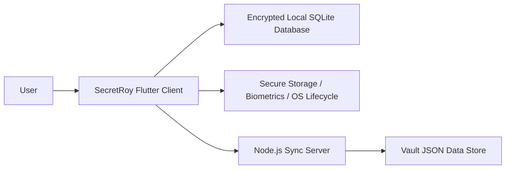
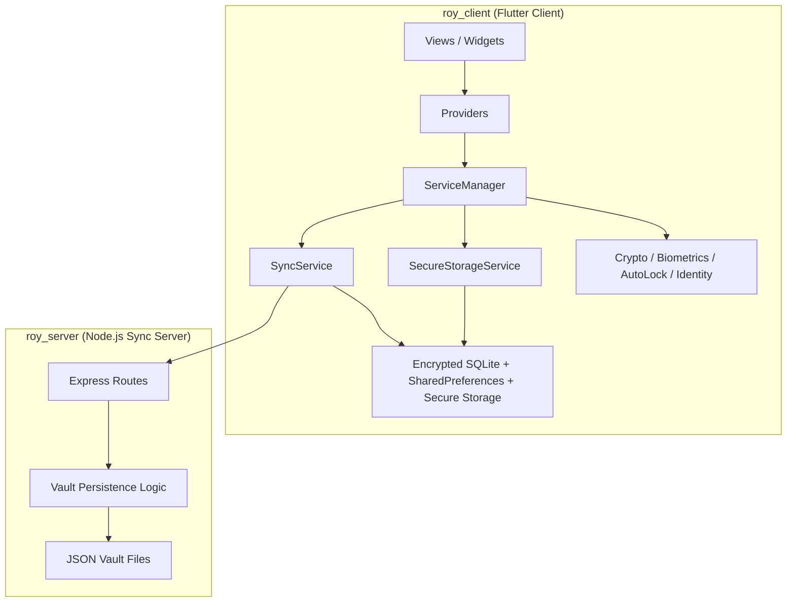

# SecretRoy System Architecture

Navigation:
[Docs Home](../README.md) |
[Architecture Index](README.md) |
Prev: [00-executive-summary.md](00-executive-summary.md) |
Next: [02-runtime-and-sync.md](02-runtime-and-sync.md)

| Item | Value |
|---|---|
| Doc ID | SR-ARCH-01 |
| Document Type | System Architecture |
| Audience | Engineers, reviewers |
| Scope | Repository topology, system boundaries, containers, dependencies |
| Owner | Repository maintainers (formal owner TBD) |
| Review Status | Draft - Unapproved |
| Last Updated | 2026-04-20 |

## 1. System Context

SecretRoy 是一个“富客户端 + 薄同步服务”的系统。



这里最关键的判断是：

- 业务真相主要在客户端
- 服务端不是业务中心，而是同步协调器

## 2. Repository Topology

```text
roy/
  docs/
  roy_client/
  roy_server/
```

### `docs/`

仓库级文档区，承载：

- 架构解读
- 教学材料
- 协议说明
- 风险与交付材料

### `roy_client/`

真正的业务主系统。

### `roy_server/`

配套的 Node.js 同步服务。

## 3. Client Architecture

### 3.1 Top-Level Client Structure

```text
roy_client/
  android/
  ios/
  linux/
  macos/
  web/
  windows/
  lib/
  test/
  docs/
  pubspec.yaml
```

### 3.2 What Matters Most

优先级最高的区域是：

- `lib/`
- `test/`

平台目录主要是宿主工程，不是业务主战场。

## 4. Core Source Layout

```text
lib/
  main.dart
  l10n/
  models/
  providers/
  services/
  sync/
  views/
  widgets/
```

### `main.dart`

职责：

- bootstrap
- root composition
- root app config

### `models/`

职责：

- 定义账号、模板、HLC 等领域模型

### `providers/`

职责：

- 提供 UI-facing shared state

### `services/`

职责：

- 运行时门面
- 本地存储
- 安全能力
- 身份与自动锁

### `sync/`

职责：

- 同步编排
- 冲突合并

### `views/`

职责：

- 页面级视图与业务工作台

### `widgets/`

职责：

- 通用组件和布局适配单元

## 5. Container Diagram



## 6. Dependency Direction Rules

### DDR-01. `views/` 不应直接依赖 SQLite 和服务端协议细节

页面层允许依赖：

- `providers`
- `models`
- `widgets`
- 少量门面级服务

页面层不应直接承担：

- 数据库存取实现
- 同步协议编排
- 远端 payload 解释

### DDR-02. `providers/` 管理可观察状态，不管理底层协议细节

Provider 可以：

- 订阅存储层变化
- 暴露 UI 所需状态和 action

但不应成为：

- 数据库 schema 层
- 同步协议实现层

### DDR-03. `ServiceManager` 负责编排，不负责吸纳所有领域规则

它是门面与运行时总线，但不是无限制的大总管。

### DDR-04. `sync/` 应保持同步语义集中

pull、push、版本推进、冲突恢复都应集中在同步模块，而不是散落到 UI。

### DDR-05. 服务端应继续保持“同步协调器”角色

它不应直接理解 Flutter UI 语义，也不应侵入客户端会话逻辑。

## 7. Module Boundary Contracts

### `main.dart`

职责：

- 完成 bootstrap 和根部依赖装配

### `ServiceManager`

职责：

- 协调解锁、锁定、存储、同步与运行时状态

### `EnhancedAppProvider`

职责：

- 提供 UI 可直接使用的业务状态

### `SecureStorageService`

职责：

- 管理 SQLite、schema、本地持久化与 `.db.enc` 文件信封加密

### `SyncService`

职责：

- 管理同步编排与恢复

### `CrdtMergeEngine`

职责：

- 提供纯领域级的合并决策

### `roy_server/index.js`

职责：

- 承担同步协调与版本秩序维护

## 8. Architecture Style Assessment

SecretRoy 的总体架构风格可以概括为：

- Local-first
- Rich client
- Thin sync backend

这让它更接近“客户端系统”而不是“传统 API 驱动前端”。

---

Navigation:
[Docs Home](../README.md) |
[Architecture Index](README.md) |
Prev: [00-executive-summary.md](00-executive-summary.md) |
Next: [02-runtime-and-sync.md](02-runtime-and-sync.md)
