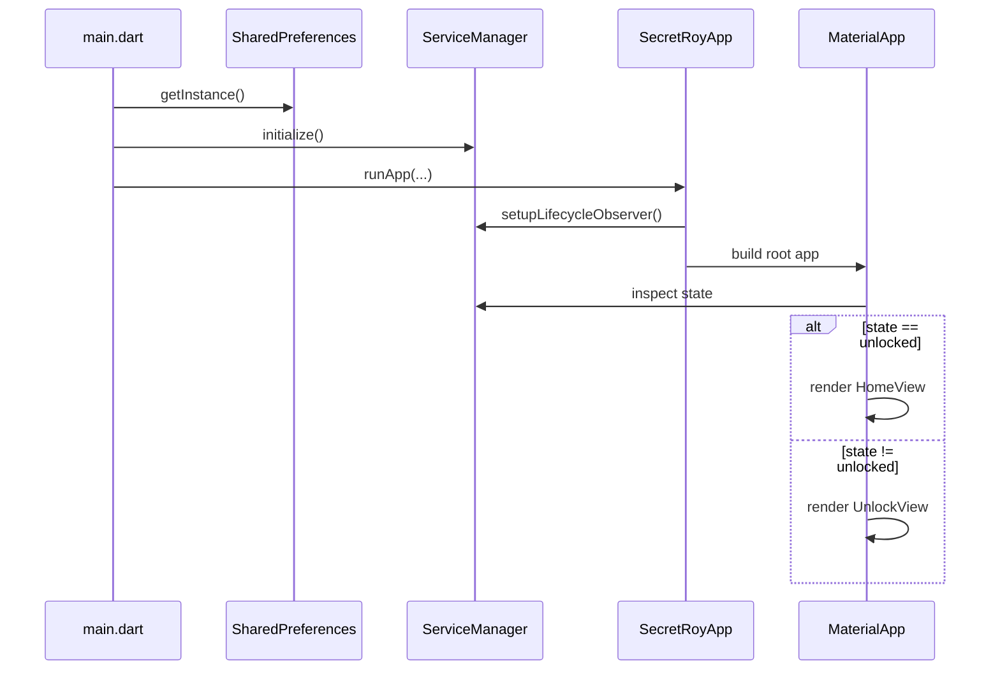
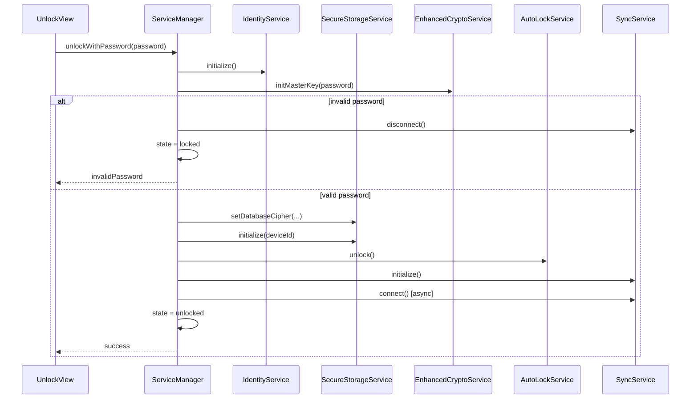
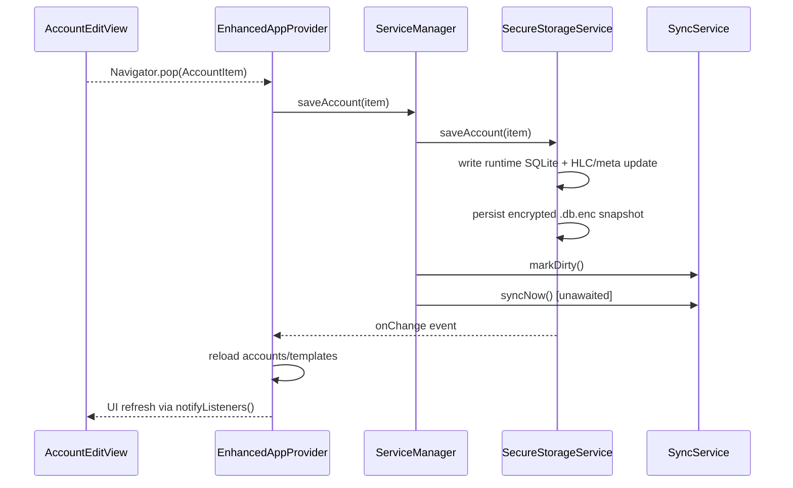
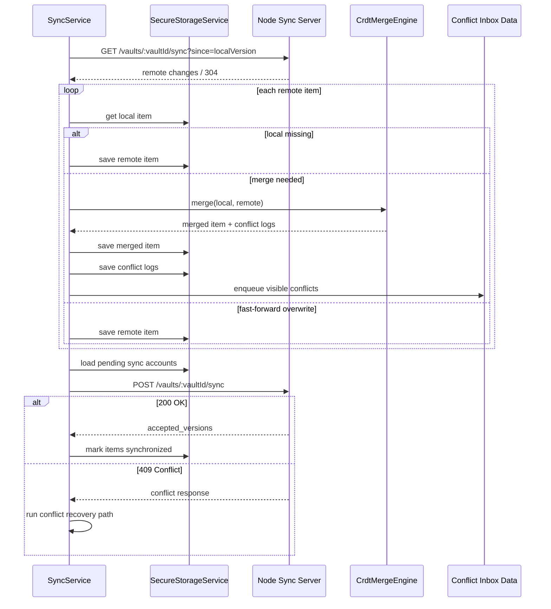

# SecretRoy Runtime and Sync

Navigation:
[Docs Home](../README.md) |
[Architecture Index](README.md) |
Prev: [01-system-architecture.md](01-system-architecture.md) |
Next: [03-risks-and-roadmap.md](03-risks-and-roadmap.md)

| Item | Value |
|---|---|
| Doc ID | SR-ARCH-02 |
| Document Type | Runtime and Sync Analysis |
| Audience | Engineers, reviewers |
| Scope | Startup flow, session flow, persistence flow, sync and conflict handling |
| Owner | Repository maintainers (formal owner TBD) |
| Review Status | Draft - Unapproved |
| Last Updated | 2026-04-28 |

## 1. Runtime Bootstrap

主入口在：

- `roy_client/lib/main.dart`

启动链路如下：

这个流程说明：

- 启动时先恢复运行时，再构建 UI
- 首页分流基于应用状态，而不是简单静态路由

## 2. Session Establishment

解锁流程本质上是在建立一个可用会话。

关键观察：

- 解锁不是一个 UI 操作，而是运行时建会话过程
- 密码错误时不会打开本地数据库文件
- 锁定也不是遮 UI，而是回收敏感上下文

## 3. Local Persistence Flow

本地保存链路是系统最典型的业务路径之一。

这条链路体现了两个重要特征：

- 系统是 local-first，而不是 API-first
- 持久化和同步语义在本地保存阶段就已绑定

## 4. Sync Architecture

### 4.1 Role of `SyncService`

`SyncService` 负责：

- 读取本地同步元数据
- 执行 pull
- 执行 push
- 处理冲突恢复
- 推进本地版本号

### 4.2 Core Strategy

当前同步策略是：

- pull first
- merge locally
- push pending data

这样做的好处是：

- 避免在过时视图上盲推本地数据
- 让客户端掌握最终领域合并逻辑

## 5. Full Sync Flow

## 6. Conflict Handling Model

`CrdtMergeEngine` 是整个系统最有技术深度的部分之一。

它采用：

- tombstone 优先级
- 字段级 HLC 比较
- 冲突日志留痕

这意味着：

- 系统不会简单按整条记录粗暴覆盖
- 被覆盖值可回到 `ConflictInboxView` 供用户审查

## 7. Security Runtime Assessment

在看这一节之前，需要先把当前实现与目标能力分开：

- `IdentityService` 已经有设备 ID、`vaultId`、mock `privateKey`、mock `symmetricKey` 的自动生成与持久化逻辑；当前问题不再是“没有生成”，而是它仍然停留在 mock identity / mock key 阶段，尚未升级为正式模型。
- `EnhancedCryptoService` 当前使用 PBKDF2-HMAC-SHA256 verifier 校验主密码，并用主密码派生包装密钥解开随机 DB 数据密钥。
- `SecureStorageService` 当前以 `secret_roy_vault.db.enc` 长期落盘，通过 AES-GCM-256 二进制文件信封保护 SQLite 快照；解锁期间存在临时 runtime SQLite 工作库，锁定时会关闭并删除。
- `SyncService` 的 `encrypted_signed_payload` 当前是记录级 nonce/ciphertext/HMAC 信封，使用 vault/device 派生材料做混淆加密与完整性校验；它仍不是标准 AEAD/E2EE 终局方案。

### 7.1 What Exists Today

- 主密码入口
- 自动锁
- 生物识别入口
- secure storage
- 本地数据库文件级 AES-GCM-256 加密

### 7.2 What Is Still Prototype-Level

- 运行时明文工作库防护
- 正式同步 payload 加密/认证
- 完整设备身份与密钥体系

因此当前“安全运行时”更准确的表达应是：

- 架构方向具备
- 实现成熟度不足

## 8. Why This Runtime Matters

SecretRoy 的运行时分析价值在于：

- 它把本地持久化、会话状态机、同步与冲突模型串成了一个完整闭环

这也是它比普通 Flutter CRUD Demo 更值得研究的原因。

---

Navigation:
[Docs Home](../README.md) |
[Architecture Index](README.md) |
Prev: [01-system-architecture.md](01-system-architecture.md) |
Next: [03-risks-and-roadmap.md](03-risks-and-roadmap.md)
