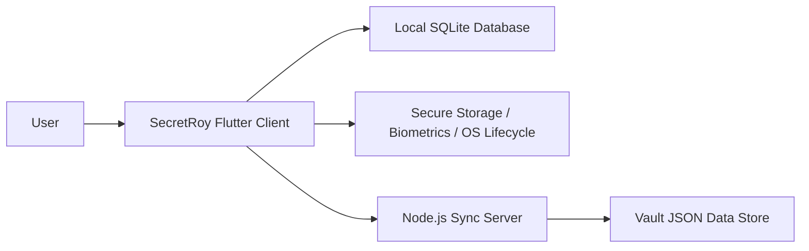
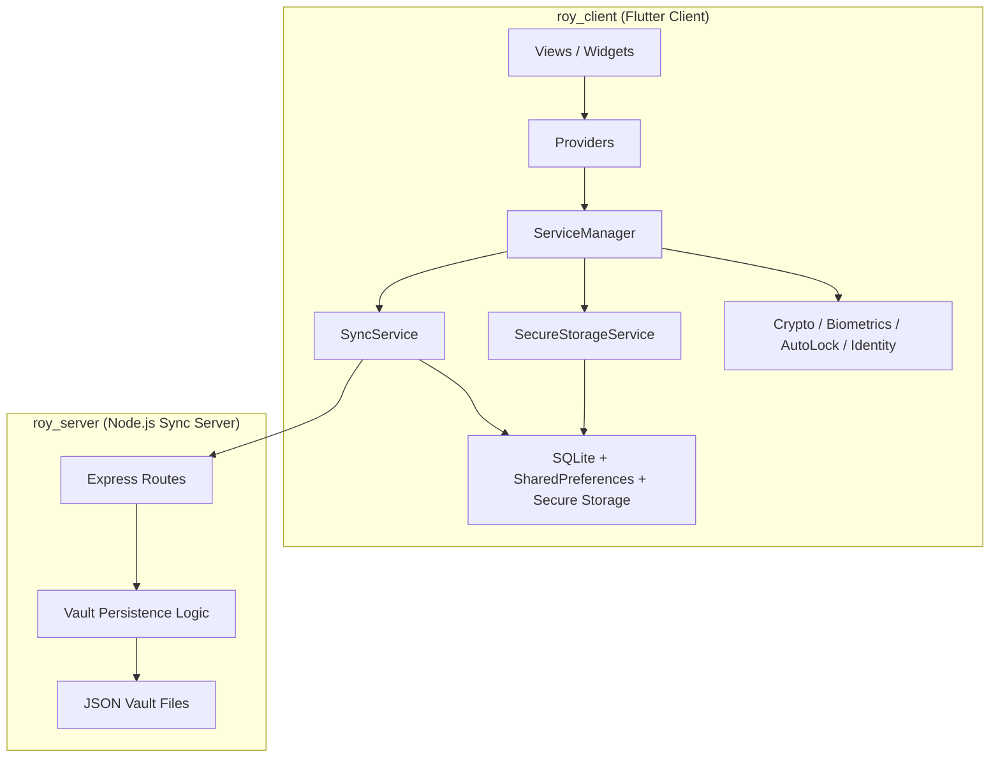
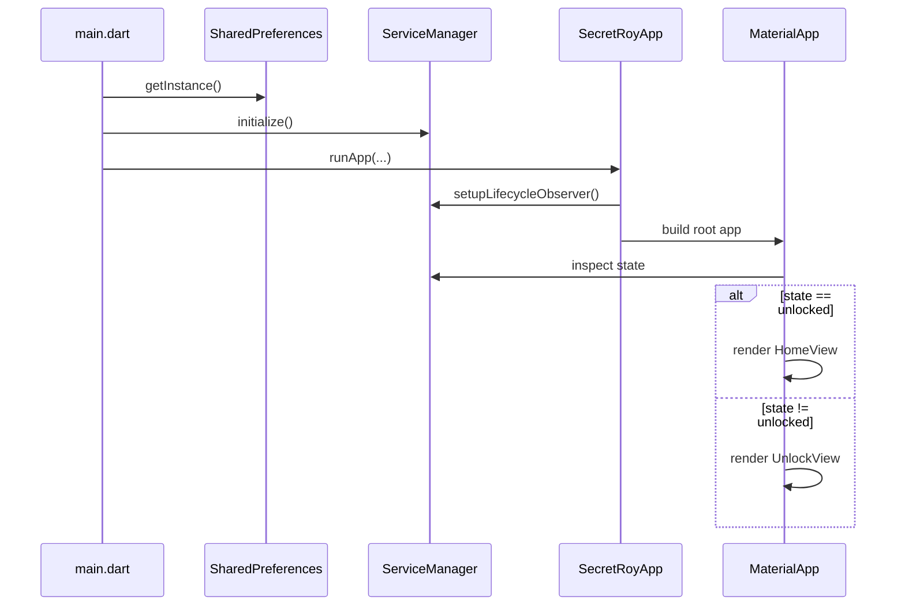
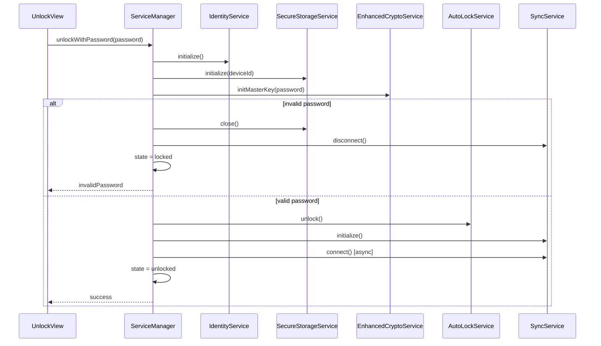
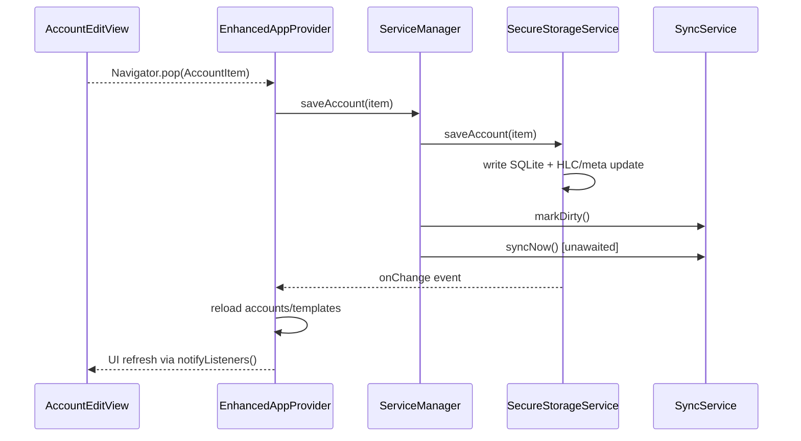
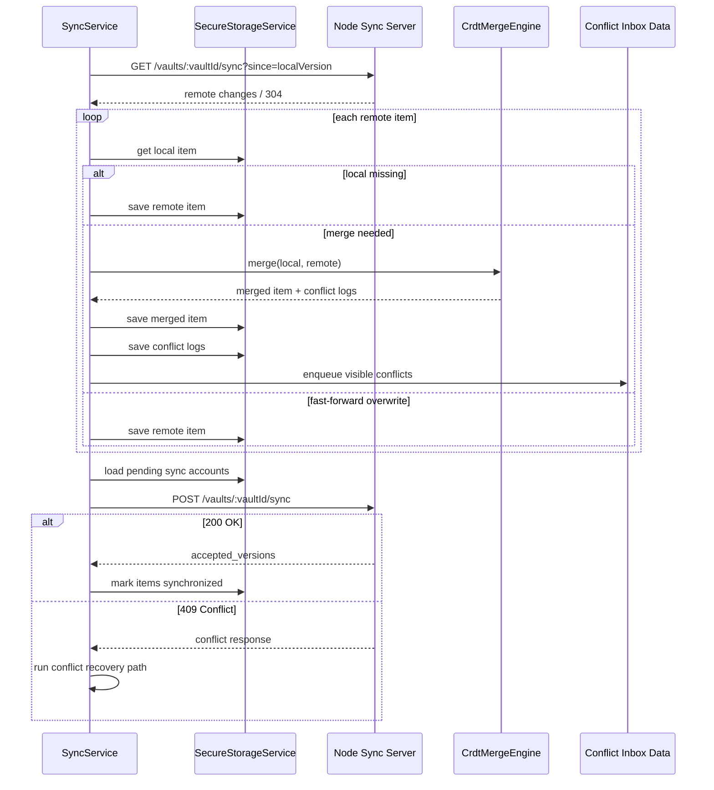
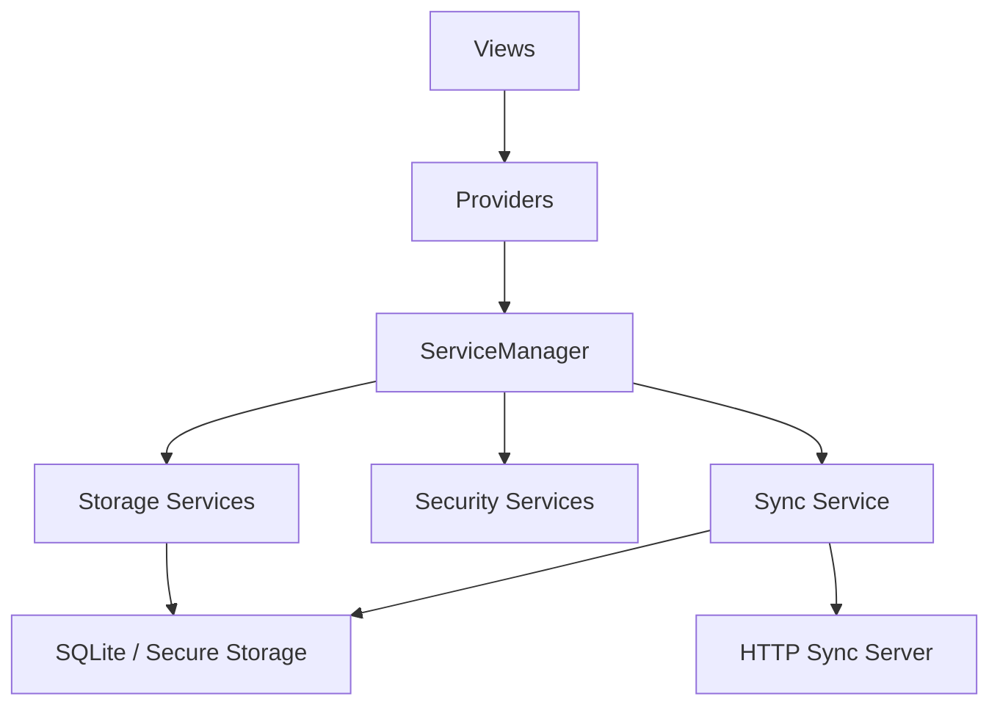
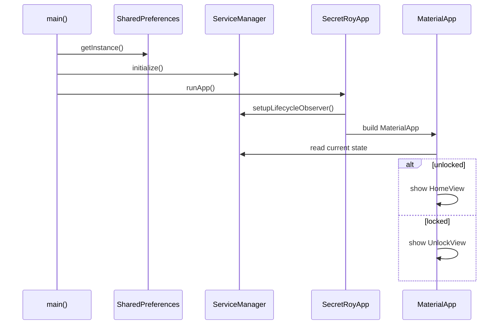

# SecretRoy 架构深度解读

> 更适合阅读的拆分文档集见：[README.md](README.md)
>
> 现实校准：本文优先以当前源码实现为准。历史版本里的固定 `vaultId`、secure storage 直接主密码比对、早期 payload 协议壳已经被收敛；当前剩余问题是 identity/key 仍偏 mock、sync payload 不是标准 AEAD/E2EE、服务端缺少认证授权。

| Item | Value |
|---|---|
| Doc ID | SR-ARCH-FULL |
| Document Type | Architecture Deep Dive |
| Audience | Engineers, reviewers, maintainers |
| Scope | `roy_client/`, `roy_server/`, selected repository docs |
| Perspective | System architecture and engineering assessment |
| Owner | Repository maintainers (formal owner TBD) |
| Review Status | Draft - Unapproved |
| Last Updated | 2026-04-28 |
| Code Baseline | Current workspace snapshot |

> 2026-04-28 delta: Local database at-rest encryption is now implemented with `secret_roy_vault.db.enc`, a Dart AES-GCM-256 binary file envelope, and a random DB data key wrapped by a master-password-derived key-encryption key. Older paragraphs about plaintext local SQLite are historical risk descriptions.

## 文档定位

这不是入门教程，也不是功能清单。

这份文档按“大型项目专业解读”的写法组织，目标是回答下面这些问题：

- 这个仓库的真实系统边界是什么？
- 客户端和服务端各自承担什么职责？
- 关键模块如何分层、如何依赖、如何协作？
- 运行时有哪些核心链路？
- 当前实现的成熟度在哪里，技术债又在哪里？
- 如果把它继续做大，应该沿着什么方向演进？

建议的阅读姿势不是“通读一遍代码”，而是先通过本文件建立系统地图，再回到源码做定点阅读。

---

## 文档结构

本文按 4 个 Part 组织：

- `Part I. 系统全景与仓库拓扑`
  解释项目定位、仓库结构、客户端代码版图与总体架构风格。
- `Part II. 客户端运行时与核心模块`
  解释启动链路、应用服务总线、状态层、领域模型与本地存储。
- `Part III. 同步、冲突与服务端`
  解释同步架构、冲突合并、安全子系统、UI 承载层与薄服务端。
- `Part IV. 工程评估与演进路线`
  解释成熟度、技术债、演进方向与推荐阅读顺序。

这意味着本文不是一篇连续长文，而是一个分部的系统解读文档。

---

## Key Findings

### F1. 这是一个客户端主导的 local-first 系统，而不是后端中心系统

系统的主复杂度集中在 Flutter 客户端：

- 本地状态
- SQLite 持久化
- 模板驱动表单
- 解锁状态机
- 同步编排
- 冲突合并

服务端承担的是同步协调角色，而不是业务真相中心。

### F2. 架构边界已经成型，但安全能力仍处于原型阶段

从模块划分上看，这个系统已经具备较好的形状，但：

- 真正密码学能力未落地
- 身份体系未完成
- 服务端持久化过薄

因此它适合做架构研究样本，不适合直接按生产系统评价。

### F3. 最有技术价值的部分不是 UI，而是同步与冲突模型

项目真正的架构亮点在：

- 字段级同步元数据
- pull-then-push 编排
- HLC 驱动的冲突合并
- 冲突日志与收件箱闭环

### F4. `ServiceManager` 是高价值门面，也是未来最需要治理的聚合点

它极大简化了 UI 与业务链路，但同时也有继续膨胀为中心化总管对象的风险。

### F5. 若继续演进，优先级应为“安全底座 > 服务端持久化 > 同步鲁棒性 > 观测测试”

这是从原型走向正式系统的合理演进顺序。

---

## Executive Summary

### One-Page Summary

SecretRoy 当前最准确的定位是：

- 一个架构方向清晰、客户端能力较强、同步模型有技术深度的本地优先密码库原型

它的核心价值不在于“已经做成生产级密码管理器”，而在于它已经形成了相对完整的系统骨架：

- 富客户端运行时
- 本地 SQLite 主存储
- 模板驱动表单系统
- 解锁与自动锁状态机
- 客户端主导同步
- 字段级冲突合并
- 冲突收件箱闭环

从评审角度看，它有三个非常明确的优点：

1. 客户端架构分层已经成型，系统边界大体清楚。
2. 同步与冲突模型明显高于普通原型项目的复杂度和成熟度。
3. 模板系统与本地优先存储的结合，使系统具备继续扩展的潜力。

同时，它也有三个非常明确的限制：

1. 安全实现仍是原型级，不应被误判为生产级密码学方案。
2. 服务端过薄，只适合开发型和教学型场景。
3. 测试、观测、恢复与运维能力还不足以支撑正式长期运行。

因此，对 SecretRoy 的专业结论应当是：

- 它是一个值得认真研究和继续演进的架构原型
- 但还不是一个可直接投入生产的安全产品

如果要继续投入，最合理的路线是：

1. 先补安全底座
2. 再升级服务端持久化
3. 再增强同步鲁棒性与测试体系
4. 最后补观测、运维与正式治理能力

---

## Table of Contents

- `Part I. 系统全景与仓库拓扑`
  - `1. 执行摘要`
  - `2. 仓库拓扑`
  - `3. 客户端目录结构与职责图`
  - `4. 客户端核心源码结构`
  - `5. 系统架构风格`
- `Part II. 客户端运行时与核心模块`
  - `6. 运行时启动链路`
  - `7. ServiceManager：客户端的应用服务总线`
  - `8. 状态管理层`
  - `9. 领域模型设计`
  - `10. 本地存储架构`
- `Part III. 同步、冲突与服务端`
  - `11. 同步架构`
  - `12. 冲突合并`
  - `13. 安全与解锁子系统`
  - `14. UI 层设计`
  - `15. 服务端设计`
- `Part IV. 工程评估与演进路线`
  - `16. 代码成熟度评估`
  - `17. 最值得注意的技术债`
  - `18. 演进路线`
  - `19. 推荐阅读顺序`
  - `20. 结论`
- `Architecture Decisions Summary`
- `Non-Goals`
- `Open Questions`
- `Risk Register`
- `Appendix A-C`

---

## Architecture Decisions Summary

这一节不是完整 ADR 仓库，而是对当前系统已经做出的关键架构决策进行摘要化记录。

### AD-001. 采用富客户端 + 薄同步服务，而非后端中心架构

决策：

- 业务主复杂度放在客户端
- 服务端只承担同步协调与版本秩序维护

原因：

- 本地优先体验更自然
- 离线能力更强
- 客户端可以掌握更细粒度的领域合并逻辑

收益：

- 用户操作无需强依赖网络
- 同步策略可按客户端领域模型设计

代价：

- 客户端复杂度显著上升
- 安全与同步鲁棒性要求更高

### AD-002. 客户端以 SQLite 作为主持久化层，而不是临时缓存

决策：

- 将 SQLite 作为本地系统记录的权威存储

原因：

- 系统是 local-first，不是 API-first
- 需要存储业务数据、同步元数据、模板与冲突日志

收益：

- 离线完整可用
- 本地状态和同步状态能统一建模

代价：

- 客户端 schema 演进更重要
- 数据迁移与本地损坏恢复变成正式问题

### AD-003. 使用模板驱动表单，而不是硬编码账号字段

决策：

- 表单结构由 `AccountTemplate` 和 `AccountField` 描述

原因：

- 账号字段类型天然多样
- 需要支持内置模板与自定义模板

收益：

- 表单扩展成本低
- 可以支持模板编辑器

代价：

- 账号编辑器复杂度提高
- 历史字段兼容问题必须显式处理

### AD-004. 同步采用 pull-then-push 的本地编排模式

决策：

- 每次同步先拉取远端变化，再推送本地待提交变化

原因：

- 减少盲推过时数据
- 让本地先看到远端新状态后再决定 push 内容

收益：

- 更稳健的同步语义
- 更适合冲突恢复

代价：

- 客户端同步逻辑更复杂
- 需要维护本地版本号与 dirty 状态

### AD-005. 冲突处理采用字段级 HLC 合并 + 冲突留痕

决策：

- 不做整条记录粗暴覆盖
- 逐字段按 HLC 决策
- 输掉的值写入 `ConflictLog`

原因：

- 多端并发修改时整条覆盖会导致高概率数据丢失

收益：

- 更高数据保真度
- 用户可通过 conflict inbox 做人工恢复

代价：

- 模型、存储、同步、UI 都要共同理解冲突语义

### AD-006. 采用 `ServiceManager` 作为客户端统一门面

决策：

- 由单一上层门面编排解锁、锁定、持久化与同步

原因：

- 减少页面对多个底层服务的直接依赖
- 集中维护运行时时序

收益：

- UI 调用面简洁
- 启动链路和锁定链路更可控

代价：

- 容易膨胀成中心化大对象

---

## Non-Goals

下列目标不应被视为当前版本已经实现，或不应作为当前架构评估的默认前提：

### NG-001. 当前版本不是生产级密码管理器

它不应被评价为：

- 已完成正式密码学设计
- 已具备生产级安全姿态
- 已满足商用密码库标准

### NG-002. 当前服务端不是正式多租户后端平台

它不应被评价为：

- 具备强并发能力
- 具备正式认证授权
- 具备审计与合规能力

### NG-003. 当前文档不试图替代完整 ADR 仓库

本文件记录的是：

- 关键架构判断的摘要

而不是：

- 每次演进的完整正式 ADR 生命周期

### NG-004. 当前项目不以“前端控件展示”为主要研究目标

虽然系统使用 Flutter，但其真正研究价值更偏：

- 客户端系统架构
- 本地优先存储
- 同步与冲突模型

而不是单纯：

- Material 组件用法
- Flutter 动效技巧

---

## Assumptions and Constraints

本节显式记录本文在分析过程中采用的前提与约束条件，避免把“当前观察到的实现”误写成“已经被正式承诺的系统目标”。

### A-001. 当前分析以工作区中的实际代码为准

本文所有判断优先基于：

- `roy_client/lib/`
- `roy_server/index.js`
- 当前测试文件

而不是基于未来规划文档、说明文案或命名暗示。

### A-002. 当前实现被视为单仓库内的开发型部署形态

即：

- 客户端与服务端通常由同一开发者在本地同时运行
- 服务端默认仅作为开发同步端点存在

这意味着本文不会假定：

- 独立运维团队
- 多环境部署矩阵
- 正式发布流水线

### A-003. 当前同步模型被视为“低到中等并发”的原型场景

本文不会默认系统已经验证以下能力：

- 高频并发写入
- 多区域部署
- 大规模设备同时同步
- 长期海量版本累积

### A-004. 当前安全分析以“原型级实现”作为评价基线

因此本文会区分：

- 架构方向是否合理
- 当前安全实现是否已达生产要求

不会把这两者混为一谈。

### A-005. 当前文档目标是系统解读，不是正式设计冻结

这意味着本文记录的是：

- 对当前代码的解释
- 对演进方向的专业建议

而不是：

- 已被团队审批冻结的不可更改规范

---

## System Context Diagram

从系统上下文看，SecretRoy 当前主要与 4 类参与者/资源交互：

- 最终用户
- Flutter 客户端
- 本地设备存储与系统能力
- Node.js 同步服务

可以抽象为：



这张图表达的关键不是“部署复杂度”，而是职责边界：

- 用户交互只进入客户端
- 客户端主导本地状态与同步逻辑
- 服务端不直接承载表单业务与解锁状态

---

## Container Diagram

如果进一步拆成容器级别，当前系统可以近似表示为：



这张图突出的是依赖收敛方式：

- UI 不直接依赖 SQLite 和 HTTP
- `ServiceManager` 是客户端运行时的汇聚点
- 服务端内部结构很薄，但仍然有 API 层与持久化逻辑层的区分

---

## Dependency Direction Rules

本节把当前系统中已经形成、且应当继续维持的依赖方向明确写出来。

### DDR-001. `views/` 不应直接依赖 SQLite、HTTP 或服务端协议细节

允许依赖：

- `providers/`
- 少量门面级服务
- `models/`
- `widgets/`

不建议直接依赖：

- `SecureStorageService`
- `SyncService` 的底层细节
- 服务端 payload 结构

原因：

- 页面层应该表达交互与展示，不应承担基础设施编排责任。

### DDR-002. `providers/` 负责 UI 可用状态，不负责底层持久化实现细节

允许：

- 调用门面层
- 订阅存储层变更

不建议：

- 在 Provider 中散布大量 SQLite schema 逻辑
- 在 Provider 中直接实现同步协议

原因：

- Provider 的职责是可观察状态与 UI-facing action，不是基础设施实现层。

### DDR-003. `ServiceManager` 作为门面存在，但不应无限吸纳领域逻辑

允许：

- 运行时编排
- 会话状态切换
- 服务组合

不建议：

- 把所有业务规则都堆进 `ServiceManager`

原因：

- 它已经是汇聚点，再继续膨胀会显著提高维护成本。

### DDR-004. `sync/` 目录应保留对同步语义的主导权

允许：

- 同步状态模型
- pull/push 编排
- 冲突合并规则

不建议：

- 把同步协议判断散落到 UI、Provider 或服务端页面逻辑中

原因：

- 同步是本系统的核心复杂度，必须保持收敛。

### DDR-005. 服务端应继续避免理解客户端 UI 语义

允许：

- 版本检查
- payload 存取
- 输入合法性校验

不建议：

- 服务端直接接入模板表单语义
- 服务端直接接入解锁与本地状态逻辑

原因：

- 当前系统的架构前提是“客户端掌握领域真相，服务端维护同步秩序”。

---

## Module Boundary Contracts

本节不是语言级 interface，而是架构级边界契约。

### MBC-001. `main.dart`

输入：

- 本地配置
- 已初始化的运行时服务

输出：

- 根 `MaterialApp`
- 全局 Provider 注入
- 顶层首页分流

契约：

- 负责应用 bootstrap，不承载具体业务规则。

### MBC-002. `ServiceManager`

输入：

- UI 发起的高层动作
- 生命周期事件
- 各底层服务能力

输出：

- 应用状态切换
- 对外统一业务入口

契约：

- 负责编排，不应成为所有领域规则的永久宿主。

### MBC-003. `EnhancedAppProvider`

输入：

- 存储层变化
- UI 发起的筛选/增删改动作

输出：

- UI 可直接消费的账号、模板与状态视图

契约：

- 负责业务状态呈现，不负责底层协议和数据库 schema 定义。

### MBC-004. `SecureStorageService`

输入：

- 领域对象
- 设置键值
- 冲突日志

输出：

- SQLite 持久化结果
- 数据变化事件流

契约：

- 负责本地持久化与 schema 演进，不负责页面编排。

### MBC-005. `SyncService`

输入：

- 本地版本元数据
- 本地 dirty 数据
- 服务端响应

输出：

- 同步状态
- 合并后本地数据
- 冲突恢复结果

契约：

- 负责同步编排与恢复，不应承担 UI 交互职责。

### MBC-006. `CrdtMergeEngine`

输入：

- 本地记录
- 远端记录

输出：

- 合并结果
- 冲突日志

契约：

- 这是纯领域决策组件，应该尽量避免 UI、存储或网络副作用。

### MBC-007. `roy_server/index.js`

输入：

- 增量拉取请求
- 推送请求

输出：

- 版本化 payload
- 乐观锁冲突结果

契约：

- 负责同步协调，不负责客户端业务语义解释。

---

## Sequence Diagrams

以下 4 条时序图覆盖当前系统最重要的运行时链路。

### SD-001. 应用启动与首页分流



### SD-002. 解锁建会话



### SD-003. 本地保存与 dirty 标记



### SD-004. 一次完整同步与冲突恢复



---

## Part I. 系统全景与仓库拓扑

### 1. 执行摘要

`roy` 是一个“富客户端 + 轻量同步服务”的本地优先应用原型。它的真正核心不在服务端，而在 Flutter 客户端：

- 客户端负责 UI、业务状态、本地 SQLite 持久化、解锁状态机、模板化表单、同步编排、字段级冲突合并。
- 服务端只承担同步协调角色：维护每个 vault 的版本秩序、保存远端快照、提供增量拉取、执行乐观锁冲突检测。

从架构风格看，这不是传统的“后端中心型系统”，而是：

- 一个以客户端为主脑的 local-first 系统
- 再配一个极薄的 sync coordinator

从工程成熟度看，它已经具备了“像样的系统形状”：

- 有明确分层
- 有状态机
- 有本地存储模型
- 有模板驱动表单
- 有同步元数据
- 有冲突收件箱

但它仍然明显处于原型阶段：

- 安全实现是占位级，不是生产级
- 身份体系是 mock 性质
- 服务端持久化还是 JSON 文件
- 监控、可观测性、队列化同步、正式密码学方案都未完成

换句话说，SecretRoy 已经足够像一个真正系统，足以用于专业解读；但它还不是一个可以直接产品化的成熟实现。

---

### 2. 仓库拓扑

#### 2.1 顶层目录

```text
roy/
  docs/
  roy_client/
  roy_server/
```

这是一个非常典型的双子仓库结构：

- `docs/`：仓库级文档区，承载说明、协议草案、白皮书、教学材料
- `roy_client/`：Flutter 客户端，真正的业务主系统
- `roy_server/`：Node.js 同步服务，作为辅助后端存在

#### 2.2 角色判断

如果按系统关键性排序：

1. `roy_client/`
2. `roy_server/`
3. `docs/`

如果按“代码阅读优先级”排序：

1. `roy_client/lib/`
2. `roy_server/index.js`
3. `roy_client/test/` 和 `roy_server/test/`
4. 其他说明性文档

---

### 3. 客户端目录结构与职责图

#### 3.1 `roy_client/` 顶层结构

```text
roy_client/
  android/
  ios/
  linux/
  macos/
  web/
  windows/
  lib/
  test/
  docs/
  pubspec.yaml
  pubspec.lock
  README.md
  analysis_options.yaml
```

可以把它分成三类：

#### 3.2 类别一：业务核心

- `lib/`
- `test/`

这是最重要的区域。

#### 3.3 类别二：平台宿主层

- `android/`
- `ios/`
- `linux/`
- `macos/`
- `web/`
- `windows/`

这些目录的职责不是承载业务，而是：

- 作为 Flutter 各平台的原生宿主工程
- 处理构建、权限、打包、平台配置

从大型项目视角看，它们属于：

- Deployment surface
- Platform integration layer

不是业务主战场。

#### 3.4 类别三：配置与说明

- `pubspec.yaml`
- `pubspec.lock`
- `README.md`
- `analysis_options.yaml`
- `docs/`

这部分属于项目元信息。

---

### 4. 客户端核心源码结构

`roy_client/lib/` 是整个系统真正的控制中枢。

```text
lib/
  main.dart
  l10n/
  models/
  providers/
  services/
  sync/
  views/
  widgets/
```

这套划分很有代表性，几乎完整呈现了一个中型客户端系统的基本骨架。

#### 4.1 `main.dart`

职责：

- 运行时入口
- 启动初始化
- 根 Provider 注入
- 根 `MaterialApp` 配置
- 根据解锁状态选择首页

这相当于：

- Web 系统中的 bootstrap 文件
- 客户端系统中的 composition root

#### 4.2 `models/`

职责：

- 承载核心领域模型

关键模型包括：

- `AccountItem`
- `AccountTemplate`
- `Hlc`

这一层决定：

- 系统处理什么数据
- 数据的边界是什么
- 同步元数据与业务数据如何同居

#### 4.3 `providers/`

职责：

- 维护共享状态
- 连接页面与服务层

当前主要有：

- `EnhancedAppProvider`
- `AppThemeProvider`

这说明项目采用的是：

- 轻量状态管理
- 以 `ChangeNotifier + Provider` 为核心

#### 4.4 `services/`

职责：

- 提供基础服务与门面能力

核心文件：

- `service_manager.dart`
- `secure_storage_service.dart`
- `enhanced_crypto_service.dart`
- `biometric_auth_service.dart`
- `auto_lock_service.dart`
- `identity_service.dart`

从系统设计角度看，这一层相当于：

- Application services
- Infrastructure adapters
- Runtime orchestration

#### 4.5 `sync/`

职责：

- 同步逻辑与冲突合并逻辑

核心文件：

- `sync_service.dart`
- `crdt_merge_engine.dart`

这一层非常关键，因为它把系统从普通离线 CRUD 应用提升成了一个有分布式状态协作特征的系统。

#### 4.6 `views/`

职责：

- 页面级视图
- 路由级容器
- 业务工作台

这部分是功能表达层，而不是架构核心；但它承载了系统最终的用户交互形态。

#### 4.7 `widgets/`

职责：

- 通用组件
- 适配容器
- 列表卡片
- 密码生成器等复用交互单元

这一层可以看作：

- UI composition library

---

### 5. 系统架构风格

#### 5.1 总体风格

SecretRoy 的核心风格不是“三层后端”，而是：

- Rich client
- Local-first
- Thin sync backend

这意味着：

- 业务真相首先存在客户端
- 服务端更像同步裁判，而不是业务中心

#### 5.2 客户端内部依赖方向

客户端的主依赖方向可以抽象成：



这张图表达了三个重要事实：

1. 页面不直接碰数据库
2. 页面也不直接编排同步
3. `ServiceManager` 是客户端的总调度门面

#### 5.3 与典型 Web SPA 的差异

如果用 Web 经验来对照，会有三个显著不同点：

1. 客户端有自己的正式持久化数据库，不只是缓存层
2. 解锁/锁定状态是顶层运行时状态，不是普通 UI 状态
3. 同步系统是客户端主逻辑，而不是接口调用附属品

这也是为什么这个项目更适合拿来学“客户端系统设计”，而不是只学 Flutter 控件。

---

## Part II. 客户端运行时与核心模块

### 6. 运行时启动链路

#### 6.1 启动流程总览

主入口在 `lib/main.dart`。

启动链路可以概括为：



#### 6.2 为什么这个启动流程专业

因为它具备大型应用常见的几个特征：

- 有显式 bootstrap
- 有全局运行时服务初始化
- 有根部依赖注入
- 有基于运行时状态的首页切换

这不是“页面一开就开始查库”的松散风格，而是一个比较完整的应用壳设计。

---

### 7. `ServiceManager`：客户端的应用服务总线

这是客户端最值得认真分析的类。

#### 7.1 它的系统角色

`ServiceManager` 同时承担三个职责：

- Composition root 中的 service container
- 顶层应用状态机
- 面向 UI 的统一门面

它让页面层不需要理解以下复杂性：

- 解锁需要先初始化哪些服务
- 保存账号时为什么要顺带标记 dirty
- 锁定时为什么要断开同步并关闭数据库

#### 7.2 为什么它存在

如果没有它，页面层将直接依赖多个服务：

- 加密
- 生物识别
- 本地存储
- 自动锁
- 同步

那会导致：

- UI 层耦合过深
- 业务链路散落
- 启动时序难以集中维护

对一个小项目来说，这样的门面类是合理的。

#### 7.3 状态机

`ServiceManagerState`：

- `uninitialized`
- `locked`
- `unlocking`
- `unlocked`
- `error`

这组状态说明作者不是用零散布尔值拼运行时，而是把“应用会话生命周期”显式化。

这是大型项目常见的做法，因为：

- 状态可推理
- 转换关系清晰
- 更容易做错误恢复

#### 7.4 依赖装配

它在构造时组装：

- `EnhancedCryptoService`
- `BiometricAuthService`
- `AutoLockService`
- `IdentityService`
- `SecureStorageService`
- `SyncService`

这说明项目有明确的服务拆分意识，只是目前选择在一个上层门面里集中装配。

#### 7.5 解锁流程分析

解锁不是单一步骤，而是一个运行时建会话过程：

1. 初始化身份服务
2. 初始化本地数据库
3. 校验主密码
4. 解除自动锁
5. 初始化同步系统
6. 尝试连接同步端点
7. 把应用切换到 `unlocked`

这说明在作者的模型中，“解锁”不是 UI 行为，而是：

- 构建一个可工作的应用会话

#### 7.6 锁定流程分析

锁定时执行的动作是：

- 触发自动锁
- 关闭数据库
- 断开同步
- 切换到 `locked`

这同样是非常系统化的设计：

- 锁定不只是遮挡 UI
- 而是回收敏感运行时上下文

#### 7.7 优点与风险

优点：

- 客户端入口统一
- 运行时链路集中
- 页面调用成本低

风险：

- 容易演化成 God Object
- 未来功能再增多时，需要继续拆解

---

### 8. 状态管理层：Provider 不是数据库，它是 UI 可用状态

#### 8.1 `EnhancedAppProvider`

它不是 repository，也不是 controller，而是：

- 面向页面的业务状态聚合器

它维护：

- 账号列表
- 自定义模板
- 搜索态
- 标签筛选
- loading
- conflict count

#### 8.2 设计重点：读写分工

`EnhancedAppProvider` 的一个重要特征是：

- 读取时直接对接存储层与变更流
- 写入时通过 `ServiceManager` 走统一业务入口

这种设计的价值在于：

- 读性能与刷新路径清晰
- 写逻辑集中在门面层

#### 8.3 它为什么监听 `onChange`

`SecureStorageService` 暴露变更流后，Provider 订阅它，就能在本地数据库变化时自动刷新自身状态。

这意味着：

- SQLite 不是一个“黑盒持久层”
- 它主动参与 UI 状态更新闭环

这对本地优先应用特别重要。

#### 8.4 `AppThemeProvider`

它是另一个状态子系统，但性质不同。

它维护的是：

- 主题模式
- 色种子
- true black

这类状态不属于业务域，而属于：

- UX preference state

从大型项目视角看，把业务状态与体验状态分开，是正确的。

---

### 9. 领域模型设计：系统如何定义“数据”

#### 9.1 `AccountItem`

这是系统最核心的领域对象。

它不是普通的“账号表单数据”，而是：

- 业务字段
- 同步字段

的组合体。

业务字段：

- `id`
- `name`
- `email`
- `templateId`
- `data`
- `createdAt`

同步字段：

- `nameHlc`
- `emailHlc`
- `dataHlc`
- `serverVersion`
- `syncStatus`
- `isDeleted`
- `deleteHlc`

这代表一个非常重要的架构判断：

- 同步不是附加功能，而是数据模型的一部分

#### 9.2 `AccountTemplate`

模板系统的引入，使这个项目从普通密码本变成了：

- 可配置字段结构的账户信息库

它让“表单结构”本身成为第一类对象。

这很专业，因为一旦业务对象变复杂，硬编码表单会迅速失控。

#### 9.3 `AccountFieldAttributes`

字段属性里包含：

- 是否必填
- 是否保密
- 是否主字段
- 是否可编辑
- 是否可搜索
- 是否可复制
- 时间格式

这相当于把 UI 行为规则下沉到 schema。

从架构角度看，这是：

- Declarative form behavior

而不是：

- View 中满地 if/else

#### 9.4 `Hlc`

项目没有用单个 `updatedAt` 粗暴解决同步，而是用字段级 HLC。

这说明作者在数据冲突模型上有明确判断：

- 冲突解决的精度应该落到字段级，不应该停留在记录级

---

### 10. 本地存储架构：为什么 SQLite 在这里是主数据库

#### 10.1 角色定位

`SecureStorageService` 实际上是客户端主数据库服务。

虽然名字带 `Secure`，但它承担的主要职责是：

- 打开与管理 SQLite
- 定义 schema
- 执行 CRUD
- 保存同步元数据
- 广播变更事件

#### 10.2 Schema 设计

核心表：

- `accounts`
- `conflict_logs`
- `templates`
- `settings`

这是一个非常合理的最小 schema 集：

- `accounts`：业务主数据
- `conflict_logs`：冲突历史
- `templates`：表单 schema
- `settings`：同步元状态与局部配置

#### 10.3 为什么 `settings` 表重要

很多项目只关注主表，却忽略系统自身状态也需要持久化。

在本项目中，`settings` 承担了：

- 同步版本号
- 上次同步时间
- dirty 标记

这些数据虽然不是用户内容，但对系统运行至关重要。

这是一种成熟设计特征。

#### 10.4 `saveAccount` 的核心价值

真正值得注意的不是写库本身，而是写库时顺带完成：

- 变更字段识别
- HLC stamping
- `pendingPush` 标记

这说明“持久化”与“同步语义生产”在本地保存阶段就已经融合。

#### 10.5 软删除

`deleteAccount()` 采用 tombstone 风格，而不是硬删。

这非常正确，因为：

- 分布式同步系统中，删除必须是一个可传播事件
- 不能只是本地物理清除

---

## Part III. 同步、冲突与服务端

### 11. 同步架构：客户端主导，服务端协调

#### 11.1 架构思想

同步子系统的核心思想是：

- 客户端掌握业务真相与合并逻辑
- 服务端只维护版本秩序

这与许多传统后端中心型系统完全不同。

#### 11.2 `SyncService` 的职责边界

它负责：

- 读取同步元数据
- 周期调度
- 手动同步
- pull
- push
- 冲突恢复
- 更新本地状态

但它不负责：

- 页面渲染
- 账号表单业务逻辑
- 最底层 SQLite schema 管理

边界是清楚的。

#### 11.3 Pull-then-push 流程

同步不是单相过程，而是：

1. 先拉取远端变化
2. 本地合并
3. 再推送本地 pending 变更

这是一种稳健策略，因为它尽量避免：

- 在旧视图基础上盲推数据

#### 11.4 冲突恢复机制

当服务端返回 `409 Conflict` 后，客户端不会直接失败退出，而是：

- 进入冲突恢复分支
- 视情况拉取快照
- 生成冲突日志
- 延迟重试

这说明作者并没有把冲突视为异常终点，而是视为：

- 正常业务路径的一部分

这对同步系统非常重要。

#### 11.5 当前“加密”现实

必须非常明确：

当前同步层所谓的“encryptAndSign”实质只是：

- JSON 编码
- UTF-8
- Base64

因此从专业角度判断：

- 同步协议结构已形成
- 真正密码学安全性尚未实现

这不影响我们解读架构，但必须作为系统成熟度评估的一部分写清楚。

---

### 12. 冲突合并：项目最有价值的技术核心

#### 12.1 为什么这部分重要

在本项目中，最值得称为“系统核心技术”的，不是 Flutter UI，而是：

- `CrdtMergeEngine`

因为真正决定这个系统质量上限的是：

- 多端并发修改能否被合理处理

#### 12.2 合并策略

它采用的不是粗粒度“整条记录更新时间更大者赢”，而是：

- tombstone 优先级判断
- name/email/data 字段级 HLC 比较
- 冲突日志保留输掉的值

#### 12.3 为什么它比普通原型更像正式系统

因为它具备三件成熟系统才会认真做的事：

1. 删除语义不是简化为布尔位，而是有自己的时钟
2. 冲突不是覆盖掉，而是留痕
3. 合并结果会反过来影响后续同步状态

#### 12.4 与冲突收件箱的闭环

这套机制最终没有停留在算法层，而是连到了：

- `ConflictInboxView`

这意味着：

- 合并引擎不是黑箱
- 业务结果可以回到用户界面

从专业产品工程视角看，这一步非常重要。

---

### 13. 安全与解锁子系统：架构上合理，实现上未完成

#### 13.1 解锁流程是顶层运行时流程

`UnlockView` 不是普通登录页，而是系统运行时入口。

它负责：

- 首次启动分流
- 无密码模式分流
- 生物识别自动尝试
- 密码解锁
- 本地重置

这说明安全入口在架构上被放到了正确位置。

#### 13.2 `EnhancedCryptoService` 的真实评价

从边界设计上，它是合理的：

- 主密码管理集中
- 密码工具归口

当前安全实现已越过原型阶段：

- 主密码校验使用 PBKDF2-HMAC-SHA256 verifier
- 解锁后用主密码派生包装密钥解开随机 DB 数据密钥
- 本地长期落盘数据库使用 AES-GCM-256 二进制文件信封

但仍不是最终安全方案：

- 运行时 SQLite 工作库仍是明文临时文件
- 生物识别解锁仍依赖 secure storage 中的主密码材料
- KDF 参数与密钥生命周期还需要继续收敛

#### 13.3 `BiometricAuthService`

设计思路是对的：

- 生物识别只负责认证用户
- 真正的应用会话解锁仍走统一解锁流程

但当前实现依然属于：

- 能跑通体验
- 但不是最终安全方案

#### 13.4 `AutoLockService`

这是一个边界划分很好的服务。

它把：

- 生命周期监听
- 后台时间记录
- 锁定超时判断

封装为独立能力。

对于大型客户端应用来说，这种隔离是非常有价值的。

#### 13.5 `IdentityService`

从意图上看，它是在为未来更正式的设备身份、vault 身份、密钥体系做预留。

但从当前实现看，它仍是：

- 设计占位明显
- mock 痕迹较强

因此专业评价应该是：

- 架构方向是对的
- 实现成熟度不够

---

### 14. UI 层设计：功能导向，而不是组件炫技

#### 14.1 `views/` 的组织方式

页面按业务域拆分：

- accounts
- templates
- home
- settings/security/sync/appearance

这是比较健康的组织方式，说明作者优先按功能边界切，而不是按“组件类型”胡乱分。

#### 14.2 `HomeView`

它是一个工作台壳层：

- 维护 `selectedIndex`
- 分发给 desktop/mobile 两套布局

这非常像成熟应用里的 shell。

#### 14.3 `AccountEditView`

这是 UI 层最复杂的页面之一。

它不仅是表单页面，还是：

- 动态模板解释器
- 历史字段兼容层
- 冲突恢复入口
- 时间输入特殊交互承载体
- 密码生成器宿主

从专业视角看，这个文件复杂度偏高，但复杂度来源合理：

- 它承载的是高业务密度场景

#### 14.4 模板编辑器 UI

`TemplateEditView` 其实是一个“表单 schema 编辑器”。

这类页面在中型系统里并不简单，因为它面对的不是普通业务对象，而是：

- 定义未来业务对象结构的数据

SecretRoy 在这一点上做得不错：

- key 唯一性
- 历史字段 key 锁定
- 字段属性配置
- 预览能力

这些都非常接近专业系统思路。

#### 14.5 适配层

`AdaptivePage` 和 `PlatformBuilder` 把：

- 响应式断点
- desktop/mobile 布局分发

从页面业务中拆出。

这说明项目没有把多端适配写成一堆 scattered layout hacks，而是形成了基本规则。

---

### 15. 服务端设计：薄，但并不随意

#### 15.1 单文件实现并不等于没有结构

`roy_server/index.js` 虽然是单文件，但内部其实已经有明显分层：

- 工具函数层
- vault 文件读写层
- push 校验层
- Express 路由层
- server 启动层

这说明它不是“想到哪写到哪”的脚本，而是一个薄后端。

#### 15.2 数据模型

服务端维护的是每个 vault 的版本化文档：

- `currentVersion`
- `items`

它并不理解业务字段，只理解：

- item id
- item version
- payload
- deleted flag

也就是说，服务端关心的是：

- replication protocol

而不是：

- domain semantics

#### 15.3 一致性模型

它采用的是：

- per-item optimistic version check

客户端 push 每条记录时都带：

- `expected_base_version`

服务端只有在当前版本完全匹配时才接受写入，否则返回 `409`。

这是一种很经典的乐观锁策略。

#### 15.4 原子写入

`writeJsonAtomically()` 体现了服务端工程质量并不随意。

它做了：

- temp file
- backup
- rename
- rollback

在文件存储型系统中，这是非常关键的可靠性措施。

#### 15.5 当前限制

服务端的薄也意味着边界明显：

- 没有正式数据库
- 没有认证鉴权
- 没有并发锁
- 没有多租户治理能力
- 没有审计/指标/追踪体系

这与其定位是一致的。

---

## Part IV. 工程评估与演进路线

### 16. 代码成熟度评估

#### 16.1 已经成熟的部分

- 客户端分层结构
- 本地存储模型
- 解锁状态机
- 模板化表单系统
- 同步编排主流程
- 冲突日志与冲突收件箱
- 多端布局适配框架

这些已经足够支撑“中型原型系统”的复杂度。

#### 16.2 半成熟的部分

- `ServiceManager` 的集中式组织
- 同步状态和 dirty 元数据管理
- 服务端版本秩序控制
- UI 对风险与冲突状态的反映

这些方向是对的，但如果继续做大，需要进一步抽象和治理。

#### 16.3 明显仍是原型的部分

- 真正密码学实现
- 身份与密钥体系
- 服务端持久化
- 审计与观测
- 大规模测试矩阵
- 错误分级与恢复策略

从专业角度，必须把这些归类为：

- Architecture-ready, production-unready

---

### 17. 最值得注意的技术债

#### 17.1 命名与现实能力有偏差

例如：

- `SecureStorageService`
- “E2EE” 风格文案

这些表达在语义上容易让读者误以为能力已经完成。

专业系统中，命名与能力应尽量一致，否则后续认知债会越来越大。

#### 17.2 `ServiceManager` 有继续膨胀风险

它当前承担了太多 orchestration 责任。

如果系统继续增大，未来可以考虑拆分：

- session runtime
- vault domain facade
- sync coordinator facade

#### 17.3 安全实现与同步文案不匹配

当前“协议壳”和“最终安全目标”之间还有明显距离。

这不是小问题，因为密码类产品最容易在这里出现误导。

#### 17.4 服务端扩展性弱

当前 JSON 文件存储适合本地开发与教学，但不适合更大规模：

- 并发写问题
- 数据恢复问题
- 数据量增长问题
- 审计与分析能力缺失

---

### 18. 如果把它继续演进成正式系统，建议的路线

#### 18.1 第一阶段：补齐安全底座

优先做：

- 真正主密钥派生
- 本地数据加密
- 同步 payload 正式加密与认证
- 生物识别与主密码的安全绑定

#### 18.2 第二阶段：重构服务端持久化

建议：

- 从文件存储迁移到正式数据库
- 引入操作日志或版本表
- 明确 vault、item、device 的模型

#### 18.3 第三阶段：提升同步鲁棒性

包括：

- 更清晰的变更日志模型
- 更完整的离线重放
- 更稳定的冲突恢复与幂等语义

#### 18.4 第四阶段：观测与测试

包括：

- 端到端同步测试
- 多设备并发场景测试
- 错误分类与诊断
- 埋点、日志、追踪

---

### 19. 推荐的专业阅读顺序

如果你想按“架构分析”方式读这个仓库，我建议顺序如下：

1. `roy_client/lib/main.dart`
2. `roy_client/lib/services/service_manager.dart`
3. `roy_client/lib/providers/enhanced_app_provider.dart`
4. `roy_client/lib/models/account_item.dart`
5. `roy_client/lib/models/account_template.dart`
6. `roy_client/lib/services/secure_storage_service.dart`
7. `roy_client/lib/sync/sync_service.dart`
8. `roy_client/lib/sync/crdt_merge_engine.dart`
9. `roy_client/lib/views/accounts/account_edit_view.dart`
10. `roy_client/lib/views/templates/template_edit_view.dart`
11. `roy_client/lib/views/conflict_inbox_view.dart`
12. `roy_server/index.js`

这个顺序的核心原则是：

- 先理解运行时壳
- 再理解状态和模型
- 再理解存储和同步
- 最后回到复杂页面和服务端

---

### 20. 结论

---

## Open Questions

当前仓库中仍然存在一些对后续演进有显著影响、但尚未完全回答的问题。

### OQ-001. Vault identity 的最终模型是什么

当前 `IdentityService` 仍有 mock 痕迹，这意味着后续必须明确：

- vault 是否稳定绑定某个用户身份
- device 与 vault 的绑定关系如何表达
- 多设备加入与撤销如何进行

### OQ-002. 运行时与远端加密边界最终放在哪里

当前本地长期落盘数据库已使用 `.db.enc` 文件信封，记录级同步 payload 也已进入 encrypted/signed 形态；后续仍必须明确：

- 运行时 SQLite 工作库是否需要进一步缩短明文窗口
- 远端 payload 是否需要从记录级封装升级到更强的端到端密钥治理
- 签名、验证、撤销与密钥轮换在哪一层执行

### OQ-003. 模板是否进入正式同步域

当前模板已经是本地正式数据对象，但未来仍需明确：

- 模板变更如何在多设备间同步
- 模板删除对历史账号的影响如何治理
- 模板 schema 版本化是否需要独立机制

### OQ-004. 服务端未来是状态存储器还是操作日志系统

当前服务端更像版本化文档存储，但未来需要明确：

- 是否保留快照模型
- 是否引入 operation log
- 是否需要 per-item 历史审计

### OQ-005. 冲突策略是否始终维持客户端主导

当前设计把冲突处理放在客户端，但后续仍需判断：

- 是否有场景需要服务端辅助合并
- 是否需要引入服务器侧校验规则

---

## Risk Register

这一节不讨论“未来可能很酷的功能”，只记录当前系统最重要的工程风险。

### R-001. 安全认知风险

描述：

- 命名与 UI 文案容易让人高估当前安全能力

影响：

- 容易形成错误的系统定位
- 对外沟通风险高

建议：

- 统一调整命名、文案与说明，使其与真实实现对齐

### R-002. `ServiceManager` 膨胀风险

描述：

- 过多运行时编排责任集中在单一门面

影响：

- 后续维护成本上升
- 测试隔离难度增加

建议：

- 在功能继续增长前规划拆分边界

### R-003. 本地数据库成为高风险单点

描述：

- 系统高度依赖 SQLite 持久化，本地损坏会直接影响用户可用性

影响：

- 数据恢复路径不足时，用户体验会严重受损

建议：

- 增强数据库完整性校验、备份、恢复与导出能力

### R-004. 服务端文件存储扩展性不足

描述：

- JSON 文件持久化无法支撑更大规模的并发与治理需求

影响：

- 后续横向扩展受限
- 数据恢复与运维能力不足

建议：

- 中期迁移到正式数据库与更稳定的版本存储模型

### R-005. 测试覆盖不足以证明同步正确性

描述：

- 当前已有测试是好的起点，但不足以覆盖多设备、多版本、异常恢复全场景

影响：

- 高风险数据路径可能在复杂并发场景中出现问题

建议：

- 补多端同步回归、离线重放、冲突恢复与服务端一致性测试

---

## Change Log

本节用于说明这份架构文档本身是如何逐步演进成当前形态的。

### Revision 1

范围：

- 建立基础架构解读正文
- 覆盖仓库拓扑、客户端结构、同步与服务端分析

### Revision 2

范围：

- 引入 `Part I ~ Part IV` 结构
- 将内容从连续长文重排为分部文档

### Revision 3

范围：

- 增加文档元信息
- 增加 `Key Findings`
- 增加附录区

### Revision 4

范围：

- 增加 `Table of Contents`
- 增加 `Architecture Decisions Summary`
- 增加 `Non-Goals`
- 增加 `Open Questions`
- 增加 `Risk Register`

### Revision 5

范围：

- 增加 `Assumptions and Constraints`
- 增加 `System Context Diagram`
- 增加 `Container Diagram`
- 增加 `Change Log`
- 增加 `Review Notes`

---

## Review Notes

以下是从评审视角给出的结论性备注，便于后续继续演化文档或系统实现。

### RN-001. 当前文档已具备“可评审材料”的基本形状

理由：

- 有范围说明
- 有关键发现
- 有分部结构
- 有 ADR 摘要
- 有风险、问题与附录

### RN-002. 下一步最值得补的是“序列图级运行时附录”

尤其建议补以下 4 条时序图：

- 应用启动与解锁时序
- 本地保存与 dirty 标记时序
- 一次完整同步时序
- 一次冲突恢复与 inbox 处理时序

### RN-003. 如果要把文档用于正式团队协作，还应补审批与责任信息

例如：

- owner
- reviewers
- last reviewed date
- decision status

当前文档更像高质量技术分析稿，而不是已经进入正式治理流程的架构规范。

### RN-004. 如果要把项目继续做大，文档应从“解读现状”过渡到“约束未来”

这意味着下一阶段的文档重心要从：

- explaining current code

逐步转为：

- defining future architecture boundaries

---

## Architecture Scorecard

下表不是绝对评价，而是为了帮助团队快速判断当前系统在哪些维度更强、哪些维度仍需优先补强。

| Dimension | Score (1-5) | Assessment |
|---|---:|---|
| Architectural Clarity | 4 | 客户端分层、门面层、同步层和页面层边界整体清楚。 |
| Domain Modeling | 4 | `AccountItem`、模板系统、同步元数据建模较完整。 |
| Local-first Design | 5 | 本地优先是系统核心，不是附属能力。 |
| Sync Design | 4 | pull-then-push、字段级冲突合并、conflict inbox 都较成熟。 |
| Security Posture | 2 | 方向合理，但实现仍明显是原型级。 |
| Backend Robustness | 2 | 轻量可跑，但持久化和治理能力都较弱。 |
| Modifiability | 4 | 模块划分较合理，但 `ServiceManager` 有集中化风险。 |
| Testability | 3 | 已覆盖高价值点，但整体测试矩阵远未完整。 |
| Observability | 2 | 只有基础日志和少量诊断信息。 |
| Production Readiness | 2 | 适合研究与演示，不适合正式生产。 |

### Score Interpretation

- `4-5`：方向明确，已具备较强结构质量
- `3`：已有较好基础，但还缺乏体系化补强
- `1-2`：仍属原型阶段，不能高估成熟度

从这张评分卡看，SecretRoy 最强的维度是：

- local-first 设计
- 模型与同步架构
- 客户端结构清晰度

最弱的维度是：

- 安全实现
- 服务端健壮性
- 观测与生产就绪度

---

## Recommended Next 90 Days

这一节给出一份更接近管理与执行层的短期行动建议。

### Days 1-30: Stabilize the Foundation

建议目标：

- 先把“系统定位”和“真实能力”对齐

建议动作：

1. 统一命名、UI 文案和文档，明确当前不是正式 E2EE 产品。
2. 梳理 `ServiceManager` 的职责，识别可拆分边界但暂不大改。
3. 补关键同步路径测试：
   - pull
   - push
   - 409 conflict
   - remote missing
4. 明确模板同步语义是否进入下一阶段范围。

预期结果：

- 团队对系统现状形成一致认知
- 关键高风险路径获得最基本回归保护

### Days 31-60: Upgrade Security and Persistence Boundaries

建议目标：

- 补齐最核心的底座缺口

建议动作：

1. 设计并评审正式主密钥派生方案。
2. 设计本地数据库保护方案。
3. 设计同步 payload 的正式加密/认证边界。
4. 制定服务端从 JSON 文件迁移到正式数据库的目标模型。

预期结果：

- 安全演进路线从“口头方向”变成正式方案
- 服务端重构具备清晰目标而不是临时发挥

### Days 61-90: Improve Operability and Migration Readiness

建议目标：

- 让系统具备继续扩展的工程条件

建议动作：

1. 建立结构化日志与同步诊断输出。
2. 增加导出/备份/恢复的最小闭环设计。
3. 为服务端持久化迁移建立兼容计划。
4. 补一套“多设备同步回归”测试基线。

预期结果：

- 系统开始从“能跑原型”走向“可演进工程”

### 90-Day Success Criteria

如果这 90 天做得好，应该至少达到：

- 系统真实定位清晰，不再误导性表述
- 安全底座演进方案得到确认
- 服务端迁移方向明确
- 关键同步路径有稳定测试
- 基础诊断能力可支撑后续开发

---

## Quality Attributes

本节从架构质量属性角度审视当前系统，而不是只从“功能有没有做出来”来评价。

### QA-001. Offline Capability

目标：

- 在弱网或无网环境中仍保持核心功能可用

当前表现：

- 较强

依据：

- 客户端以 SQLite 作为主数据存储
- 保存流程本地优先
- 同步是后置动作而不是前置依赖

当前缺口：

- 离线重放与异常恢复仍偏基础
- 更复杂的同步失败队列化处理未完成

### QA-002. Consistency

目标：

- 在多端同步和并发修改场景中尽可能保持数据一致

当前表现：

- 中等偏强

依据：

- 本地维护同步版本号
- pull-then-push 策略
- 字段级 HLC 合并
- 冲突日志和冲突收件箱

当前缺口：

- 服务端仍然过薄
- 缺乏更高强度的一致性验证与回归测试

### QA-003. Security

目标：

- 保护本地敏感数据、主密码、远端同步载荷

当前表现：

- 架构方向合理，本地长期落盘边界已加固，但运行时和远端边界仍需继续推进

依据：

- 有解锁入口、自动锁、生物识别、secure storage
- 有 PBKDF2 主密码 verifier、随机 DB 数据密钥 envelope、AES-GCM-256 `.db.enc` 信封
- 同步 payload 已有 encrypted/signed 编解码

当前缺口：

- 运行时 SQLite 工作库仍是明文临时文件
- payload 加密与认证还缺少完整密钥治理与服务端强认证
- 身份与密钥体系仍是过渡态

### QA-004. Modifiability

目标：

- 系统应支持新增页面、模板字段、同步规则和服务能力扩展

当前表现：

- 较强

依据：

- `models/providers/services/sync/views/widgets` 分层明确
- 模板驱动表单具有良好扩展性
- 同步逻辑已集中在专门模块

当前缺口：

- `ServiceManager` 的进一步膨胀会影响可修改性

### QA-005. Observability

目标：

- 系统故障、同步异常、运行时状态应可诊断

当前表现：

- 较弱

依据：

- 客户端同步页有少量诊断信息
- 服务端有基础日志

当前缺口：

- 没有正式指标、结构化日志、追踪体系
- 没有面向运维的状态导出

### QA-006. Testability

目标：

- 关键风险路径应可稳定测试

当前表现：

- 中等

依据：

- 已有同步合并与服务端校验测试

当前缺口：

- 缺少系统级同步回归矩阵
- 缺少多设备、多版本、多故障场景覆盖

---

## Operational Readiness

这一节回答一个更偏工程落地的问题：

- 当前系统距离“可长期运行和维护”还有多远？

### OR-001. Runtime Configuration

当前状态：

- 基础可用

说明：

- 客户端支持配置同步服务地址
- 本地运行时会保存主题与同步设置

不足：

- 缺乏更系统化的环境配置管理
- 缺乏多环境切换模型

### OR-002. Error Handling

当前状态：

- 有基础处理，但不够体系化

说明：

- UI 层会显示错误消息
- 同步层区分部分错误场景

不足：

- 错误分级不统一
- 无统一异常编码或诊断策略

### OR-003. Logging and Diagnostics

当前状态：

- 基础可见，正式度不足

说明：

- 服务端会记录 HTTP 请求
- 客户端部分页面能查看同步版本和时间

不足：

- 缺乏结构化日志
- 缺乏系统级调试开关
- 缺乏可供长期排障的运行档案

### OR-004. Recovery and Backup

当前状态：

- 局部具备，整体不足

说明：

- 本地数据库打开失败时尝试备份损坏文件
- 服务端文件写入使用原子替换

不足：

- 没有正式备份与恢复策略
- 没有完整的数据导入导出协议

### OR-005. Deployment Readiness

当前状态：

- 适合开发与原型演示，不适合正式生产部署

说明：

- 客户端可运行于多平台
- 服务端可本地快速启动

不足：

- 无正式部署模型
- 无安全基线
- 无容量与并发评估

---

## Migration Strategy

本节不讨论理想中的最终系统，而讨论“如何从当前状态平滑演进”。

### MS-001. 安全能力迁移

建议顺序：

1. 引入正式主密钥派生方案
2. 让本地数据库逐步进入受保护边界
3. 升级同步 payload 到正式加密/认证格式
4. 重构生物识别与密钥持有关系

迁移原则：

- 尽量保留现有 UI 入口不变
- 优先替换底层安全实现，而不是先重写整套交互

### MS-002. 服务端持久化迁移

建议顺序：

1. 从单 JSON vault 文件切换到正式数据库
2. 保留现有 API 协议壳，降低客户端改动面
3. 再逐步引入更细粒度的版本或日志模型

迁移原则：

- 先保持协议兼容，再替换底层实现

### MS-003. 同步能力迁移

建议顺序：

1. 强化现有 `SyncService` 的错误分类与恢复能力
2. 补多端回归测试
3. 在协议边界稳定后再考虑更复杂的日志型同步

迁移原则：

- 不要在安全底座未稳时同时重写同步模型

### MS-004. 模板系统迁移

建议顺序：

1. 明确模板的同步语义
2. 明确模板删除与历史字段治理规则
3. 视需要引入模板 schema version

迁移原则：

- 模板一旦成为正式同步对象，就必须以 schema 演进视角治理，而不是仅视为 UI 配置

---

## Glossary

这一节用于统一本文中高频出现的术语，减少歧义。

### Vault

指一个逻辑上的数据保险库，通常代表一组账号、模板及其同步状态的集合。

### Device Identity

指某个本地客户端实例在系统中的设备级身份标识。

### Local-first

指系统优先把本地状态与本地持久化作为操作中心，网络同步是后续协调行为，而不是用户操作前置条件。

### HLC

Hybrid Logical Clock，混合逻辑时钟。在本项目中用于字段级变更顺序比较。

### Tombstone

软删除标记，不表示物理删除，而表示一条“已删除但需传播”的状态。

### Dirty Data

指本地已经修改、但尚未与远端完成同步的数据。

### Conflict Log

指冲突合并过程中被覆盖值的留痕记录，用于后续人工审查与恢复。

### Conflict Inbox

指面向用户的冲突处理入口，用于查看、忽略或恢复冲突值。

### Thin Sync Backend

指只承担同步协调、版本秩序和持久化职责，而不承载主要业务语义的后端。

### Composition Root

指应用启动时集中装配依赖、初始化运行时并构造根对象的入口位置。在本项目中主要对应 `main.dart` 与根部 Provider 注入。

---

## Appendix A. Source-of-Truth Reading Map

在当前仓库中，以下文件最接近系统真实实现，而不是设想或远期方案：

- `roy_client/lib/main.dart`
- `roy_client/lib/services/service_manager.dart`
- `roy_client/lib/providers/enhanced_app_provider.dart`
- `roy_client/lib/services/secure_storage_service.dart`
- `roy_client/lib/sync/sync_service.dart`
- `roy_client/lib/sync/crdt_merge_engine.dart`
- `roy_client/lib/views/accounts/account_edit_view.dart`
- `roy_client/lib/views/templates/template_edit_view.dart`
- `roy_server/index.js`

如果文档、注释或 UI 文案与这些文件冲突，应优先以这些实现文件为准。

## Appendix B. High-Value Runtime Flows

阅读和评审本项目时，最值得沿着以下 4 条运行时链路分析：

1. 应用启动：`main.dart` -> `ServiceManager.initialize()` -> 根页面分流
2. 解锁建会话：`UnlockView` -> `ServiceManager.unlockWithPassword()` -> storage/sync 初始化
3. 本地保存：`AccountEditView` -> `EnhancedAppProvider` -> `ServiceManager.saveAccount()` -> SQLite -> mark dirty
4. 同步闭环：`SyncService.syncNow()` -> pull -> merge -> push -> conflict inbox

这 4 条链路覆盖了系统的主要复杂性。

## Appendix C. Production-Readiness Gap Summary

如果按“是否可直接生产化”来审视，当前主要缺口如下：

- 密码学与密钥管理未完成
- 服务端存储与认证体系未完成
- 可观测性与审计能力未建立
- 大规模并发与容灾能力未验证
- 测试覆盖不足以支撑高风险数据系统

因此更准确的定位是：

- architecture-valid prototype

而不是：

- production-ready secure vault

SecretRoy 的专业价值，不在于它已经做成了一个完整的密码管理器，而在于它已经呈现出一个真正系统应有的几条主线：

- 顶层运行时状态机
- 本地优先持久化
- 模板驱动 UI
- 客户端主导同步
- 字段级冲突处理
- 明确的多端适配壳

它的不足也同样清晰：

- 安全实现尚未落地
- 身份体系尚未完成
- 服务端还处于极薄原型

如果把它当作“教学级系统样本”，它是很有价值的。

如果把它当作“生产级密码库”，它还远远不够。

而恰恰是这种“结构已经成型、实现还未完工”的状态，最适合拿来做架构解读，因为你不仅能看到现在的代码，还能看见作者真正的设计方向。
