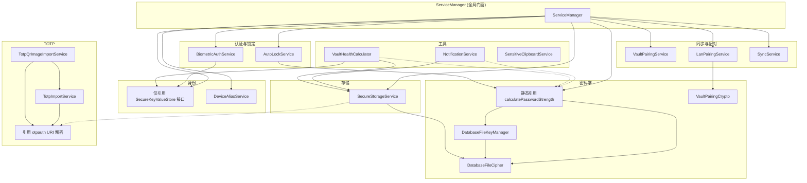

# SecretRoy 服务层开发速查目录

> **文档定位**：面向日常开发的参考手册，不是新人入门指南。  
> **覆盖范围**：`lib/services/*.dart`（18 个服务文件）+ `lib/system/service_manager/`（10 个 Coordinator）  
> **生成依据**：`01_services_api_scan.md`（2026-05-16）+ `00_tech_baseline_overview.md`

---

## 一、18 个服务文件总览

| # | 文件 | 核心类 | 一句话职责 |
|---|------|--------|-----------|
| 1 | `auto_lock_service.dart` | `AutoLockService` | 应用生命周期监听与自动锁定策略 |
| 2 | `biometric_auth_service.dart` | `BiometricAuthService` | 生物识别启用/禁用/解锁及主密码包装存储 |
| 3 | `database_file_cipher.dart` | `DatabaseFileCipher` | 本地数据库文件的 AES-GCM-256 二进制信封加密/解密 |
| 4 | `database_file_key_manager.dart` | `DatabaseFileKeyManager` | 主密码派生包装密钥，管理 DB 文件密钥的 envelope 加解密与轮换 |
| 5 | `device_alias_service.dart` | `DeviceAliasService` | 设备别名的本地缓存、解析与国际化回退 |
| 6 | `enhanced_crypto_service.dart` | `EnhancedCryptoService` | 主密码 PBKDF2 验证、DB 密钥解锁、密码生成与强度计算 |
| 7 | `identity_service.dart` | `IdentityService` | 设备与 Vault 身份生成/校验/导出/导入，管理私钥与对称密钥 |
| 8 | `lan_pairing_service.dart` | `LanPairingService` | LAN 局域网配对广播、配对码协商、HTTP claim 与 X25519 加密传输 |
| 9 | `notification_service.dart` | `NotificationService` | 本地通知初始化、密码过期/弱密码通知生成、定时提醒调度 |
| 10 | `secure_storage_service.dart` | `SecureStorageService` | 加密 SQLite 运行时管理、CRUD、Schema 升级、原子写与备份恢复 |
| 11 | `sensitive_clipboard_service.dart` | `SensitiveClipboardService` | 敏感内容剪贴板复制与 SHA-256 hash 防误删定时清理 |
| 12 | `service_manager.dart` | `ServiceManager` | 全局单例门面，编排所有服务生命周期、解锁/锁定/同步/配对 |
| 13 | `totp_import_service.dart` | `TotpImportService` | 从纯文本/URI/标签中提取并标准化 TOTP 配置字符串 |
| 14 | `totp_qr_image_import_service.dart` | `TotpQrImageImportService` | 从剪贴板图片或字节流解码 QR 码并转为 TOTP 配置 |
| 15 | `totp_service.dart` | `TotpService` | RFC 6238 TOTP 生成、otpauth URI 解析、Base32 编解码 |
| 16 | `vault_health_calculator.dart` | `VaultHealthCalculator` | 保险库健康评分计算（弱密码、重复密码、备份年龄、冲突等） |
| 17 | `vault_pairing_crypto.dart` | `VaultPairingCrypto` | X25519 + AES-GCM-256 配对 bundle 加密/解密 |
| 18 | `vault_pairing_service.dart` | `VaultPairingService` | 服务端配对会话 HTTP API 封装（创建/加入/审批/拉取 bundle） |

---

## 二、改功能速查表

| 我要改的功能 | 应该看哪个文件 | 可能还要看的文件 |
|-------------|--------------|----------------|
| 改密码生成逻辑（长度、字符集、强度算法） | `enhanced_crypto_service.dart` | — |
| 改密码强度计算规则 | `enhanced_crypto_service.dart` | `vault_health_calculator.dart` |
| 改同步冲突处理 / 字段级合并策略 | `sync/crdt_merge_engine.dart` | `sync/totp_credential_merge_engine.dart` |
| 改 TOTP 解析（otpauth URI、JSON、纯 secret） | `totp_service.dart` | `totp_import_service.dart` |
| 改 TOTP QR 图片解码 | `totp_qr_image_import_service.dart` | `totp_import_service.dart` |
| 改剪贴板敏感内容清理策略 | `sensitive_clipboard_service.dart` | — |
| 改生物识别解锁流程 | `biometric_auth_service.dart` | `service_manager.dart`（门面入口） |
| 改自动锁定时间间隔或前后台策略 | `auto_lock_service.dart` | — |
| 改本地数据库 Schema / 新增业务表 | `secure_storage_service.dart` | — |
| 改数据库文件加密格式（magic、version、nonce） | `database_file_cipher.dart` | `secure_storage_service.dart` |
| 改主密码验证 / 修改主密码 | `enhanced_crypto_service.dart` | `database_file_key_manager.dart` |
| 改设备身份生成 / 恢复码导出导入 | `identity_service.dart` | `vault_pairing_crypto.dart` |
| 改服务端配对 HTTP API 调用 | `vault_pairing_service.dart` | `vault_pairing_crypto.dart` |
| 改 LAN 局域网配对广播/发现 | `lan_pairing_service.dart` | `sync/lan_sync_coordinator.dart` |
| 改同步 Payload 加密格式 | `sync/sync_payload_codec.dart` | `identity_service.dart`（密钥材料） |
| 改同步状态机 / 拉取推送流程 | `sync/sync_service.dart` + `sync/sync_service_pull.dart` + `sync/sync_service_push.dart` | `sync/sync_service_conflict.dart` |
| 改批准制推送（outbox 审批流程） | `sync/sync_service_push.dart` | `secure_storage_service.dart`（`loadOpenLocalSyncChanges`） |
| 改 LAN 同步数据传输流程 | `sync/lan_sync_client.dart` + `sync/lan_sync_host_handler.dart` | `sync/lan_sync_coordinator.dart` |
| 改保险库健康检查评分项 | `vault_health_calculator.dart` | `secure_storage_service.dart` |
| 改通知内容（弱密码/过期密码文案） | `notification_service.dart` | `vault_health_calculator.dart` |
| 改设备别名显示 / 国际化回退 | `device_alias_service.dart` | — |
| 改账号/模板/冲突日志的 CRUD | `secure_storage_service.dart` | — |
| 改解锁流程整体编排 | `system/service_manager/vault_unlock_coordinator.dart` | `service_manager.dart` |
| 改同步服务器地址解析优先级 | `system/service_manager/sync_server_url_store.dart` | `system/service_manager/sync_coordinator.dart` |
| 改数据导入导出（备份包） | `system/service_manager/vault_import_export_coordinator.dart` | `system/service_manager/vault_dump_coordinator.dart` |
| 改配对流程 UI 背后的协调逻辑 | `system/service_manager/vault_pairing_coordinator.dart` | `vault_pairing_service.dart` |

---

## 三、服务详细 API 与依赖

### 3.1 认证与锁定

#### `AutoLockService` (`auto_lock_service.dart`)
- **职责**：监听 `AppLifecycleState`，在切后台/超时时自动锁定应用。
- **关键方法**：`initialize()`, `setDuration(AutoLockDuration)`, `onAppLifecycleStateChanged()`, `lock()`, `unlock()`
- **依赖**：`EnhancedCryptoService`（锁定后清理密钥状态）
- **状态**：`AutoLockState`（unlocked / locked / backgroundTimer）

#### `BiometricAuthService` (`biometric_auth_service.dart`)
- **职责**：封装 `local_auth`，管理生物识别的启用/禁用/解锁。
- **关键方法**：`getStatus()`, `enableBiometric(String masterPassword)`, `unlockWithBiometric()`, `disableBiometric()`
- **依赖**：`SecureKeyValueStore` 接口（存储加密后的主密码）
- **注意**：启用生物识别时，主密码用设备密钥加密后存入 `FlutterSecureStorage`。

---

### 3.2 密码学与密钥管理

#### `EnhancedCryptoService` (`enhanced_crypto_service.dart`)
- **职责**：主密码学门面。PBKDF2 验证、数据库密钥解锁、密码生成、强度评分。
- **关键方法**：
  - `initMasterKey(String)` — 验证/初始化主密码，解锁 DB 密钥
  - `updateMasterPassword(old, new)` — 修改主密码并轮换 envelope
  - `verifyMasterPassword(String)` — 仅验证，不解锁
  - `generatePassword(...)` (static) — 安全随机密码生成
  - `calculatePasswordStrength(String)` (static) — 强度评分 0-100
- **依赖**：`DatabaseFileCipher`, `DatabaseFileKeyManager`

#### `DatabaseFileCipher` (`database_file_cipher.dart`)
- **职责**：纯加密原语。AES-GCM-256 二进制信封，附加 `magic + version + nonce + mac` 头。
- **关键方法**：`encrypt(Uint8List)`, `decrypt(Uint8List)`, `looksEncrypted(...)` (static), `generateKeyBytes()` (static)
- **无外部依赖**（纯算法类）

#### `DatabaseFileKeyManager` (`database_file_key_manager.dart`)
- **职责**：主密码 → PBKDF2 派生包装密钥 → 解密/加密数据库文件密钥的 envelope。
- **关键方法**：`unlock(String password)` → `Uint8List`（DB 文件密钥）, `rotateEnvelope(newPassword, databaseKeyBytes)`
- **依赖**：`SecureStorageReader/Writer/Deleter` typedef（注入函数引用）

#### `VaultPairingCrypto` (`vault_pairing_crypto.dart`)
- **职责**：X25519 密钥交换 + AES-GCM-256 加密配对 bundle。
- **关键方法**（全静态）：`createKeyPair()`, `encryptBundle(plainBundle, requesterPublicKey)`, `decryptBundle(wrappedBundle, keyPair)`
- **无外部依赖**

---

### 3.3 身份与设备

#### `IdentityService` (`identity_service.dart`)
- **职责**：设备与 Vault 身份的全生命周期。生成 `deviceId`、`vaultId`、`privateKey`、`symmetricKey`；管理 API token；导出/导入加密恢复码。
- **关键方法**：
  - `initialize({allowGenerateVaultIdentity})` — 加载或生成身份
  - `exportSecureLinkCode(password, ...)` — PBKDF2+AES-GCM-256 加密导出
  - `importSecureLinkCode(secureCode, password)` — 解密并导入
  - `previewSecureLinkCode(...)` / `applyImportPreview(...)` — 预览+应用两步导入
- **依赖**：`SecureKeyValueStore`, `Uuid`
- **⚠️ 废弃**：`exportTransferCode()` 为明文 base64 导出，已废弃。

#### `DeviceAliasService` (`device_alias_service.dart`)
- **职责**：设备显示名称的本地缓存与国际化回退。
- **关键方法**：`create()` (工厂), `resolve(context, deviceId)`, `setAlias(deviceId, alias)`
- **依赖**：`SharedPreferences`

---

### 3.4 存储

#### `SecureStorageService` (`secure_storage_service.dart`)
- **职责**：加密 SQLite 运行时数据库的唯一入口。Schema 管理、CRUD、原子写、备份恢复、同步变更箱。
- **关键方法**：
  - `initialize({deviceId})` / `close()` — 运行时数据库生命周期
  - `saveAccount(AccountItem)` / `deleteAccount(id)` / `togglePin(id)`
  - `saveTemplate(AccountTemplate)` / `deleteTemplate(id)`
  - `saveTotpCredential(TotpCredential)` / `deleteTotpCredential(id)`
  - `recordLocalSyncChange(...)` / `loadOpenLocalSyncChanges()` — 同步变更箱
  - `saveConflictLogs(...)` / `getConflictLogs(...)` — 冲突日志
  - `replaceAllDataForImport(...)` — 导入覆盖（T14 规则）
- **依赖**：`DatabaseFileCipher`（构造函数注入 / setter）
- **⚠️ 注意**：`deleteTemplate` 会检查是否仍有账号引用，有则抛异常。

---

### 3.5 同步与配对

#### `VaultPairingService` (`vault_pairing_service.dart`)
- **职责**：服务端配对 HTTP API 的纯客户端封装。
- **关键方法**：`createSession(...)`, `joinSession(...)`, `getHostSessionStatus(...)`, `approveSession(...)`, `getBundle(...)`
- **无 Dart 层依赖**（纯 `http` 调用）

#### `LanPairingService` (`lan_pairing_service.dart`)
- **职责**：LAN 局域网配对的 UDP 广播 + HTTP claim。
- **关键方法**：`startHosting(...)`, `stopHosting()`, `claimTransferCodeByCode(...)`, `discoverHost(...)`, `normalizePairingCode()` (static)
- **依赖**：`VaultPairingCrypto`（静态调用）

---

### 3.6 TOTP

#### `TotpService` (`totp_service.dart`)
- **职责**：RFC 6238 TOTP 生成与配置解析。
- **关键方法**：`parseConfig(raw)` (static), `generate(config, {at})`, `hotp(...)` (static), `decodeBase32(secret)` (static)
- **数据类**：`TotpConfig`, `TotpCode`, `TotpAlgorithm`（sha1 / sha256 / sha512）

#### `TotpImportService` (`totp_import_service.dart`)
- **职责**：从任意文本中提取并标准化 TOTP 配置字符串。
- **关键方法**（全静态）：`normalizeImportValue(String)`, `extractCandidate(String)`

#### `TotpQrImageImportService` (`totp_qr_image_import_service.dart`)
- **职责**：从图片字节流解码 QR 码并转为 TOTP 配置。
- **关键方法**（全静态）：`normalizeClipboardQrImage(...)`, `normalizeImageBytes(Uint8List)`, `decodeQrImage(Uint8List)`
- **依赖**：`zxing2` 包

---

### 3.7 工具

#### `NotificationService` (`notification_service.dart`)
- **职责**：本地推送通知的初始化、生成与定时调度。
- **关键方法**：`init()`, `generatePasswordExpiryNotifications(...)`, `generateWeakPasswordNotifications(...)`, `scheduleDailyCheck(...)`
- **依赖**：`SecureStorageService`（读取账号数据扫描）

#### `VaultHealthCalculator` (`vault_health_calculator.dart`)
- **职责**：保险库健康评分计算。
- **关键方法**：`calculate()` → `VaultHealthReport`, `checkWeakPasswords(...)` / `checkReusedPasswords(...)` / `checkStaleRecords(...)` (static)
- **依赖**：`SecureStorageService`, `IdentityService`, `EnhancedCryptoService`（静态引用 `calculatePasswordStrength`）

#### `SensitiveClipboardService` (`sensitive_clipboard_service.dart`)
- **职责**：敏感内容剪贴板复制 + 定时清理。
- **关键方法**（全静态）：`copy({required text, level, clearAfter})`, `cancelPendingClear()`
- **机制**：复制时计算 SHA-256 hash，清理前再次比对 hash，防止误删用户后续复制的内容。

---

### 3.8 全局门面

#### `ServiceManager` (`service_manager.dart`)
- **职责**：全局单例门面。不实现业务规则，只做**编排**和**状态聚合**。
- **状态**：`ServiceManagerState`（uninitialized / locked / unlocking / unlocked / error）
- **关键方法**：
  - 解锁：`unlockWithPassword()`, `unlockWithBiometric()`
  - 业务代理：`saveAccount()`, `deleteAccount()`, `saveTemplate()`, `syncNow()`, `connectToSyncServer()` 等
  - 配对代理：`createVaultPairingSession()`, `joinVaultPairingSession()`, `startLanVaultPairingHost()` 等
- **内部持有**：18 个服务 + 10 个 Coordinator 的引用（详见第 5 节）

---

## 四、服务间依赖关系图



### 注入方式汇总

| 依赖方 | 被依赖方 | 注入方式 |
|--------|---------|---------|
| `ServiceManager` | 全部服务 | 内部硬编码构造（单例模式） |
| `AutoLockService` | `EnhancedCryptoService`, `FlutterSecureStorage` | 构造函数注入 |
| `BiometricAuthService` | `SecureKeyValueStore`, `LocalAuthentication` | 构造函数注入 |
| `DatabaseFileKeyManager` | `SecureStorageReader/Writer/Deleter` | 构造函数注入（函数引用） |
| `EnhancedCryptoService` | `FlutterSecureStorage` | 构造函数注入 |
| `IdentityService` | `SecureKeyValueStore`, `Uuid` | 构造函数注入 |
| `LanPairingService` | `VaultPairingCrypto` | 直接静态方法调用 |
| `NotificationService` | `SecureStorageService` | 构造函数注入 |
| `SecureStorageService` | `DatabaseFileCipher` | 构造函数注入 / setter |
| `VaultHealthCalculator` | `SecureStorageService`, `IdentityService` | 构造函数注入 |

---

## 五、ServiceManager → Coordinator → Service 调用链

`ServiceManager` 当前已拆分出 **10 个 Coordinator**，将具体流程编排从门面中剥离。日常开发中，如果你发现 `ServiceManager` 的某个门面方法只是转发，实际逻辑大概率在对应的 Coordinator 里。

### 5.1 Coordinator 清单（`lib/system/service_manager/`）

| 文件 | 类名 | 职责 |
|------|------|------|
| `vault_unlock_coordinator.dart` | `VaultUnlockCoordinator` | 解锁流程编排：Identity → Crypto → Storage 链式初始化 |
| `sync_coordinator.dart` | `SyncCoordinator` | 同步服务器地址解析、SyncService 惰性管理、连接/断开/立即同步编排 |
| `lan_sync_coordinator.dart` | `LanSyncCoordinator` | LAN 同步生命周期协调、角色管理（Host/Requester） |
| `vault_pairing_coordinator.dart` | `VaultPairingCoordinator` | 服务端配对流程编排（创建会话 → 等待加入 → 审批 → 拉取 bundle） |
| `vault_import_export_coordinator.dart` | `VaultImportExportCoordinator` | 数据导入导出、备份包生成与验证 |
| `vault_dump_coordinator.dart` | `VaultDumpCoordinator` | Vault 数据快照 dump 与恢复 |
| `vault_data_repository.dart` | `VaultDataRepository` | 对 SecureStorageService 的 Repository 模式封装 |
| `sync_server_url_store.dart` | `SyncServerUrlStore` | 同步服务器地址的持久化与优先级解析 |
| `default_sync_server_url.dart` | — | 默认同步服务器地址常量 |
| `password_tools.dart` | — | 密码工具相关常量/辅助函数 |

### 5.2 典型调用链示例

#### 解锁流程
```
ServiceManager.unlockWithPassword(password)
  └── VaultUnlockCoordinator.initializeAndUnlock(password)
        ├── IdentityService.initialize()
        ├── EnhancedCryptoService.initMasterKey(password)
        │     └── DatabaseFileKeyManager.unlock(password)
        ├── SecureStorageService.setDatabaseCipher(cipher)
        ├── SecureStorageService.initialize(deviceId)
        └── AutoLockService.unlock()
  └── DeviceAliasService.create()          ← 解锁成功后初始化
  └── state = unlocked
```

#### 同步流程
```
ServiceManager.syncNow()
  └── SyncCoordinator.syncNow()
        └── SyncService.syncNow()
              ├── sync_service_pull.dart   ← GET /vaults/:id/sync
              ├── sync_service_push.dart   ← POST /vaults/:id/sync
              └── sync_service_conflict.dart ← 409 冲突恢复
```

#### 配对流程
```
ServiceManager.createVaultPairingSession(...)
  └── VaultPairingCoordinator.createSession(...)
        └── VaultPairingService.createSession(...)

ServiceManager.joinVaultPairingSession(...)
  └── VaultPairingCoordinator.joinAndFetchBundle(...)
        ├── VaultPairingService.joinSession(...)
        ├── VaultPairingService.getBundle(...)
        └── VaultPairingCrypto.decryptBundle(...)
```

#### 数据导入流程
```
ServiceManager.importVaultLinkCode(...)
  └── VaultImportExportCoordinator.import(...)
        ├── IdentityService.previewSecureLinkCode(...)
        ├── VaultDumpCoordinator.restoreFromDump(...)
        └── SecureStorageService.replaceAllDataForImport(...)
```

### 5.3 调用链规则

1. **Views/Providers 只调 ServiceManager**。不允许跨层直接调 Coordinator 或 Service。
2. **ServiceManager 优先委托 Coordinator**。简单代理（如 `saveAccount`）直接转发到 `SecureStorageService`；复杂流程（解锁、同步、配对）委托 Coordinator。
3. **Coordinator 可以跨 Service 组合**。Coordinator 持有多个 Service 引用，编排它们的调用顺序。
4. **Service 之间尽量不直接调用**。例外：纯静态工具方法（如 `VaultPairingCrypto`）和接口抽象（如 `SecureKeyValueStore`）。

---

## 六、文档与代码一致性备注

- 本目录基于 2026-05-16 的代码扫描生成，覆盖 `lib/services/*.dart` 全部 18 个文件。
- `ServiceManager` 内部服务列表、解锁流程、同步服务器地址解析逻辑，与旧文档 `docs/guides/technical-documentation.md` 存在漂移，以本文档为准。
- 18 个公共类/枚举中，仅 `SensitiveClipboardService` 有完整类级 dartdoc，其余均缺失。如需补充 dartdoc，参考 `sensitive_clipboard_service.dart` 的写法。
