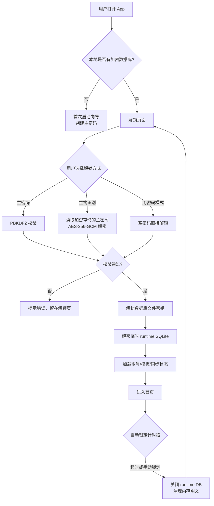
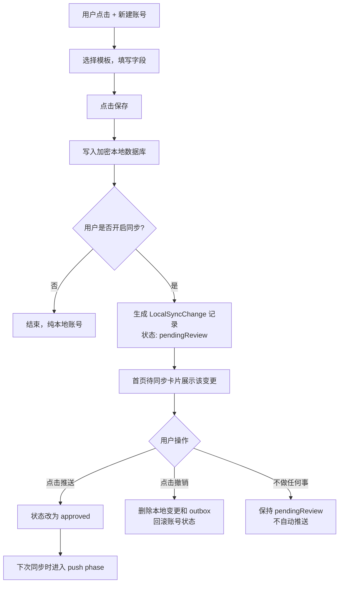
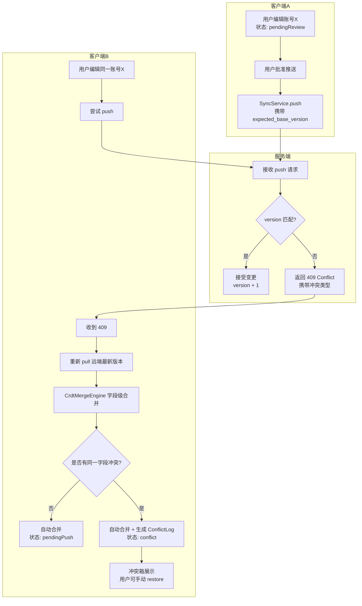
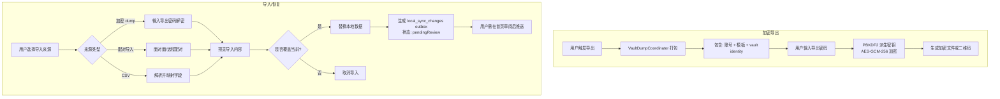

# SecretRoy 业务说明文档

**版本**: v1.0.0
**最后更新**: 2026-05-06
**适用对象**: 产品经理、开发者、测试、运营

---

## 1. 产品定位

SecretRoy 是一款**本地优先的个人敏感信息保险库**。核心承诺是：

> "你的数据首先属于你自己，保存在你自己的设备上，加密后可选同步到你自有的其他设备。"

### 1.1 价值主张

| 用户痛点 | SecretRoy 的解法 |
|---|---|
| 不信任云端密码管理器 | 本地加密 SQLite，主密码只有用户知道 |
| 多设备密码不同步 | 自托管同步服务器，端到端加密传输 |
| 误删/改密码后无法恢复 | CRDT 冲突日志 + 本地审阅队列 |
| 2FA 分散在各 Authenticator 里 | 独立 TOTP 凭据，与账号模板关联 |
| 换设备迁移痛苦 | 面对面链接 / 离线恢复码 / 远程配对 |

### 1.2 明确不做

- 不做企业管理员控制台、团队共享、SSO
- 不做云端托管账号系统
- 不做浏览器自动填充插件（当前阶段）
- 不做暗网监控、密码泄露查询

---

## 2. 核心业务流程

### 2.1 解锁与 Session 生命周期

用户每次打开应用，必须先解锁才能访问保险库。

**关键业务规则**:
- 解锁期间，数据库以明文形式存在于临时文件 `secret_roy_vault.runtime.db`。
- 锁定或应用退后台超时时，必须删除该临时文件。
- 生物识别只解锁设备本地的加密主密码副本，不替代主密码本身。
- 无密码模式自动禁用生物识别（因为空密码 + 生物识别 = 零安全）。

---

### 2.2 账号创建与本地审阅

SecretRoy 的核心差异点：**保存账号后不会自动推送到服务器**，而是进入本地审阅队列，由用户确认后才允许同步。

**关键业务规则**:
- `create -> delete`: 直接取消 outbox，删除本地草稿，不留下痕迹。
- `update -> update`: 合并为一条 update，保留最早的 `before` 快照。
- `update -> delete`: 转为 delete，保留最早的 `before` 快照。
- 启动同步、周期同步、手动同步**都不能绕过** `pendingReview` 状态。

---

### 2.3 多设备同步与冲突处理

同步采用 **Pull -> Merge -> Push** 三段式，服务端仅作为无状态密文中转站。

**冲突类型与处理策略**:

| 冲突类型 | 触发场景 | 自动处理 | 用户可见 |
|---|---|---|---|
| `remote_missing` | 推送时远端记录已被删除 | 生成冲突记录，用户选择覆盖远端或接受删除 | 冲突箱 |
| `stale_base_version` | 本地 base version 落后于远端 | 重新 pull + CRDT merge | 仅当字段冲突时进冲突箱 |
| `concurrent_edit` | 多设备同时编辑同一记录 | 字段级 HLC 合并，冲突字段进 conflict log | 冲突箱（若同一字段） |
| `concurrent_delete` | 一方删除，一方编辑 | Tombstone 优先：删除 HLC 大者胜出 | Toast 提示 |
| `invalid_payload` | payload 被篡改或格式错误 | 同步失败，进入 protocolError | 同步设置页错误状态 |

---

### 2.4 TOTP 2FA 全流程

TOTP 在 SecretRoy 中是**独立加密对象**，不与账号字段耦合，通过模板字段建立关联。

```mermaid
flowchart TD
    subgraph 导入
        I1[用户获取 TOTP 来源] --> I2{来源类型}
        I2 -->|手机扫码| I3[mobile_scanner 相机扫码]
        I2 -->|桌面粘贴图片| I4[pasteboard + zxing2 解码]
        I2 -->|otpauth URI 文本| I5[直接解析文本]
        I3 --> I6[解析 otpauth:// 参数]
        I4 --> I6
        I5 --> I6
        I6 --> I7[创建 TotpCredential<br/>存入加密 totp_credentials 表]
    end

    subgraph 关联
        L1[用户编辑账号] --> L2[模板含 2FA 字段]
        L2 --> L3[展示关联 2FA 面板]
        L3 --> L4{用户操作}
        L4 -->|选择已有| L5[建立 linkedAccountIds 关联]
        L4 -->|新建| L6[跳转新建 TOTP 流程]
        L4 -->|取消关联| L7[移除 linkedAccountIds]
    end

    subgraph 使用
        U1[首页账号列表] --> U2{账号是否关联 TOTP?}
        U2 -->|是| U3[列表显示 2FA 已配置图标]
        U2 -->|否| U4[不显示]
        U3 --> U5[用户进入 2FA 标签页]
        U5 --> U6[TotpService.generateCode]
        U6 --> U7[显示 6 位验证码 + 倒计时]
        U7 --> U8[用户点击复制]
        U8 --> U9[SensitiveClipboardService.copy<br/>45秒后自动清理]
    end

    subgraph 同步
        Y1[账号或 TOTP 变更] --> Y2[进入 local_sync_changes outbox]
        Y2 --> Y3[用户批准后 push]
        Y3 --> Y4[SyncPayloadCodec 加密为 sroy-sync: AEAD]
        Y4 --> Y5[服务端只存密文]
        Y5 --> Y6[其他设备 pull 后解密并合并]
    end
```

**关键业务规则**:
- TOTP secret **绝不**进入账号 `data` 字段、搜索摘要、账号列表明文或服务端明文。
- 未审阅的 TOTP credential **不会自动 push**。
- 删除账号**不会级联删除**关联的 TOTP credential（独立对象）。
- TOTP 凭据冲突走独立的 `TotpCredentialMergeEngine`，字段级 HLC 合并。

---

### 2.5 设备配对与密钥恢复

新设备加入已有 Vault 时，必须安全地传递 `vaultId` + `privateKey` + `symmetricKey` + `vaultApiToken`，同时保留新设备独立的 `deviceId`。

**关键业务规则**:
- 密钥同步**只共享 vault 身份**，接收设备保留自己的 `deviceId`。
- `sroy-link:` 是内部兼容码，**不作为普通用户恢复入口**。
- 导入前必须**预览**（显示账号数、模板数、vaultId），用户确认覆盖后才写入。
- 新 vault 首次连接服务器时自动获得 `vaultApiToken`，后续同步必须携带 `X-Vault-Token`。

---

### 2.6 备份、恢复与导入

**关键业务规则**:
- 导入后**不自动标记为 synchronized**，而是进入 outbox 审阅队列。
- 覆盖前必须明确确认，禁止半成功状态。
- 加密 dump 的导出密码**独立于主密码**，用户可自选。

---

## 3. 用户旅程地图

### 3.1 新用户首次启动

| 阶段 | 用户行为 | 系统响应 | 业务目标 |
|---|---|---|---|
| 发现 | 搜索/推荐了解到 SecretRoy | 展示"本地优先"价值 | 建立信任心智 |
| 安装 | 下载并打开 App | 检测是否首次启动 | - |
| 创建 | 设置主密码 | PBKDF2 派生，创建加密数据库 | 安全基底 |
| 首增 | 添加第一个账号 | 使用网站模板，快速保存 | 激活价值 |
| 探索 | 浏览设置、模板、安全页 | 展示生物识别、自动锁定、同步选项 | 功能发现 |
| 留存 | 日常查看/复制密码 | 快速解锁、敏感剪贴板自动清理 | 习惯养成 |

### 3.2 多设备用户同步旅程

| 阶段 | 用户行为 | 系统响应 | 业务目标 |
|---|---|---|---|
| 认知 | 意识到需要在第二台设备使用 | 设置页展示配对选项 | 功能发现 |
| 选择 | 判断网络环境 | 局域网 -> 面对面链接；异地 -> 远程配对 | 降低门槛 |
| 执行 | 按步骤完成配对 | 安全传递 vault identity，保留 deviceId | 安全连接 |
| 验证 | 第二台设备执行首次同步 | pull 远端数据，解密，合并 | 数据一致性 |
| 日常 | 双设备编辑 | outbox 审阅 + CRDT 合并 + 冲突箱 | 无缝协作 |

---

## 4. 关键业务指标（建议）

| 指标 | 定义 | 目标值 |
|---|---|---|
| 解锁成功率 | 用户输入主密码/生物识别后成功进入首页的比例 | > 99.5% |
| 同步冲突率 | 每次同步触发冲突恢复的比例 | < 5% |
| outbox 积压率 | pendingReview 超过 7 天未处理的比例 | < 10% |
| TOTP 导入成功率 | 扫码/粘贴/文本导入成功创建凭据的比例 | > 95% |
| 配对完成率 | 开始配对流程到成功导入 identity 的比例 | > 90% |
| 主密码遗忘率 | 用户因忘记主密码而重置/丢失数据的比例 | 无法直接统计，依赖用户反馈 |

---

## 5. 附录：术语表

| 术语 | 说明 |
|---|---|
| **Vault** | 逻辑上的数据保险库，由 `vaultId` 唯一标识，可跨多设备同步 |
| **Device** | 物理设备，由 `deviceId` 唯一标识，不随 vault 共享 |
| **Local-first** | 本地状态与本地持久化优先，网络同步是后置协调动作 |
| **Outbox** | 本地待同步变更队列（`local_sync_changes`），用户批准后才会推送 |
| **HLC** | Hybrid Logical Clock，混合逻辑时钟，用于分布式事件排序 |
| **Tombstone** | 软删除标记，用于删除状态传播 |
| **Conflict Inbox** | 供用户查看和恢复冲突值的 UI 入口 |
| **AEAD** | Authenticated Encryption with Associated Data，当前同步 payload 使用 AES-256-GCM + HKDF |
| **Thin Sync Backend** | 只承担同步协调与版本秩序的薄后端，不接触明文 |

---

**文档版本**: 1.0
**最后更新**: 2026-05-06
