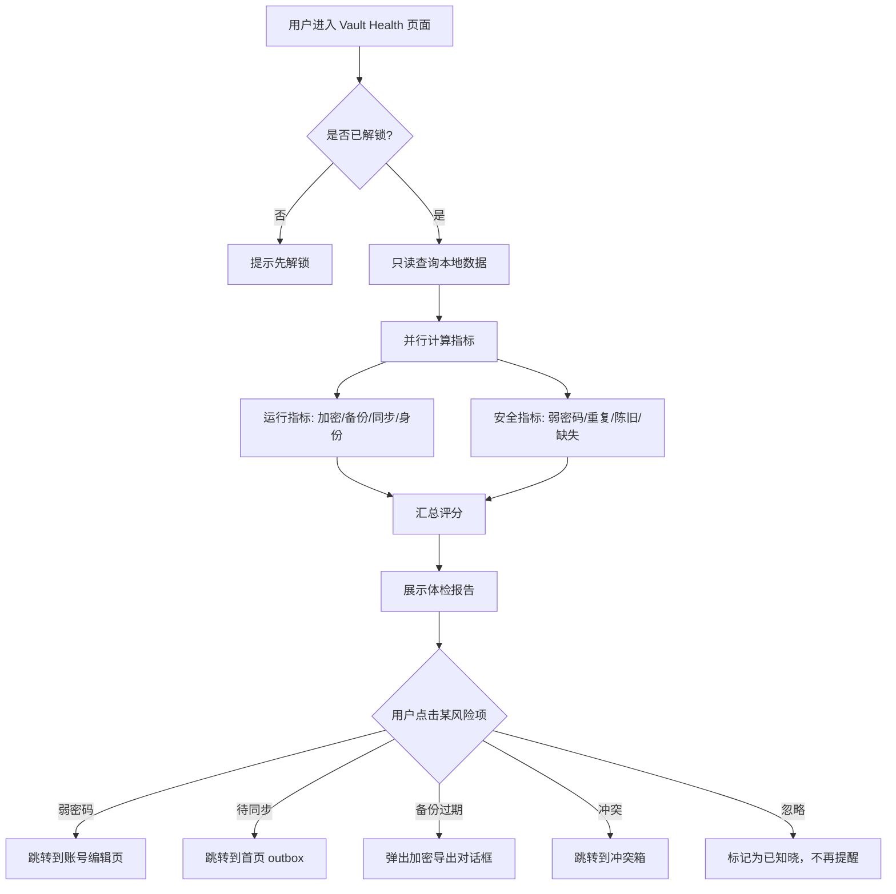
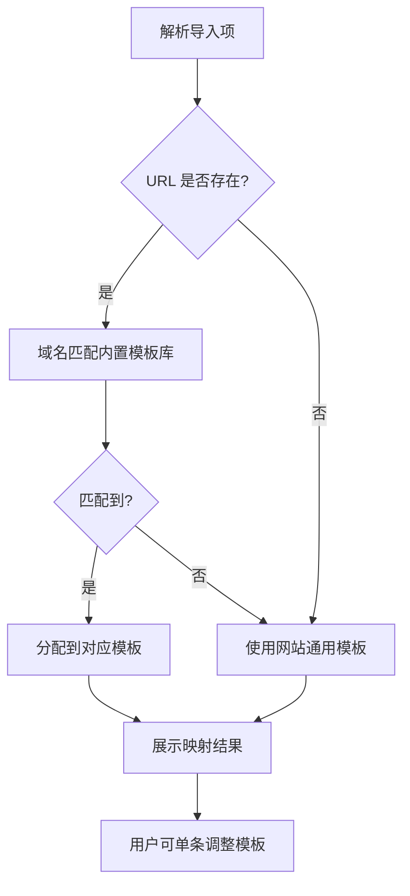

# SecretRoy 迭代功能业务说明文档

**版本**: v1.0.0
**最后更新**: 2026-05-06
**范围**: Vault Health 体检面板、一键导入向导、安全大笔记
**状态**: 待评审

---

## 功能一：Vault Health 本地体检面板

### 1.1 背景与目标

用户当前无法直观回答"我的保险库安全吗？"这个问题。安全状态散落在设置页、同步页和执行报告中，缺乏统一的产品化入口。

**目标**: 在首页或设置页提供一个**只读、离线可用、不上传数据**的体检面板，让用户在 10 秒内理解自己的安全态势，并获得可执行的下一步。

### 1.2 用户故事

- 作为用户，我想在打开 App 时看到保险库的安全评分，以便知道是否需要采取行动。
- 作为用户，我想知道哪些密码是弱密码或重复使用的，以便及时更换。
- 作为用户，我想在离线状态下也能查看体检结果，因为安全不应依赖网络。

### 1.3 体检指标与评分规则

体检指标分为两大类，每项指标有明确的风险等级和可执行动作。

#### A. 保险库运行体检（Vault Runtime Health）

| 指标 | 检查内容 | 风险等级 | 可执行动作 |
|---|---|---|---|
| 本地加密 | `secret_roy_vault.db.enc` 是否存在 | 高 | 若缺失，提示"数据库未加密，请立即备份" |
| 备份年龄 | 最近一次加密导出或同步成功时间 | 高 | >30 天提示"备份已过期"，引导导出或同步 |
| 恢复演练 | 用户是否验证过备份可恢复 | 中 | 若未演练，提示"建议测试恢复流程" |
| 待同步变更 | `local_sync_changes` 中 pendingReview 数量 | 中 | >0 时提示"有 X 条变更待审阅"，跳转到首页 |
| 冲突数量 | conflict log 未处理数量 | 中 | >0 时提示"有 X 条冲突待处理"，跳转到冲突箱 |
| vault identity | `vaultId`/`deviceId` 是否完整 | 高 | 损坏时提示"身份异常，请重新配对" |
| 同步认证 | `vaultApiToken` 是否存在 | 低 | 无 token 时提示"首次同步将自动获取 token" |

#### B. 账号安全体检（Credential Security Health）

| 指标 | 检查内容 | 风险等级 | 可执行动作 |
|---|---|---|---|
| 弱密码 | 密码长度 < 8 或强度分数 < 40 | 高 | 列表展示，一键跳转到编辑页 |
| 重复密码 | 两个及以上账号使用相同密码 | 高 | 列表展示，建议分批更换 |
| 陈旧记录 | 超过 180 天未修改的密码 | 中 | 列表展示，建议轮换 |
| 不完整记录 | 缺少 URL、邮箱或关键字段的账号 | 低 | 列表展示，引导补全 |
| 缺少 2FA | 网站模板账号未关联 TOTP 凭据 | 中 | 列表展示，引导添加 2FA |
| 缺少恢复码 | 关键账号未填写恢复码字段 | 低 | 列表展示，引导补全 |

### 1.4 评分算法（建议）

```
总分 = 100
- 每项高风险未通过: -15
- 每项中风险未通过: -8
- 每项低风险未通过: -3

评分等级:
- 90-100: 优秀 (绿色)
- 70-89:  良好 (黄色)
- 50-69:  需关注 (橙色)
- 0-49:   危险 (红色)
```

**业务规则**:
- 评分仅用于用户自我感知，**不影响任何功能可用性**。
- 所有计算在本地完成，不上传、不泄露 secret。
- 体检耗时目标 < 100ms（账号数 < 1000 时）。

### 1.5 业务流程图



### 1.6 页面结构（建议）

```
Vault Health 页面
├── 顶部: 安全评分圆环 + 等级标签
├── 中段: 风险项卡片列表（按等级排序）
│   ├── 弱密码 (3) → 点击展开账号列表
│   ├── 重复密码 (2) → 点击展开账号列表
│   └── 备份已过期 (1) → 点击触发导出
└── 底部: 上次体检时间 + 手动刷新按钮
```

### 1.7 验收标准

- [ ] 离线状态下可完整计算所有指标。
- [ ] 1000 个账号以内计算耗时 < 100ms。
- [ ] 每个风险项都能指向一个可执行的下一步操作。
- [ ] 不修改任何账号/模板/同步数据。
- [ ] 单元测试覆盖评分算法和所有指标分支。

---

## 功能二：一键导入向导

### 2.1 背景与目标

新用户从其他密码管理器或浏览器迁移到 SecretRoy 时，当前缺少产品化的导入路径。手动逐个添加账号是最大流失点。

**目标**: 提供一站式导入向导，支持常见导出格式，导入后进入本地审阅队列（复用 T0 outbox），由用户选择性确认后再同步。

### 2.2 用户故事

- 作为从 Chrome 迁移的用户，我想直接导入 Chrome 导出的 CSV，不用手动逐条添加。
- 作为从 Bitwarden 迁移的用户，我想导入 JSON 导出文件，并保留文件夹/标签结构。
- 作为用户，我想在导入前预览哪些账号会被创建，避免覆盖或重复。
- 作为用户，我想导入的账号默认进入待审阅状态，不自动同步到服务器。

### 2.3 支持的导入源（第一阶段）

| 来源 | 格式 | 映射策略 |
|---|---|---|
| Chrome/Edge | CSV | `name`→账号名, `url`→URL, `username`→文本字段, `password`→密码字段 |
| Firefox | CSV | 同上，字段名略有差异 |
| Bitwarden | JSON | 解析 `items` 数组，映射 `name`/`login`/`uris`/`fields` |
| Generic CSV | CSV | 用户手动指定列映射（账号名/URL/用户名/密码/备注） |

**明确不做（第一阶段）**:
- 1Password（.1pif/.1puux 格式复杂，第二阶段）
- KeePass（.kdbx 需要专用解析库，第二阶段）
- 自动从浏览器读取（需要系统权限，超出当前范围）

### 2.4 业务流程图

```mermaid
flowchart TD
    A[用户进入设置 -> 导入] --> B[选择导入来源]
    B --> C{来源类型}
    C -->|Chrome/Edge/Firefox| D[上传 CSV 文件]
    C -->|Bitwarden| E[上传 JSON 文件]
    C -->|Generic CSV| F[上传 CSV + 手动列映射]
    D --> G[解析文件]
    E --> G
    F --> G
    G --> H{解析结果}
    H -->|失败| I[展示错误信息<br/>格式不对/编码错误/空文件]
    H -->|成功| J[展示预览列表]
    J --> J1[账号数量]
    J --> J2[模板映射情况]
    J --> J3[重复检测<br/>与现有账号同名/同URL]
    J --> K{用户操作}
    K -->|全选导入| L[全部标记为待导入]
    K -->|选择性导入| M[用户勾选/取消单条]
    K -->|取消| N[返回，不做任何事]
    L --> O[写入本地数据库]
    M --> O
    O --> P[生成 local_sync_changes<br/>状态: pendingReview]
    P --> Q[提示"导入完成，请在首页审阅后推送"]
    Q --> R[跳转到首页 outbox]
```

### 2.5 重复检测规则

导入预览阶段必须检测与现有账号的潜在重复，避免用户创建大量冗余数据。

| 匹配维度 | 权重 | 判定为重复的条件 |
|---|---|---|
| 名称完全相同 | 高 | `account.name == existing.name` |
| URL 域名相同 | 高 | `Uri.parse(url).host == existing.host` |
| 用户名相同 | 中 | 辅助确认 |

**业务规则**:
- 高权重匹配命中时，默认**不勾选**该条导入（用户可手动勾选）。
- 预览列表中重复项用黄色警告图标标记。
- 导入**不覆盖**现有账号，只创建新账号；如需更新，用户需手动编辑。

### 2.6 模板自动映射

导入的账号需要自动匹配到现有模板，减少用户手动调整成本。



**内置域名映射（示例）**:

| 域名关键词 | 分配模板 |
|---|---|
| github.com, gitlab.com | 网站模板（含 2FA 字段） |
| google.com, gmail.com | 网站模板（含 2FA 字段） |
| taobao.com, tmall.com, jd.com | 网站模板（含 2FA 字段） |
| 无 URL 或未知域名 | 网站通用模板 |

### 2.7 与现有系统的交互

| 现有系统 | 交互方式 |
|---|---|
| `LocalSyncChange` / outbox | 导入完成后为每个新账号生成 `pendingReview` 记录 |
| `SecureStorageService` | 批量写入账号数据，复用现有 `saveAccount` 事务 |
| 模板系统 | 复用 `AccountTemplate` 匹配逻辑，不创建新模板 |
| 同步服务 | 导入不直接触发 `markDirty` 或 `syncNow`，等待用户审阅 |

### 2.8 验收标准

- [ ] Chrome CSV 100 条导入耗时 < 2 秒。
- [ ] 预览阶段正确检测 90% 以上的重复项。
- [ ] 导入的账号默认进入首页 outbox 审阅队列。
- [ ] 解析失败时给出人类可读的错误信息（编码错误、缺少必需列等）。
- [ ] 不覆盖、不删除现有账号数据。

---

## 功能三：安全大笔记模板

### 3.1 背景与目标

当前模板系统主要服务于"结构化账号"（网站登录、银行卡等），但用户有大量非结构化敏感信息需要保存：API Key、SSH 私钥、软件许可证、家庭 WiFi 密码、加密钱包助记词等。这些信息不适合硬塞进"账号名/密码"的框架里。

**目标**: 在现有模板系统上扩展一个**安全大笔记**类型，支持多行文本和代码块，同时复用现有的加密存储、同步、剪贴板清理机制。

### 3.2 用户故事

- 作为开发者，我想安全保存我的 AWS Access Key 和 Secret Key，并能在需要时快速复制。
- 作为用户，我想保存我的家庭路由器和 NAS 的登录信息，格式自由。
- 作为用户，我想保存软件许可证密钥，并知道它会在剪贴板中自动清理。

### 3.3 模板设计

安全大笔记本质上是一种特殊的 `AccountTemplate`，但使用体验更接近"加密备忘录"。

#### 内置模板：安全笔记

| 字段 | 类型 | 属性 | 说明 |
|---|---|---|---|
| 标题 | text | isRequired, isPrimary | 笔记名称 |
| 内容 | note | isRequired, isSecret | 大文本区域，默认隐藏 |
| 标签 | text | isSearchable | 用于分类和搜索 |
| 过期提醒 | time | - | 可选，如 API Key 轮换日期 |

#### 字段类型扩展：`note`（大文本）

```dart
enum AccountFieldType {
  // ... 现有类型
  note, // 新增: 多行大文本，支持代码块显示
}
```

**`note` 类型的特殊属性**:
- 输入区域为多行文本框（最小 4 行，最大 20 行）。
- 默认以密码圆点隐藏，点击眼睛图标展开明文。
- 复制时走 `SensitiveClipboardService.copy`，45 秒后自动清理。
- 搜索时只索引标题和标签字段，不索引大文本内容（避免性能问题）。

### 3.4 业务流程图

```mermaid
flowchart TD
    subgraph 创建
        C1[用户选择"安全笔记"模板] --> C2[填写标题和内容]
        C2 --> C3[可选: 添加标签和过期提醒]
        C3 --> C4[保存]
        C4 --> C5[写入 encrypted accounts 表]
        C5 --> C6[若开启同步，进入 outbox pendingReview]
    end

    subgraph 查看
        V1[用户在列表看到安全笔记] --> V2[标题 + 标签展示]
        V2 --> V3{用户点击}
        V3 --> V4[详情页展示]
        V4 --> V5[内容默认隐藏]
        V5 --> V6{用户点击眼睛图标}
        V6 -->|显示| V7[明文展示，支持代码高亮]
        V6 -->|隐藏| V5
    end

    subgraph 复制
        Y1[用户点击复制按钮] --> Y2[复制全部内容到剪贴板]
        Y2 --> Y3[SensitiveClipboardService<br/>高风险 45 秒清理]
        Y3 --> Y4[Toast 提示"已复制，45 秒后自动清理"]
    end

    subgraph 同步
        S1[用户批准 outbox] --> S2[SyncPayloadCodec 加密]
        S2 --> S3[push 到服务端]
        S3 --> S4[其他设备 pull 后解密合并]
        S4 --> S5[安全笔记作为普通账号走 CRDT 合并]
    end
```

### 3.5 与现有系统的兼容性

| 现有系统 | 兼容性策略 |
|---|---|
| `AccountItem` / `AccountTemplate` | 完全复用，不新增数据模型，只新增字段类型 |
| `SecureStorageService` | 复用 `saveAccount`/`loadAccounts`，`data` 字段存大文本 |
| `SyncService` / `CrdtMergeEngine` | 复用现有字段级 CRDT 合并，大文本作为单个字段处理 |
| `SensitiveClipboardService` | 复用高风险清理策略 |
| 搜索 | 大文本内容不参与搜索索引，只搜标题和标签 |

### 3.6 安全考虑

- **内存安全**: 大文本在运行时与密码字段同等处理，页面离开时清理控制器中的明文缓存。
- **同步安全**: 走现有 `sroy-sync:` AEAD envelope，不新增协议。
- **显示安全**: 截屏/录屏时，内容默认隐藏；切换到多任务视图时，若已开启安全模式则自动模糊处理。

### 3.7 验收标准

- [ ] 安全笔记的创建、查看、编辑、删除与账号操作体验一致。
- [ ] 大文本内容（1MB 以内）的保存和加载耗时 < 200ms。
- [ ] 内容默认隐藏，复制后 45 秒自动清理。
- [ ] 同步后多设备内容完全一致，冲突时按 HLC 字段级合并。
- [ ] 搜索只命中标题和标签，不暴露大文本内容。

---

## 4. 迭代排期建议

| 优先级 | 功能 | 预估工作量 | 前置依赖 | 关键验证 |
|---|---|---|---|---|
| P0 | Vault Health 体检面板 | 3-4 天 | 无（纯只读查询） | 首页可见，离线可用，<100ms |
| P1 | 一键导入向导 | 5-7 天 | Vault Health（可选） | CSV/JSON 解析正确，进入 outbox |
| P2 | 安全大笔记模板 | 3-4 天 | 模板系统已支持字段扩展 | `note` 类型 UI 完成，同步正常 |

**建议执行顺序**:

1. 先做 **Vault Health**，因为它是纯只读功能，风险最低，且能立刻提升用户对产品的信任感。
2. 再做 **一键导入向导**，因为它直接解决新用户迁移门槛，是获客关键功能。
3. 最后做 **安全大笔记**，因为它依赖前两个功能打下的用户习惯基础，且技术实现相对简单。

---

## 5. 迭代执行计划

本计划按功能依赖关系分为三个阶段，每个阶段完成后可独立提交和验证。

### 5.1 阶段一：Vault Health 体检面板（F1）

**目标**: 首页或设置页可见的只读安全体检面板。
**预估工期**: 3-4 天。
**前置依赖**: 无。
**准入条件**: `flutter test` 120 passed / 1 skipped；`dart analyze` 0 issues。

#### 任务拆分

| # | 任务 | 状态 | 验收标准 |
|---|---|---|---|
| F1.1 | 定义 `VaultHealthReport` 只读数据模型 | ⬜ | 模型包含评分、指标列表、风险项；不依赖 UI |
| F1.2 | 实现 `VaultHealthCalculator` 计算服务 | ⬜ | 覆盖全部 13 项指标；1000 账号内 <100ms；纯 Dart，无平台调用 |
| F1.3 | 实现 `vault_health_view.dart` 页面 | ⬜ | 评分圆环、风险卡片列表、可点击跳转；支持深色模式 |
| F1.4 | 在 `SettingsView` 或 `HomeSearchView` 增加入口 | ⬜ | 低噪音入口，不干扰主流程 |
| F1.5 | 补 `vault_health_calculator_test.dart` | ⬜ | 覆盖所有指标分支、评分边界（0/50/70/90/100） |
| F1.6 | 更新 `application-characteristics.md` 全局功能地图 | ⬜ | 标记 Vault Health 为已实现 |
| F1.7 | 创建执行报告 `docs/reports/execution/2026-05-xx-vault-health.md` | ⬜ | 记录实现决策、性能数据、残留风险 |

#### 验收命令

```bash
flutter analyze --no-pub                  # 0 issues
flutter test test/vault/                  # 新增测试全绿
flutter test                              # 总基线不回归
```

#### 风险与回滚

| 风险 | 影响 | 缓解 |
|---|---|---|
| 大账号库计算超时 | 体检页面卡顿 | 添加计算超时保护（>500ms 时中断并提示"账号过多，建议分批体检"） |
| 评分算法争议 | 用户不理解分数 | 评分仅作参考，不阻塞功能；每个扣分项都有明确解释 |
| 与现有首页布局冲突 | UI 回归 | 入口放在设置页优先，首页入口作为可选配置 |

**回滚方式**: 该功能纯客户端、纯只读，若验收失败可直接 revert 提交，不影响任何用户数据。

---

### 5.2 阶段二：一键导入向导（F2）

**目标**: 支持 Chrome/Edge/Firefox CSV、Bitwarden JSON、Generic CSV 的一站式导入。
**预估工期**: 5-7 天。
**前置依赖**: 阶段一完成（或并行，但建议串行以减少回归面）。
**准入条件**: 阶段一已合并到 main；`flutter test` 基线稳定。

#### 任务拆分

| # | 任务 | 状态 | 验收标准 |
|---|---|---|---|
| F2.1 | 定义 `ImportSource` 枚举和 `ImportPreview` 模型 | ⬜ | 支持 csvChrome、csvFirefox、jsonBitwarden、csvGeneric |
| F2.2 | 实现 CSV 解析器（`CsvAccountImporter`） | ⬜ | 支持 UTF-8/BOM；容错空行、引号、换行；人类可读错误 |
| F2.3 | 实现 Bitwarden JSON 解析器（`BitwardenJsonImporter`） | ⬜ | 解析 `items` / `login` / `uris` / `fields`；忽略 notes/cards |
| F2.4 | 实现重复检测（名称 + URL 域名匹配） | ⬜ | 预览阶段标记重复；默认不勾选 |
| F2.5 | 实现模板自动映射（域名 -> 内置模板） | ⬜ | 常见域名准确率 >80%；未知域名 fallback 到网站通用模板 |
| F2.6 | 实现 `import_wizard_view.dart`（三步向导） | ⬜ | 步骤1: 选择来源和上传；步骤2: 预览和勾选；步骤3: 确认导入 |
| F2.7 | 导入后生成 `LocalSyncChange` outbox 记录 | ⬜ | 状态为 `pendingReview`；不自动推送 |
| F2.8 | 补 `import_service_test.dart` | ⬜ | 覆盖解析正确性、重复检测、错误处理、大文件性能 |
| F2.9 | 补 widget test：`import_wizard_view_test.dart` | ⬜ | 覆盖三步流程、全选/取消、错误状态展示 |
| F2.10 | 更新 `application-characteristics.md` | ⬜ | 标记导入向导为已实现 |
| F2.11 | 创建执行报告 | ⬜ | 记录支持的格式、已知限制（如 KeePass/1Password 暂不支持） |

#### 验收命令

```bash
flutter analyze --no-pub                  # 0 issues
flutter test test/import/                 # 新增测试全绿
flutter test                              # 总基线不回归
```

#### 风险与回滚

| 风险 | 影响 | 缓解 |
|---|---|---|
| CSV 编码/格式千奇百怪 | 解析失败率高 | 先支持 UTF-8 标准导出；错误时提示"请用标准格式重新导出" |
| 大文件导入阻塞 UI | 应用假死 | 使用 `compute()` 或 isolate 解析；显示进度条 |
| 误导入导致大量垃圾数据 | 用户需要手动删除 | 导入后进入 outbox，用户可批量撤销；不直接写入 synchronized |
| Bitwarden JSON 结构变更 | 解析失败 | 添加版本检测；若结构不匹配，提示"版本不兼容，请导出为标准 CSV" |

**回滚方式**: 导入功能独立，若验收失败可 revert。已导入的数据若已进入 outbox，用户可手动撤销；若已 approved，走正常删除流程即可。

---

### 5.3 阶段三：安全大笔记模板（F3）

**目标**: 扩展模板系统支持 `note` 大文本字段，内置"安全笔记"模板。
**预估工期**: 3-4 天。
**前置依赖**: 阶段一或阶段二完成。
**准入条件**: 阶段二已合并或并行开发时基线稳定。

#### 任务拆分

| # | 任务 | 状态 | 验收标准 |
|---|---|---|---|
| F3.1 | 在 `AccountFieldType` 增加 `note` | ⬜ | 枚举扩展；现有测试不失败 |
| F3.2 | 实现 `NoteFieldWidget`（多行输入 + 显示） | ⬜ | 最小 4 行，最大 20 行；默认隐藏；支持代码块样式 |
| F3.3 | 在 `AccountEditView` 中适配 `note` 类型 | ⬜ | 编辑、保存、加载与现有字段一致 |
| F3.4 | 内置"安全笔记"模板（`secureNoteTemplate`） | ⬜ | 含标题（text）、内容（note）、标签（text）、过期提醒（time） |
| F3.5 | 搜索排除 `note` 内容索引 | ⬜ | 搜索只命中标题和标签；`note` 内容不进入搜索索引 |
| F3.6 | 复制按钮走 `SensitiveClipboardService` | ⬜ | 高风险 45 秒清理；显示 Toast 提示 |
| F3.7 | 补 `note_field_widget_test.dart` | ⬜ | 覆盖显示/隐藏、复制、编辑保存 |
| F3.8 | 更新 `application-characteristics.md` | ⬜ | 标记安全笔记为已实现 |
| F3.9 | 创建执行报告 | ⬜ | 记录字段类型扩展决策和模板设计 |

#### 验收命令

```bash
flutter analyze --no-pub                  # 0 issues
flutter test test/widgets/                # widget 测试全绿
flutter test                              # 总基线不回归
```

#### 风险与回滚

| 风险 | 影响 | 缓解 |
|---|---|---|
| `note` 内容过大导致 DB 性能下降 | 加载卡顿 | 限制单条 note 最大 1MB；超出时提示"内容过长，建议拆分为多条笔记" |
| 与现有模板编辑器冲突 | 模板编辑页崩溃 | `note` 类型在模板编辑器中仅提供行数配置，不提供复杂选项 |
| 同步时大文本 payload 过大 | 同步失败或超时 | 走现有 SyncPayloadCodec，但添加单条 payload 大小检查（>500KB 时提示"笔记过大，可能影响同步"） |

**回滚方式**: `note` 字段类型是枚举扩展，回滚时只需移除枚举值和模板；已保存的 `note` 数据在 DB 中存为普通 `data` 字段，回滚后显示为原始文本，不丢失数据。

---

### 5.4 跨阶段依赖与里程碑

```mermaid
flowchart LR
    subgraph 阶段一
        A1[F1.1 数据模型] --> A2[F1.2 计算器]
        A2 --> A3[F1.3 UI]
        A3 --> A4[F1.4 入口]
        A4 --> A5[F1.5 测试]
    end

    subgraph 阶段二
        B1[F2.1 模型] --> B2[F2.2-2.3 解析器]
        B2 --> B3[F2.4 重复检测]
        B3 --> B4[F2.5 模板映射]
        B4 --> B5[F2.6 UI 向导]
        B5 --> B6[F2.7 outbox]
        B6 --> B7[F2.8-2.9 测试]
    end

    subgraph 阶段三
        C1[F3.1 note 枚举] --> C2[F3.2-3.4 UI+模板]
        C2 --> C3[F3.5 搜索排除]
        C3 --> C4[F3.6 剪贴板]
        C4 --> C5[F3.7 测试]
    end

    A5 -->|建议串行| B1
    B7 -->|可串行或并行| C1
```



**里程碑定义**:

| 里程碑 | 完成标志 | 预计日期 |
|---|---|---|
| M1 | 阶段一完成：Vault Health 页面可访问，评分计算正确，测试通过 | Day 4 |
| M2 | 阶段二完成：导入向导支持 CSV/JSON，导入后进入 outbox，测试通过 | Day 10 |
| M3 | 阶段三完成：安全笔记模板可用，note 字段正常同步，测试通过 | Day 14 |
| M4 | 全量回归：三个阶段合并后，`flutter test` 基线不回归 | Day 15 |

---

## 6. 通用业务规则

三个功能都遵循以下通用规则：

1. **本地优先**: 所有功能在离线状态下完全可用，不依赖服务器。
2. **不自动同步**: 涉及数据变更的操作（导入、新建笔记），若开启同步，默认进入 `pendingReview` outbox，由用户审阅后推送。
3. **敏感剪贴板统一策略**: 任何复制操作默认走 `SensitiveClipboardService`，高风险内容 45 秒后自动清理。
4. **不覆盖现有数据**: 导入和同步合并都不直接覆盖用户现有内容，冲突时进入 conflict inbox。
5. **可测试性**: 每个功能都必须有明确的单元测试或 widget 测试覆盖，验收标准中列出的指标必须能量化验证。

---

**文档版本**: 1.0
**最后更新**: 2026-05-06
