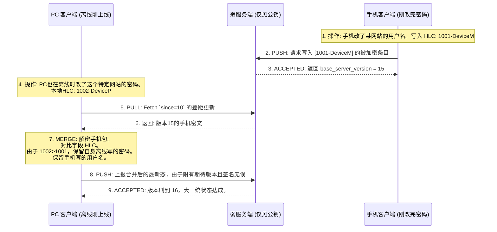

# SecretRoy 分布式加密同步架构白皮书

> **版本:** v1.0.0
> **状态:** Draft / Proposed
> **核心标签:** `E2EE` `Zero-Knowledge` `CRDT` `Decentralized Identity`

## 1. 摘要与构想愿景 (Abstract)

SecretRoy 旨在成为一款革命性的去中心化、端到端加密（E2EE）跨平台密码管理器。不同于传统的以服务端数据库为核心的“中心化登录系统”，SecretRoy 抛弃了经典的“邮箱+密码”注册体系，转向使用 **Web3 / 无中心化的身份衍生机制 (Mnemonic Identity)**。

在这个架构下，“服务器”被降级为不知晓任何关于内容的“弱文件宿主机”（Dumb Server），仅仅提供定序与盲传服务。客户端则包揽了所有复杂的 CRDT (无冲突复制数据类型) 逻辑以用于离线/在线的并行数据合并，保证了极致的安全防范与灵活扩展。

---

## 2. 身份与密码学基石：无主化密钥体系

### 2.1 BIP39 助记词根 (Mnemonic Root)
全系统的安全基点是一串由 12-24 位单词组成的助记词（如 `apple banana...`）。客户端通过这串词执行所有权的认领：
- **恢复与便携**：抛弃繁琐的密码规则，凭人类可转录的单词即可在新设备一秒切入密码库。
- **本地极高熵**：本地利用 PBKDF2/Argon2 等算法产生高强度的 512 位种子（Root Seed）。
- **设备级保护**：落地设备后，助记词不再明文滞留，系统调用本地硬件级加密库 (iOS KeyChain, Android Keystore) 或设置二次 PIN 码进行严苛隔离防盗。

### 2.2 密钥树分叉推导 (Key Derivation Tree)
由根种子派生出针对本地密码库业务的两大加密原语序列：
- **非对称验证池 (EdDSA / Ed25519)**：
  - **公钥 (Public Key)**：充当整个密码库与全世界交互时**唯一的暴露 ID（Vault ID）**。
  - **私钥 (Private Key)**：绝不能碰触外网。主要用来给向弱服务端发送的数据包进行防伪签发（Digital Signature）。
- **对称载荷池 (XChaCha20-Poly1305 或 AES-256-GCM)**：
  - **对称主密钥 (Master Symmetric Key)**：由衍生算法确定性生出。绝对不离开设备沙盒。它是将每一条账号密码行文数据死死锁住、成为别人眼中的乱码的最强护盾。

---

## 3. 架构组件：零知识盲投拓扑

### 3.1 弱端：托管人 (Dumb Server)
服务端数据库完全“眼盲”。它唯一的检索条件为路由参数 `/<PublicKey>/`。它只能看见外层防伪包装，永远无法获悉“某个 Vault 里存了我的多少个银行卡密码”。
其数据库表 `server_vault_items` 结构极其干瘪：
- `vault_id` (文本, 即公钥)
- `item_id` (UUID, 条目主键)
- `base_server_version` (整数, 服务端全局自增定序游标)
- `is_deleted` (布尔, 墓碑标识)
- `encrypted_signed_payload` (强密文块)

### 3.2 强端：终结者 (Super Fat Client)
与传统 Web 页面不同，Flutter APP 是终极集权处。无论是加解密管道渲染，还是多个设备各改同一条密码产生冲突时的缝合，全由客户端纯算力接管执行。

---

## 4. 防御机制与协议补丁 (Security & Mitigation)

该模型虽然去除了中心化账号控制体系，但极易遭到公共网络攻击。为此打上了两道核心的防篡改门限，这两套安全补丁保证了不需要注册验证码就能拒绝对手。

### 🚨 补丁一：数据污染防护 (EdDSA 签名校验)
**威胁模型**：攻击者虽然无法解密你的密文 Payload，但如果他知道了你的 Public Key（仓库号）。他可以向内网疯狂写入无意义的垃圾乱码去破坏你的仓库。
**架构补丁**：
所有请求 Push 的数据体，必须包含基于该仓库 Private Key 对 `HASH(加密数据块)` 进行的数学签名参数：`Signature`。
弱服务端虽没有系统账号体系，但只有两个使命：
1. 提取请求中带入的 Public Key。
2. 用 Public Key 根据椭圆曲线数学原理，校验传来的这个数据包 Signature 是否匹配。
不匹配的非法杂数据直接拒绝服务。这构建了完全剥离“密码登录框”概念的最强无痛鉴权。

### 🚨 补丁二：防重放击穿 (Anti-Replay 嵌套)
**威胁模型**：攻击者窃听到你在咖啡馆网络中成功提交的一次旧数据（数据+签名完美匹配）。并在今天向服务端重放它，导致你的系统“回滚”丢弃刚刚修改的帐号。
**架构补丁**：
客户端在发起私钥数字签名前，必将当前的预期版本游标（`expected_base_server_version`）强制裹挟进被签署的原文中：
`Payload = HASH( encryptedData + timestamp + target_server_version )`。
即便重载攻击者将合法包甩回，弱服务端一验发现：包内定序标定的 version 是 13，而库内该游标早滚到了 18。由于它是写死在签名防伪里，黑客无法修改这个数字。于是该请求被认定为过期的重放尸体，遭到弃用。

---

## 5. 多主同步路由规程 (The Git-like Push/Pull Sync)

多个同时握有助记词种子的设备并作一团网状拓扑。我们利用 **基于 HLC 控制的 Git 模型** 来调和他们：

### 实施结论与后续推演
整套 SecretRoy 架构极度激进但无懈可击。它不但完美适应了多端跨平台的同步需求，未来即便要将该架构改作局域网通信、基于 NAS 同步或蓝牙直传（由于所有冲突都是通过 HLC 基于端计算），它也无需做任何推展。
下一步的实施行动，将正式基于此白皮书，进行本地 `SyncService` 框架的骨架建设和同步基类的抽象重整。
