# SecretRoy QA 回归测试计划

**文档版本**: v1.0  
**适用迭代**: 2026-05-06 收敛迭代  
**测试目标**: 覆盖所有功能模块的回归验证，确保 P0/P2 改动未引入回归  
**预期读者**: QA 工程师、产品经理、开发  

---

## 1. 测试范围与策略

### 1.1 测试策略

| 策略 | 说明 |
|---|---|
| 本地优先 | 所有功能必须在离线状态下可验证；同步功能在有网环境下验证 |
| 数据安全 | 任何测试不得使用真实个人密码；使用测试专用的 vault 身份 |
| 多端覆盖 | 关键同步/配对流程必须在至少 2 台设备上交叉验证 |
| 脏数据回归 | 升级测试必须使用旧版本数据库，验证迁移不丢数据 |

### 1.2 必测 vs 选测

| 优先级 | 模块 | 原因 |
|---|---|---|
| P0 | 解锁、账号 CRUD、同步 Push/Pull、冲突处理、配对 | 核心链路，失败即不可用 |
| P1 | 模板管理、TOTP、密码工具、Vault Health | 高频功能，体验关键 |
| P2 | 外观设置、发布说明、恢复码、内部兼容码 | 低频功能，但仍需回归 |

---

## 2. 测试环境

### 2.1 设备矩阵

| 平台 | 最低版本 | 推荐测试机 |
|---|---|---|
| Android | Android 10 (API 29) | 实体机 + 模拟器 |
| iOS | iOS 15 | 实体机 |
| Windows | Windows 10 | 桌面端 |
| macOS | macOS 12 | 桌面端 |

### 2.2 服务端

- 使用测试环境同步服务器（非生产）
- 服务器 URL 可配置在 `设置 > 同步`
- 测试前确认服务器健康：`GET /health`

### 2.3 测试数据准备

1. 创建测试 vault，记录 `vaultId` 和恢复码
2. 预置账号：至少 20 个，覆盖不同模板（网站、支付、自定义）
3. 预置 2FA：至少 3 个，其中 1 个已关联账号
4. 预置自定义模板：至少 2 个

---

## 3. 功能模块测试用例

### 3.1 模块 A：本地保险库解锁

**业务说明**：用户通过主密码、生物识别或无密码模式进入本地加密数据库。

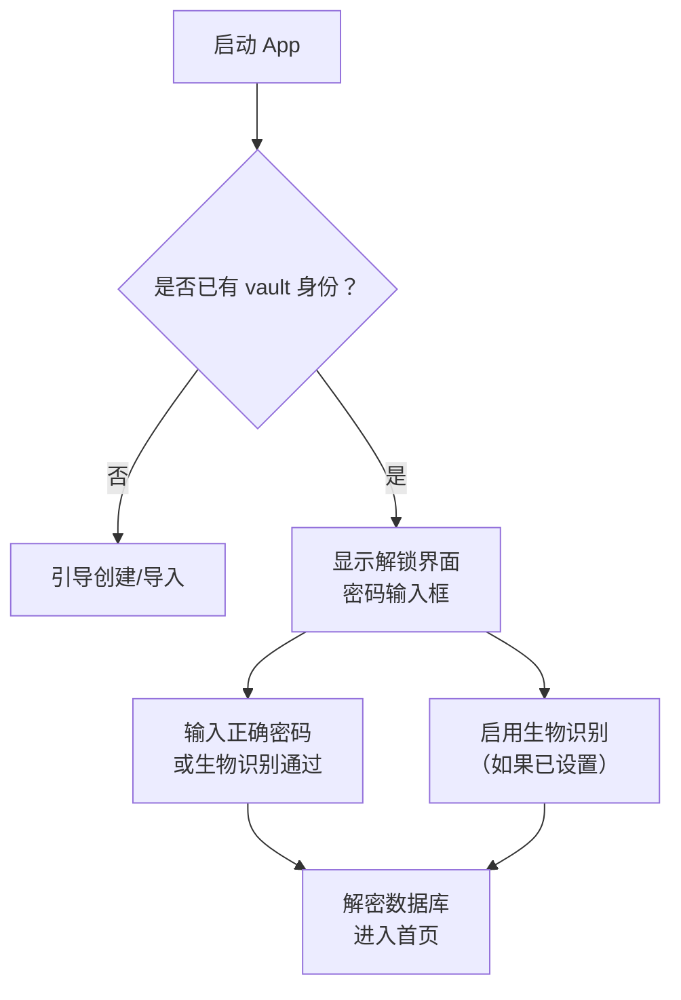

| 用例 ID | 用例名称 | 前置条件 | 操作步骤 | 预期结果 |
|---|---|---|---|---|
| A-01 | 首次安装创建 vault | 全新安装 | 1. 启动 App  <br>2. 设置主密码  <br>3. 确认主密码  <br>4. 记录恢复码 | 成功创建 vault，进入首页，恢复码可正常显示和复制 |
| A-02 | 密码解锁成功 | 已有 vault | 1. 启动 App  <br>2. 输入正确主密码  <br>3. 点击解锁 | 进入首页，账号列表正常加载 |
| A-03 | 密码解锁失败 | 已有 vault | 1. 启动 App  <br>2. 输入错误主密码  <br>3. 点击解锁 | 提示密码错误，不进入首页 |
| A-04 | 生物识别解锁 | 已启用生物识别 | 1. 启动 App  <br>2. 触发指纹/面容识别 | 识别通过后直接进入首页 |
| A-05 | 自动锁定 | 已设置自动锁定 | 1. 进入首页  <br>2. 将 App 置于后台超过设定时间  <br>3. 切回前台 | 显示解锁界面，要求重新验证 |
| A-06 | 数据库损坏恢复 | 模拟损坏加密文件 | 1. 替换加密数据库为损坏文件  <br>2. 启动 App  <br>3. 输入正确密码 | 提示数据库损坏，提供备份路径，不崩溃 |
| A-07 | 无密码模式 | 已设置无密码 | 1. 启用无密码模式  <br>2. 重启 App | 直接进入首页（无密码输入界面） |

---

### 3.2 模块 B：账号管理

**业务说明**：用户保存、编辑、删除账号数据。账号基于模板，字段数据存储在 JSON 中。

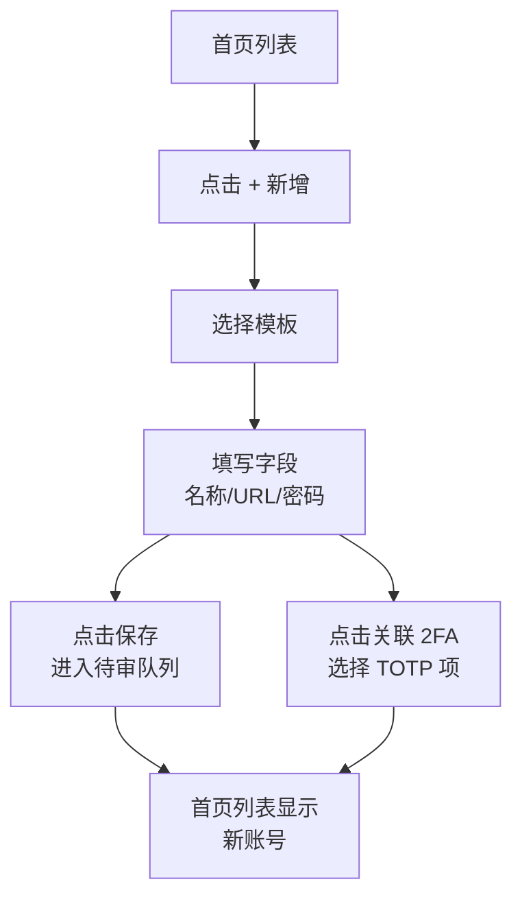

| 用例 ID | 用例名称 | 前置条件 | 操作步骤 | 预期结果 |
|---|---|---|---|---|
| B-01 | 新增网站账号 | 在首页 | 1. 点击 +  <br>2. 选择"网站模板"  <br>3. 填写网站/用户名/密码  <br>4. 保存 | 返回首页，列表出现新账号，字段正确显示 |
| B-02 | 复制密码 | 已有账号 | 1. 进入账号详情  <br>2. 点击密码字段的复制按钮 | 密码复制到剪贴板，剪贴板定时自动清空 |
| B-03 | 编辑账号字段 | 已有账号 | 1. 进入编辑页  <br>2. 修改密码  <br>3. 保存 | 账号更新，旧字段数据不丢失（历史字段保留） |
| B-04 | 删除账号 | 已有账号 | 1. 进入编辑页  <br>2. 点击删除  <br>3. 确认删除 | 账号进入删除待审队列，首页显示"待同步删除"标记 |
| B-05 | 撤销删除 | 账号待删除 | 1. 进入首页搜索/任务聚合  <br>2. 找到待删除项  <br>3. 撤销删除 | 账号恢复，同步状态恢复为 synchronized |
| B-06 | 使用自定义模板 | 已创建自定义模板 | 1. 新增账号  <br>2. 选择自定义模板  <br>3. 填写自定义字段  <br>4. 保存 | 账号保存成功，字段按模板定义显示 |
| B-07 | 模板缺失保护 | 账号使用已删除模板 | 1. 删除自定义模板  <br>2. 查看使用该模板的账号 | 账号仍能正常显示，字段以原始 data 键值展示 |
| B-08 | 搜索账号 | 已有多个账号 | 1. 在首页搜索框输入关键词  <br>2. 观察结果 | 搜索结果包含名称/URL/用户名匹配项 |
| B-09 | 敏感字段遮罩 | 已有含密码账号 | 1. 查看账号列表  <br>2. 查看账号详情 | 密码字段默认显示为星号/点，点击可短暂显示 |
| B-10 | 复制密码后覆盖保护 | 已复制密码 | 1. 复制密码  <br>2. 在其他 App 复制一段文本  <br>3. 返回 SecretRoy 复制另一段内容 | 剪贴板清理策略不覆盖用户的正常复制，只清理敏感内容 |

---

### 3.3 模块 C：模板管理

**业务说明**：内置模板由客户端代码提供；用户可创建自定义模板定义字段结构。

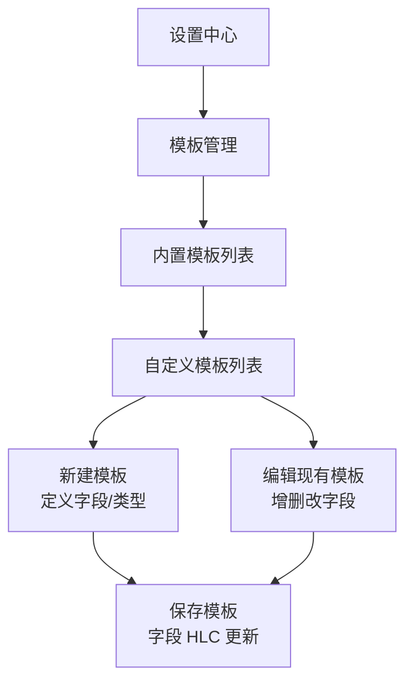

| 用例 ID | 用例名称 | 前置条件 | 操作步骤 | 预期结果 |
|---|---|---|---|---|
| C-01 | 查看内置模板 | 进入模板管理 | 1. 打开设置 > 模板管理 | 显示"网站模板"，不可删除 |
| C-02 | 创建自定义模板 | 在模板管理页 | 1. 点击新建  <br>2. 输入模板名称  <br>3. 添加多个字段（文本/密码/URL/时间）  <br>4. 保存 | 自定义模板出现在列表，字段类型正确 |
| C-03 | 编辑模板字段 | 已有自定义模板 | 1. 进入编辑  <br>2. 修改字段标签  <br>3. 保存 | 字段标签更新，已保存账号的旧字段数据不丢失 |
| C-04 | 删除自定义模板 | 模板未被账号使用 | 1. 点击删除  <br>2. 确认 | 模板删除成功 |
| C-05 | 删除模板保护 | 模板正被账号使用 | 1. 点击删除  <br>2. 确认 | 提示"模板正在使用中，无法删除" |
| C-06 | 时间字段格式 | 模板含时间字段 | 1. 创建含时间字段的模板  <br>2. 设置不同格式（全格式/仅日期/月年/仅时间）  <br>3. 用该模板创建账号 | 时间字段按选定格式展示和保存 |
| C-07 | 关联字段（isReference） | 模板含关联字段 | 1. 创建含"关联字段"的模板  <br>2. 保存模板  <br>3. 查看字段属性 | 关联字段不保存数据，仅作为关联入口 |

---

### 3.4 模块 D：2FA/TOTP 验证器

**业务说明**：独立保存 TOTP 凭据，本地生成动态验证码。可与账号关联，但 secret 不进入账号 data。

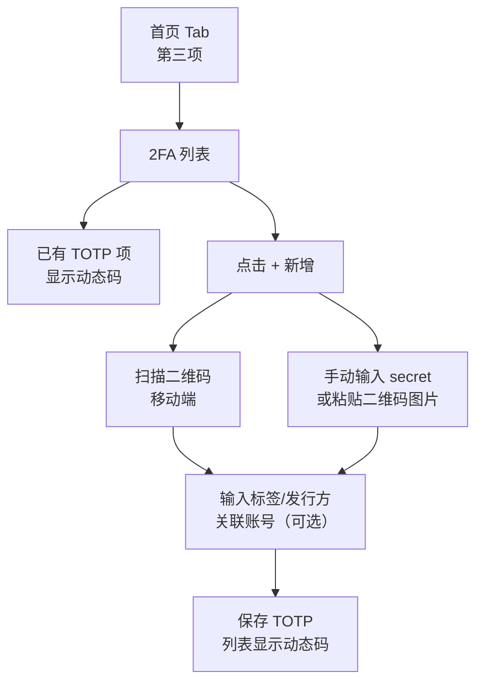

| 用例 ID | 用例名称 | 前置条件 | 操作步骤 | 预期结果 |
|---|---|---|---|---|
| D-01 | 新增 TOTP（手动） | 在 2FA 列表页 | 1. 点击 +  <br>2. 输入 secret  <br>3. 输入标签  <br>4. 保存 | 列表出现新项，动态码正确生成（与标准验证器一致） |
| D-02 | 扫描二维码 | 移动端 | 1. 点击 +  <br>2. 选择扫描  <br>3. 对准二维码 | 自动解析 secret 和发行方，进入确认页 |
| D-03 | 粘贴二维码图片 | 桌面端 | 1. 点击 +  <br>2. 选择"粘贴图片"  <br>3. 粘贴含二维码的截图 | 解析成功，进入确认页 |
| D-04 | 关联账号 | 已有 TOTP 和账号 | 1. 编辑 TOTP  <br>2. 选择关联账号  <br>3. 保存 | 账号详情页显示 2FA 关联入口，可一键跳转 |
| D-05 | 动态码刷新 | 已有 TOTP | 1. 查看 2FA 列表  <br>2. 等待 30 秒 | 倒计时结束后动态码更新 |
| D-06 | TOTP 搜索排除 | 已有 TOTP | 1. 在首页搜索框输入 TOTP 标签 | 搜索结果**不包含** TOTP 项 |
| D-07 | 删除 TOTP | 已有 TOTP | 1. 进入编辑  <br>2. 点击删除  <br>3. 确认 | TOTP 删除，关联账号的 2FA 入口消失 |
| D-08 | TOTP 同步 | 多设备 | 1. 设备 A 创建 TOTP  <br>2. 触发同步  <br>3. 设备 B 拉取 | 设备 B 的 2FA 列表出现新项，动态码一致 |

---

### 3.5 模块 E：服务端同步（Push / Pull）

**业务说明**：多设备共享普通账号/模板数据。同步分入站（Pull）和出站（Push），数据以 AEAD 加密传输。

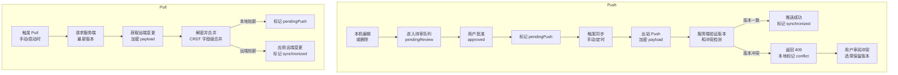

| 用例 ID | 用例名称 | 前置条件 | 操作步骤 | 预期结果 |
|---|---|---|---|---|
| E-01 | 首次 Push 账号 | 本机有待推送账号 | 1. 配置同步服务器  <br>2. 批准待审变更  <br>3. 点击同步 | 账号成功推送到服务端，状态变为 synchronized |
| E-02 | Pull 远端新账号 | 服务端有新账号 | 1. 本机触发 Pull  <br>2. 观察列表 | 新账号出现在本机列表，字段完整 |
| E-03 | 并发编辑冲突 | 设备 A 和 B 同时编辑同一账号 | 1. A 修改密码并推送  <br>2. B 修改用户名并推送  <br>3. 双方触发同步 | 后同步的设备进入 conflict 状态，冲突收件箱显示差异 |
| E-04 | 冲突解决 | 存在 conflict 状态账号 | 1. 进入冲突收件箱  <br>2. 查看差异  <br>3. 选择保留本地/远端 | 选定版本应用，状态恢复为 synchronized |
| E-05 | 远端删除本地编辑 | 服务端删除账号，本机后编辑 | 1. 服务端删除账号  <br>2. 本机编辑该账号  <br>3. 本机触发同步 | 本地编辑权获胜，账号复活，状态为 pendingPush |
| E-06 | 本地删除远端编辑 | 本机删除账号，服务端后编辑 | 1. 本机删除账号并推送  <br>2. 服务端编辑同一账号  <br>3. 本机触发 Pull | 本地删除权获胜（deleteHlc 较新），账号保持删除 |
| E-07 | 断网重连同步 | 离线期间编辑账号 | 1. 关闭网络  <br>2. 编辑账号  <br>3. 恢复网络  <br>4. 触发同步 | 账号成功推送，无重复或丢失 |
| E-08 | 同步服务器切换 | 已配置服务器 A | 1. 修改服务器 URL 为 B  <br>2. 保存  <br>3. 触发同步 | 向新服务器推送，旧服务器数据不影响 |
| E-09 | 无效服务器 URL | 未配置或错误 URL | 1. 输入无效 URL  <br>2. 触发同步 | 提示连接失败，不崩溃，本地数据完整保留 |
| E-10 | 字段级合并 | 两端编辑同一账号不同字段 | 1. A 编辑密码  <br>2. B 编辑 URL  <br>3. 双方同步 | 最终账号同时包含 A 的密码和 B 的 URL（字段级合并） |
| E-11 | 模板字段级合并 | 两端编辑同一模板不同字段 | 1. A 编辑字段 X 标签  <br>2. B 编辑字段 Y 标签  <br>3. 双方同步 | 最终模板同时包含 A 的 X 修改和 B 的 Y 修改 |

---

### 3.6 模块 F：本地出站同步审阅（Outbox）

**业务说明**：防止本机误删误改自动扩散。所有出站变更先进入待审队列，用户批准后才真正 Push。

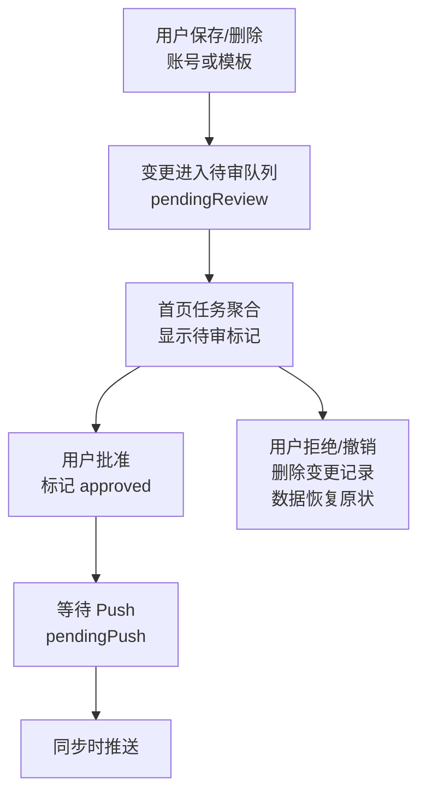

| 用例 ID | 用例名称 | 前置条件 | 操作步骤 | 预期结果 |
|---|---|---|---|---|
| F-01 | 保存后进入待审 | 已有 vault | 1. 编辑账号  <br>2. 保存 | 首页显示"待审"任务，账号标记 pendingReview |
| F-02 | 批准推送 | 有待审变更 | 1. 进入首页任务聚合  <br>2. 点击批准  <br>3. 触发同步 | 变更推送到服务端，状态变为 synchronized |
| F-03 | 撤销变更 | 有待审变更 | 1. 进入首页任务聚合  <br>2. 点击撤销  <br>3. 确认 | 账号恢复编辑前状态，待审记录删除 |
| F-04 | 删除后撤销 | 有待删除账号 | 1. 删除账号  <br>2. 进入任务聚合  <br>3. 撤销删除 | 账号恢复，状态恢复为 synchronized |
| F-05 | 批量审阅 | 多个待审变更 | 1. 首页显示多个待审项  <br>2. 逐个批准/拒绝 | 每项按选择处理，无互相干扰 |
| F-06 | 未批准不推送 | 有待审未批准 | 1. 保存账号（不批准） <br>2. 直接点击同步 | 该账号不被推送，其他已批准的正常推送 |

---

### 3.7 模块 G：冲突收件箱

**业务说明**：展示并处理同步冲突。冲突类型包括：并发编辑、远端缺失、本地删除后远端编辑等。

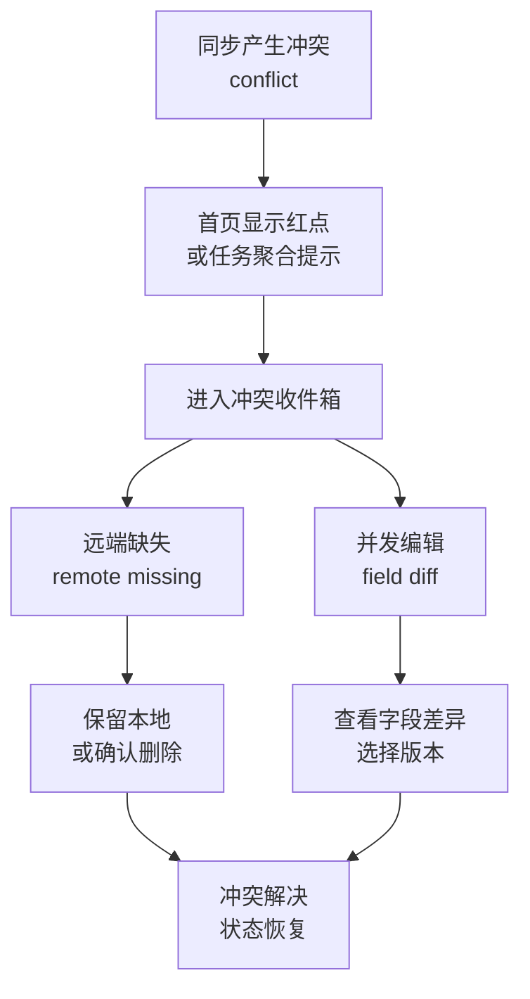

| 用例 ID | 用例名称 | 前置条件 | 操作步骤 | 预期结果 |
|---|---|---|---|---|
| G-01 | 并发编辑冲突展示 | 两端编辑同一账号 | 1. 触发同步产生冲突  <br>2. 进入冲突收件箱 | 显示账号名称、冲突字段、本地值、远端值 |
| G-02 | 选择本地版本 | 存在冲突 | 1. 进入冲突详情  <br>2. 点击"保留本地" | 应用本地版本，状态变为 synchronized |
| G-03 | 选择远端版本 | 存在冲突 | 1. 进入冲突详情  <br>2. 点击"保留远端" | 应用远端版本，状态变为 synchronized |
| G-04 | 远端缺失冲突 | 服务端删除了账号 | 1. 本机触发 Pull  <br>2. 查看冲突收件箱 | 显示"远端当前不存在"，用户可选择保留本地或确认删除 |
| G-05 | 冲突日志查看 | 存在字段级冲突 | 1. 进入冲突详情  <br>2. 查看冲突日志 | 显示每个冲突字段的旧值、HLC 时间戳 |
| G-06 | 冲突解决后推送 | 已解决冲突 | 1. 解决冲突（保留本地） <br>2. 触发同步 | 本地版本推送到服务端，其他设备拉取后一致 |
| G-07 | 批量处理冲突 | 多个冲突 | 1. 冲突收件箱显示多项  <br>2. 逐个处理 | 每项独立处理，处理后的项从列表移除 |

---

### 3.8 模块 H：密钥同步与设备配对

**业务说明**：让可信新设备加入已有 vault。路线包括：面对面 LAN 链接、远程配对、离线恢复码。

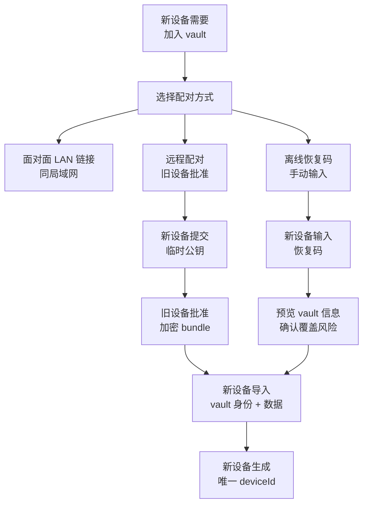

| 用例 ID | 用例名称 | 前置条件 | 操作步骤 | 预期结果 |
|---|---|---|---|---|
| H-01 | 面对面 LAN 配对 | 两台设备同局域网 | 1. 旧设备开启"面对面链接"  <br>2. 新设备选择"加入 vault"  <br>3. 新设备输入 8 位配对码 | 新设备成功加入 vault，数据开始同步 |
| H-02 | LAN 配对码过期 | 面对面链接弹窗关闭 | 1. 旧设备开启配对  <br>2. 关闭弹窗  <br>3. 新设备尝试用旧码加入 | 提示配对码无效或已过期 |
| H-03 | 远程配对 | 新旧设备不在同局域网 | 1. 新设备选择"远程配对"  <br>2. 输入 vaultId 提交临时公钥  <br>3. 旧设备收到请求并批准  <br>4. 新设备领取加密 bundle | 新设备成功加入 vault |
| H-04 | 远程配对拒绝 | 旧设备拒绝 | 1. 新设备提交请求  <br>2. 旧设备点击拒绝 | 新设备提示配对被拒绝 |
| H-05 | 离线恢复码导入 | 已有恢复码 | 1. 新设备选择"恢复 vault"  <br>2. 输入恢复码  <br>3. 预览 vault 信息  <br>4. 确认导入 | 成功恢复 vault 身份，vaultId 与旧设备一致 |
| H-06 | 恢复码 vaultId 一致 | 使用正确恢复码 | 1. 新设备导入恢复码  <br>2. 检查 vaultId | vaultId 必须与创建时的值一致 |
| H-07 | 新设备 deviceId 独立 | 配对成功 | 1. 查看新设备设置  <br>2. 检查 deviceId | deviceId 是新设备自己生成的唯一值，不等于旧设备 |
| H-08 | 配对后数据同步 | 新设备加入 vault | 1. 新设备加入后触发同步 | 账号、模板、2FA 数据正常拉取 |
| H-09 | 恢复码覆盖确认 | 新设备已有数据 | 1. 新设备已有本地账号  <br>2. 尝试导入恢复码 | 提示"导入将覆盖现有数据"，需用户确认 |
| H-10 | LAN 配对失败次数限制 | 连续输错配对码 | 1. 连续输入错误配对码 5 次 | 配对会话销毁，需旧设备重新开启 |

---

### 3.9 模块 I：Vault Health 体检

**业务说明**：本地安全检查，不上传任何数据。检查项包括弱密码、密码复用、陈旧记录、缺失 2FA、待同步状态等。

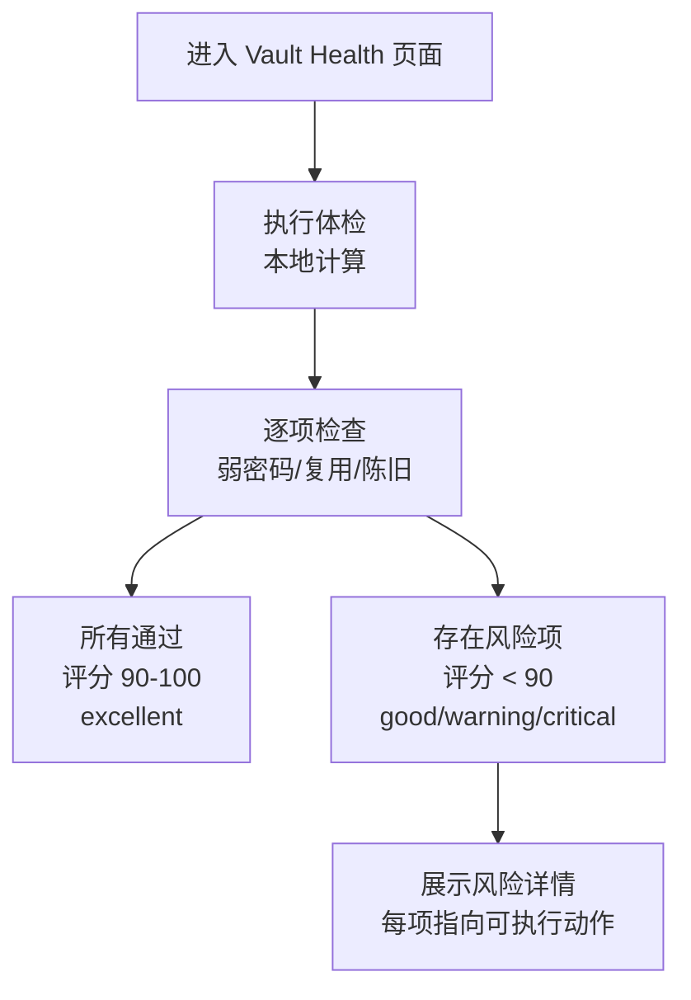

| 用例 ID | 用例名称 | 前置条件 | 操作步骤 | 预期结果 |
|---|---|---|---|---|
| I-01 | 满分体检 | 所有账号安全 | 1. 进入 Vault Health  <br>2. 点击体检 | 评分 100，显示 excellent，所有项通过 |
| I-02 | 弱密码检测 | 有账号密码为"123" | 1. 进入 Vault Health  <br>2. 点击体检 | 弱密码项失败，列出风险账号，评分下降 |
| I-03 | 密码复用检测 | 两个账号密码相同 | 1. 进入 Vault Health  <br>2. 点击体检 | 密码复用项失败，列出复用账号 |
| I-04 | 陈旧记录检测 | 有账号 180 天未更新 | 1. 进入 Vault Health  <br>2. 点击体检 | 陈旧记录项失败，列出旧账号 |
| I-05 | 缺失 2FA 检测 | 有网站模板账号未关联 2FA | 1. 进入 Vault Health  <br>2. 点击体检 | 缺失 2FA 项失败，提示可添加 2FA |
| I-06 | 待同步状态检测 | 有待审/冲突项 | 1. 进入 Vault Health  <br>2. 点击体检 | 待同步状态项提示，指向待审队列或冲突收件箱 |
| I-07 | 离线可用 | 无网络 | 1. 关闭网络  <br>2. 进入 Vault Health  <br>3. 点击体检 | 正常计算并展示结果，不依赖网络 |
| I-08 | 删除账号不检测 | 有已删除账号 | 1. 删除账号（未彻底删除） <br>2. 点击体检 | 已删除账号不参与健康检查 |

---

### 3.10 模块 J：安全设置与剪贴板策略

**业务说明**：管理锁定、生物识别、无密码模式；统一管理敏感复制的剪贴板清理。

| 用例 ID | 用例名称 | 前置条件 | 操作步骤 | 预期结果 |
|---|---|---|---|---|
| J-01 | 启用生物识别 | 设备支持指纹/面容 | 1. 进入安全设置  <br>2. 启用生物识别  <br>3. 验证生物识别 | 解锁界面出现生物识别入口 |
| J-02 | 禁用生物识别 | 已启用 | 1. 进入安全设置  <br>2. 关闭生物识别 | 解锁界面不再显示生物识别入口 |
| J-03 | 设置自动锁定时间 | 已解锁 | 1. 进入安全设置  <br>2. 修改自动锁定时间为 1 分钟  <br>3. 将 App 置于后台 1 分钟 | 切回前台时显示解锁界面 |
| J-04 | 启用无密码模式 | 已设置主密码 | 1. 进入安全设置  <br>2. 启用无密码模式  <br>3. 重启 App | 直接进入首页，无解锁界面 |
| J-05 | 敏感剪贴板清理 | 已复制密码 | 1. 复制账号密码  <br>2. 等待 60 秒 | 剪贴板内容被清空（或覆盖） |
| J-06 | 剪贴板不覆盖用户复制 | 已复制密码 | 1. 复制密码  <br>2. 在其他 App 复制文本  <br>3. 等待清理时间 | 用户的正常复制不被 SecretRoy 覆盖，只清理自己的敏感内容 |
| J-07 | 修改主密码 | 已设置密码 | 1. 进入安全设置  <br>2. 点击修改密码  <br>3. 输入旧密码和新密码 | 修改成功，下次解锁需用新密码 |

---

### 3.11 模块 K：密码工具

**业务说明**：密码生成和强度评估。

| 用例 ID | 用例名称 | 前置条件 | 操作步骤 | 预期结果 |
|---|---|---|---|---|
| K-01 | 生成密码 | 在密码工具页 | 1. 设置长度 16  <br>2. 勾选大小写+数字+符号  <br>3. 点击生成 | 生成符合规则的随机密码 |
| K-02 | 密码强度评估 | 已有密码 | 1. 输入"abcdefg"  <br>2. 观察强度提示 | 显示弱（红色） |
| K-03 | 密码强度评估强密码 | 已有密码 | 1. 输入"Ab3#kL9$pQ2@wR5!"  <br>2. 观察强度提示 | 显示强（绿色） |
| K-04 | 一键填入账号 | 在账号编辑页 | 1. 打开密码生成器  <br>2. 生成密码  <br>3. 点击"填入" | 密码自动填入编辑页的密码字段 |

---

### 3.12 模块 L：外观设置

**业务说明**：主题、色彩、视觉偏好。

| 用例 ID | 用例名称 | 前置条件 | 操作步骤 | 预期结果 |
|---|---|---|---|---|
| L-01 | 切换深色模式 | 当前浅色 | 1. 进入外观设置  <br>2. 开启深色模式 | 全 App 变为深色主题 |
| L-02 | 切换主题色 | 当前默认色 | 1. 进入外观设置  <br>2. 选择蓝色主题 | 主题色变为蓝色，按钮/强调色同步 |
| L-03 | 桌面端布局 | Windows/macOS | 1. 调整窗口大小  <br>2. 观察布局变化 | 小窗口用紧凑布局，大窗口用双栏布局 |

---

### 3.13 模块 M：导入/导出（Vault Dump）

**业务说明**：加密导出数据快照，用于灾难恢复或新设备重建。

| 用例 ID | 用例名称 | 前置条件 | 操作步骤 | 预期结果 |
|---|---|---|---|---|
| M-01 | 导出加密快照 | 已解锁 | 1. 进入同步设置  <br>2. 点击"导出加密快照"  <br>3. 保存文件 | 生成加密文件，内容不可读 |
| M-02 | 导入加密快照 | 新设备 | 1. 选择"导入快照"  <br>2. 选择文件  <br>3. 输入 vault 密钥  <br>4. 确认导入 | 数据恢复，账号和模板完整 |
| M-03 | 导入失败不残留 | 损坏的快照文件 | 1. 选择损坏文件  <br>2. 尝试导入 | 提示导入失败，本地数据不被覆盖 |
| M-04 | 恢复码导入预览 | 已有恢复码 | 1. 输入恢复码  <br>2. 点击预览 | 显示 vaultId、设备数等信息，不直接导入 |
| M-05 | 恢复码覆盖确认 | 本地已有数据 | 1. 输入恢复码  <br>2. 点击预览  <br>3. 点击应用 | 提示"将覆盖本地数据"，需二次确认 |

---

## 4. 端到端核心流程图

### 4.1 完整用户旅程：从新安装到多设备同步

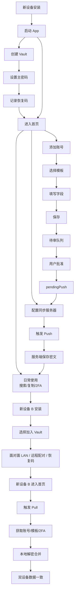

### 4.2 同步状态机

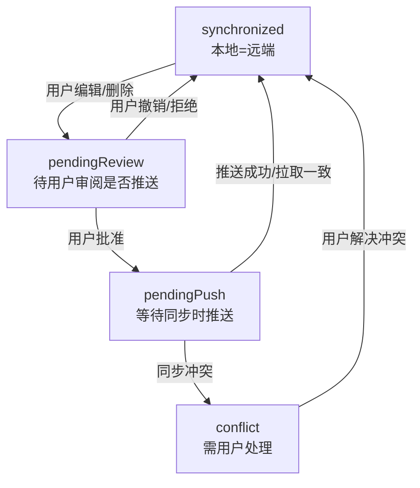

### 4.3 删除生命周期

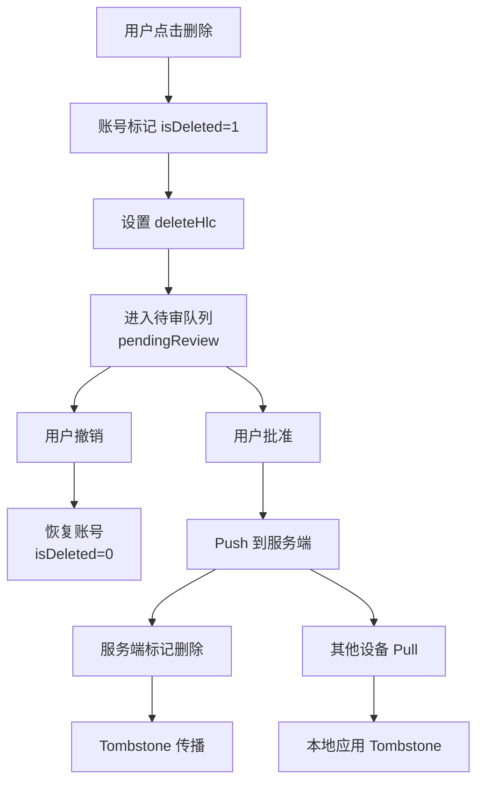

---

## 5. 回归测试检查清单

### 5.1 数据库迁移回归

| 检查项 | 通过标准 |
|---|---|
| 从 v6 数据库启动 | App 正常启动，自动执行 v7 迁移，无崩溃 |
| 旧账号数据完整 | 迁移后所有账号名称、邮箱、data 字段不丢失 |
| 旧模板数据完整 | 迁移后自定义模板标题、字段、category 不丢失 |
| 旧 2FA 数据完整 | 迁移后 TOTP secret、标签、关联账号不丢失 |
| 旧同步状态保留 | 迁移后 syncStatus、serverVersion、HLC 值不丢失 |
| 新 field_hlc 列 | 迁移后旧模板 field_hlc 为 `{}`，不报错 |

### 5.2 CRDT 合并回归

| 检查项 | 通过标准 |
|---|---|
| 账号字段级合并 | 两端编辑不同 data 字段，合并后保留双方修改 |
| 模板字段级合并 | 两端编辑不同模板字段，合并后保留双方修改 |
| 同字段 LWW | 两端编辑同一字段，HLC 较新的获胜 |
| Tombstone 优先 | 删除 HLC 晚于编辑 HLC，删除获胜 |
| 并发 Tombstone | 两端都删除，deleteHlc 较新的获胜 |
| 快速前进检测 | 本地无修改时拉取远端，状态直接变为 synchronized |
| 冲突检测 | 本地 pendingPush 时合并远端，状态变为 conflict |

### 5.3 性能与稳定性

| 检查项 | 通过标准 |
|---|---|
| 1000 个账号加载 | 首页列表加载时间 < 2 秒，滚动流畅 |
| 大量 2FA 动态码刷新 | 20 个 TOTP 同时倒计时，UI 不卡顿 |
| 数据库加密落盘 | 运行时 `.runtime.db` 不存在于持久化目录 |
| 后台切换 | 反复前后台切换 20 次，无崩溃、无数据丢失 |
| 离线模式 | 关闭网络 30 分钟，所有本地功能正常使用 |

---

## 6. Bug 记录模板

QA 发现缺陷时请使用以下格式记录：

```markdown
**模块**: (如 E-同步)
**用例 ID**: (如 E-05)
**严重级别**: Blocker / Critical / Major / Minor / Trivial
**标题**: (一句话描述问题)
**复现步骤**:
1. ...
2. ...
**预期结果**:
**实际结果**:
**环境**: (平台 / 版本 / 设备型号)
**截图/录屏**: (附件)
**日志**: (如有崩溃，附崩溃日志)
```

---

## 7. 附录：术语表

| 术语 | 解释 |
|---|---|
| Vault | 用户的加密保险库，由 vaultId 标识 |
| HLC | Hybrid Logical Clock，用于冲突解决的逻辑时钟 |
| CRDT | Conflict-free Replicated Data Type，无冲突复制数据类型 |
| Tombstone | 墓碑标记，表示记录已被逻辑删除 |
| AEAD | Authenticated Encryption with Associated Data，带关联数据的认证加密 |
| TOTP | Time-based One-Time Password，基于时间的一次性密码 |
| Outbox | 本地出站同步审阅队列 |
| PendingReview | 变更已产生，等待用户审阅是否推送 |
| PendingPush | 变更已批准，等待同步时推送 |
| Conflict | 同步冲突，需要用户手动解决 |
| LAN Pairing | 局域网面对面设备配对 |
| Vault Dump | 加密的数据快照，用于灾难恢复 |

---

*本文档由开发辅助生成，QA 执行时如遇业务逻辑疑问，可对照 `docs/product/application-characteristics.md` 核对。*
