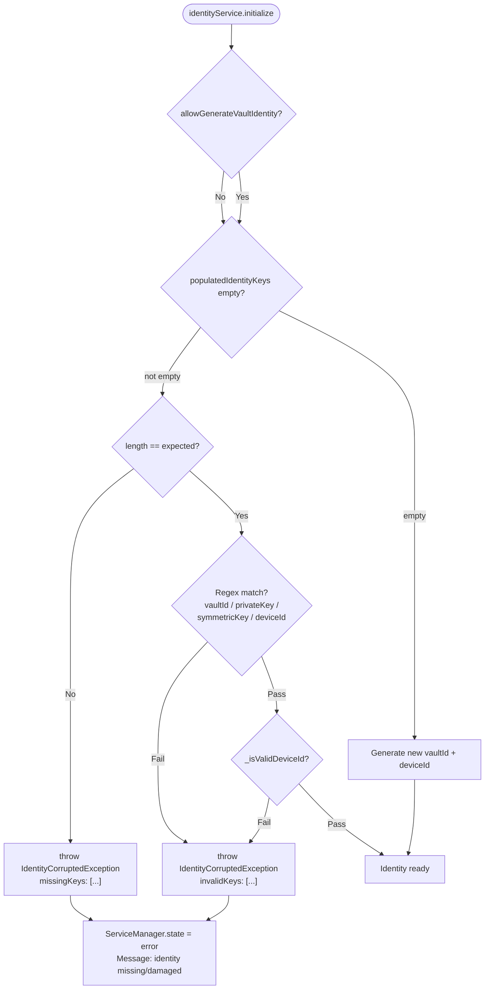
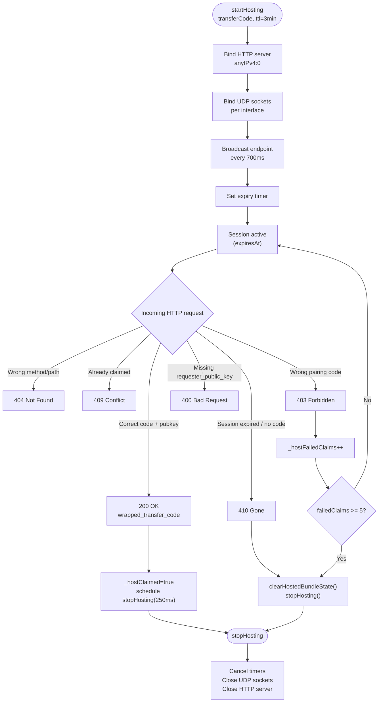
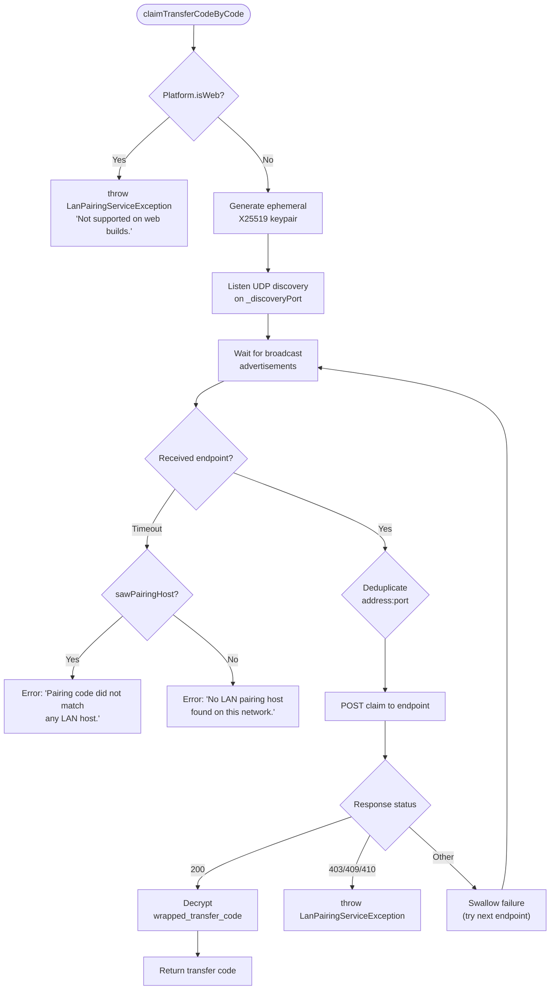
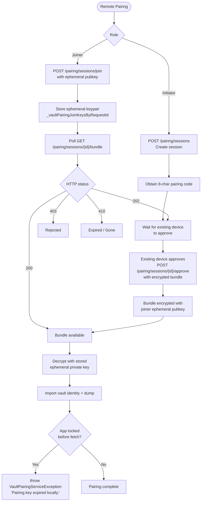
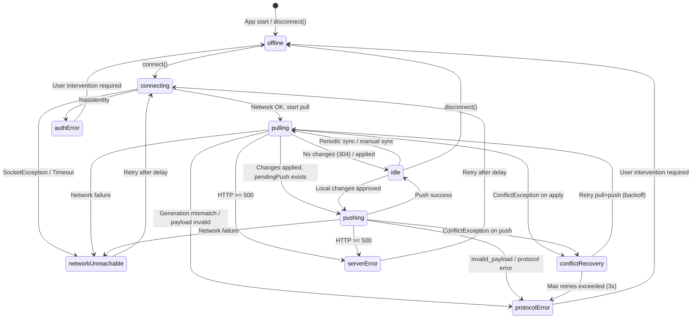
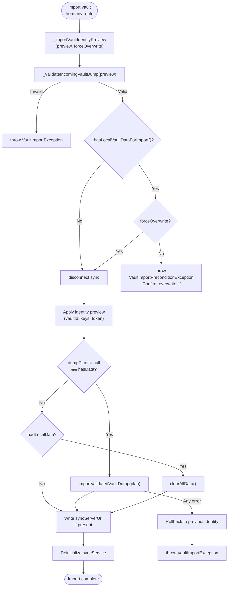
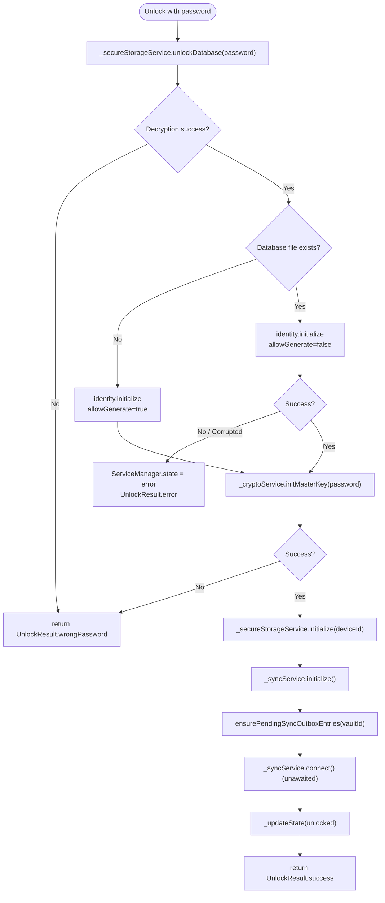
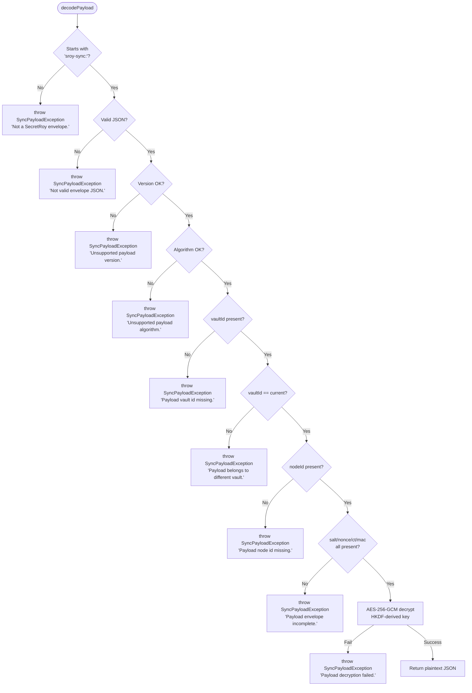
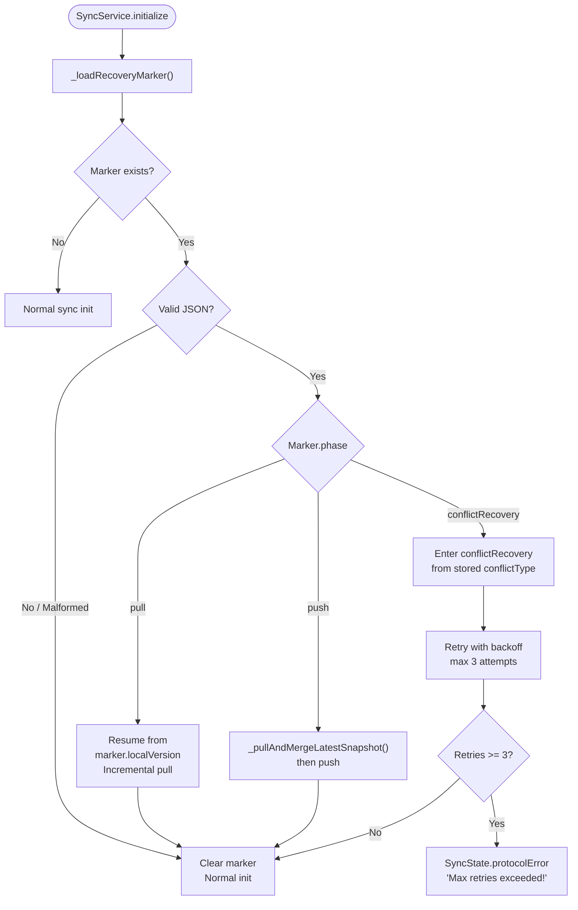
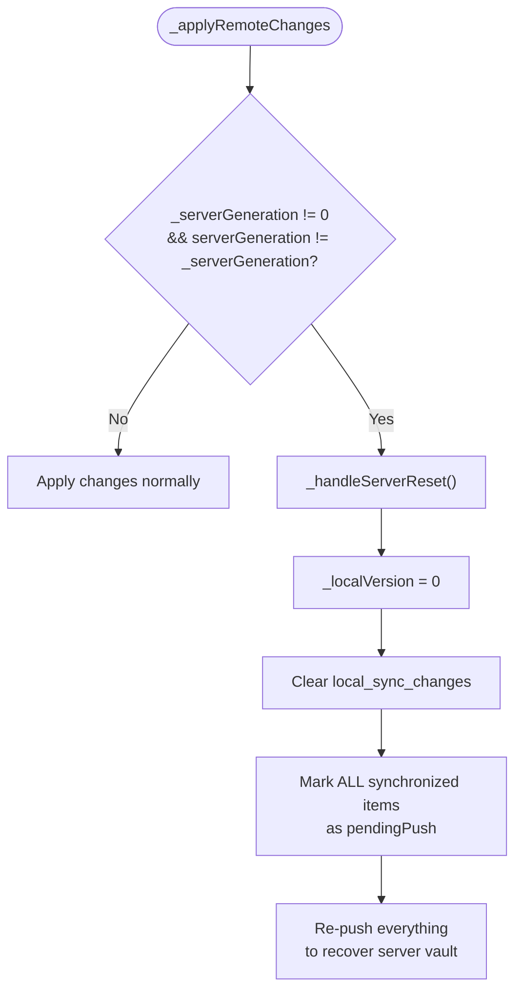

# Vault Sync Boundary State Diagrams

> 本文档使用 Mermaid 绘制密钥同步（vault pairing / sync / identity）各子系统的边界状态与决策分支。
> 覆盖范围：Identity 生命周期、LAN/远程配对、同步状态机、导入/导出安全边界、解锁鉴权。

---

## 1. Identity Initialization Boundary

### Key Branches

| Condition | Outcome |
|---|---|
| `allowGenerateVaultIdentity=false` + no stored keys | `IdentityCorruptedException` |
| Partial keys stored | `IdentityCorruptedException(missingKeys)` |
| Regex format mismatch | `IdentityCorruptedException(invalidKeys)` |
| Legacy 8-char hex `deviceId` | Accepted via `_legacyDeviceIdPattern` |
| All valid | `hasIdentity == true` |

---

## 2. LAN Pairing Host Lifecycle

---

## 3. LAN Pairing Client Claim Flow

---

## 4. Remote Pairing (Server-Assisted) Flow

---

## 5. Sync State Machine with Boundary States

### Global Error Handler Mapping

| Exception | SyncState | User-Facing Message |
|---|---|---|
| `SocketException` / `TimeoutException` | `networkUnreachable` | "Cannot reach sync server..." |
| `ClientException` wrapping `SocketException` | `networkUnreachable` | "Network unreachable..." |
| `ClientException` cleartext blocked | `protocolError` | "Cleartext HTTP blocked..." |
| `SyncHttpException` (status >= 500) | `serverError` | `serverMessage` or generic |
| `SyncHttpException` (generation_mismatch) | `protocolError` | "Server vault has been reset..." |
| `SyncHttpException` (invalid_payload) | `protocolError` | "Sync payload rejected..." |
| `SyncProtocolException` | `protocolError` | "Sync protocol invalid..." |
| `SyncPayloadException` | `protocolError` | "Sync payload invalid..." |

---

## 6. Vault Import Safety Boundary

### _hasLocalVaultDataForImport Check

Returns `true` if **any** of:
- `loadAccounts(includeDeleted:true).isNotEmpty`
- `loadCustomTemplates(includeDeleted:true).isNotEmpty`
- `_syncService.localVersion > 0`
- `_syncService.isDirty`

---

## 7. Unlock Flow with Identity Boundary

---

## 8. Sync Payload Codec Boundary

---

## 9. Recovery Marker Resume Boundary

---

## 10. Server Generation Mismatch Recovery

---

## 附录：错误类型速查

| 错误类型 | 来源 | 含义 |
|---|---|---|
| `IdentityCorruptedException` | `IdentityService` | 身份密钥缺失、部分存储或格式非法 |
| `VaultPairingCryptoException` | `VaultPairingCrypto` | 配对包加解密失败、格式不支持 |
| `VaultPairingServiceException` | `VaultPairingService` | 远程配对 HTTP 错误或会话状态异常 |
| `LanPairingServiceException` | `LanPairingService` | LAN 配对网络/平台/验证失败 |
| `VaultImportException` | `VaultDumpCoordinator` | 导入过程中 dump 解密或写入失败 |
| `VaultImportPreconditionException` | `ServiceManager` | 非干净设备未确认覆盖 |
| `SyncPayloadException` | `SyncPayloadCodec` | Payload 信封格式/解密/vault 隔离失败 |
| `SyncProtocolException` | `SyncService` | 协议语义错误（如 generation 不匹配） |
| `SyncHttpException` | `SyncService` | HTTP 层错误，携带 `conflict_type` |
| `ConflictException` | `SyncService` | 推送到服务器时发生冲突，需恢复 |

---

*文档版本：基于 2026-05-07 代码基线绘制。*
