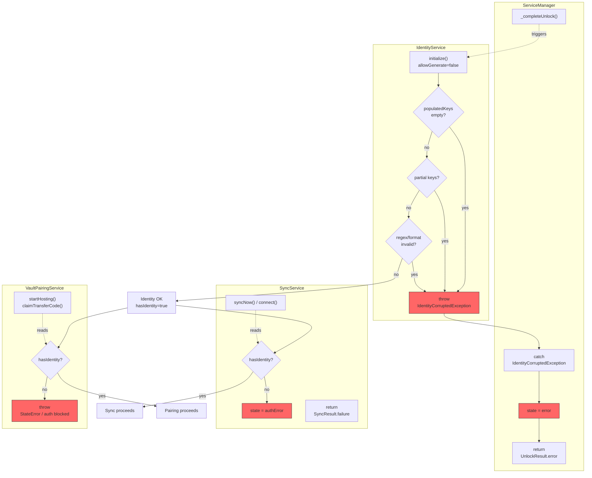
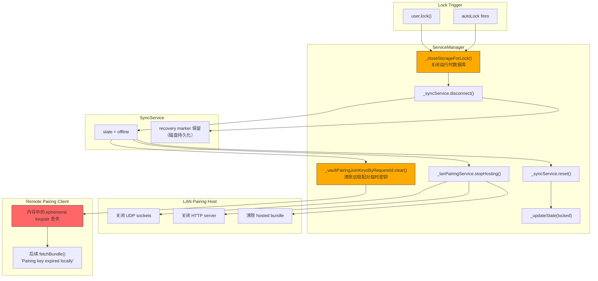
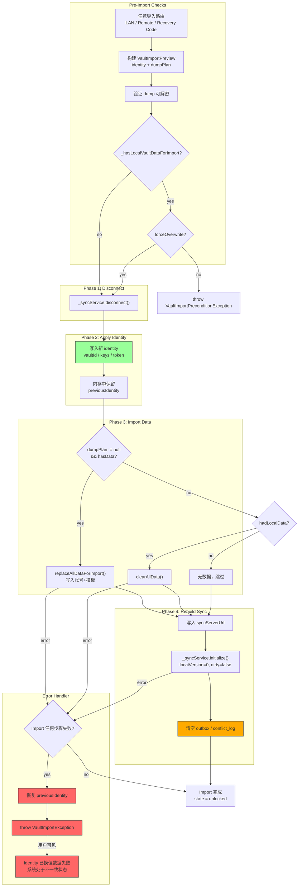
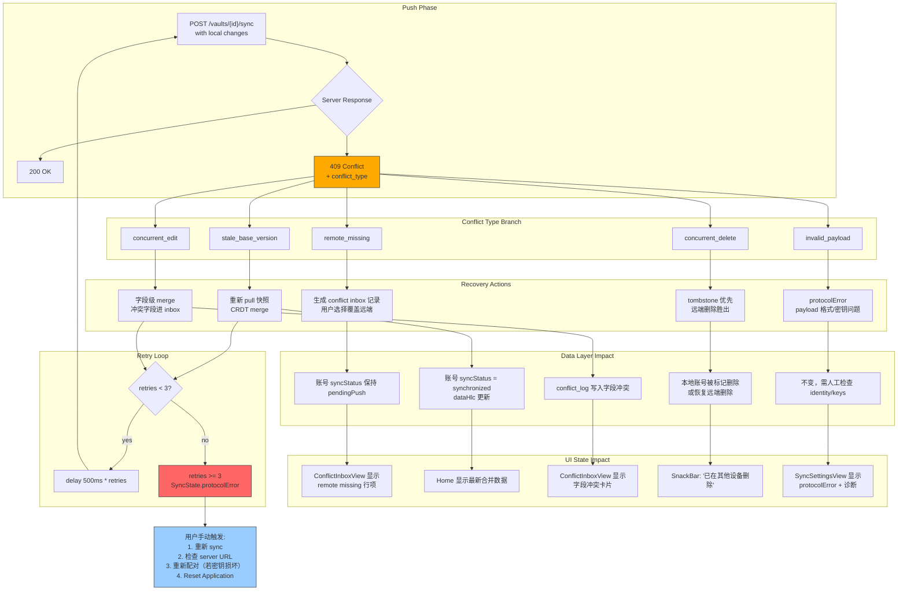
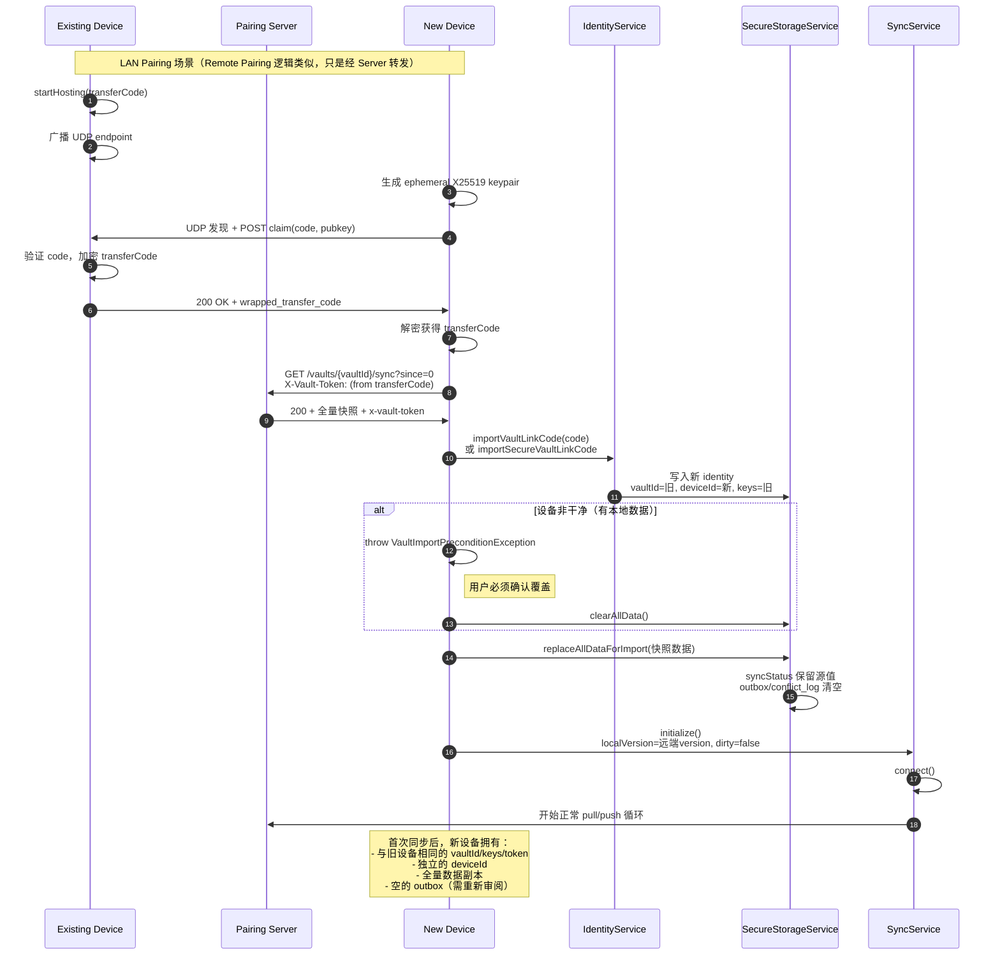
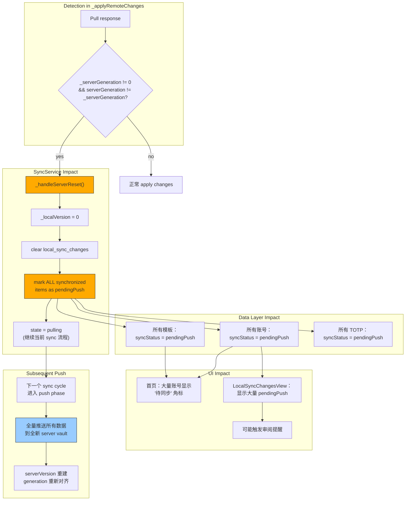
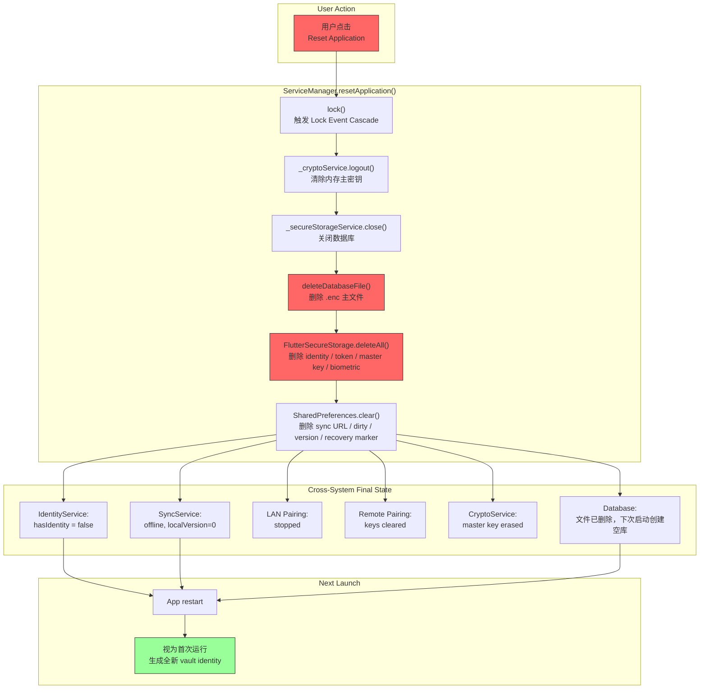

# Vault Sync Cross-System Impact Diagrams

> 本文档绘制密钥同步各子系统**互相影响**下的边界状态流程图。
> 覆盖：身份损坏级联、锁定事件清理、Vault 导入原子替换、同步失败跨系统恢复、配对-同步-数据四系统交互。

---

## 1. Identity Corruption Cascade

当 `IdentityService` 检测到密钥不完整或格式非法时，级联阻断所有依赖身份的系统。

### 级联规则

| 源系统异常 | 直接影响 | 间接影响 | 恢复路径 |
|---|---|---|---|
| `IdentityCorruptedException` | Unlock 失败，App 卡在 error 状态 | Sync 无法连接、Pairing 无法启动 | 用户必须 Reset Application 或使用 Recovery Code 重建身份 |
| `hasIdentity == false` | Sync 进入 `authError` | 所有 pull/push 被拒绝 | 解锁成功后自动恢复 |
| `hasIdentity == false` | Pairing 服务抛出 `StateError` | 新设备无法加入 vault | 解锁成功后自动恢复 |

---

## 2. Lock Event Cascade

当用户手动锁定或自动锁触发时，多个系统需要同步清理内存中的敏感状态。

### 关键级联规则

| 清理动作 | 影响系统 | 后果 |
|---|---|---|
| `_vaultPairingJoinKeysByRequestId.clear()` | Remote Pairing Client | 已加入会话但未取 bundle 的设备，锁定后永远丢失解密能力，必须重新加入 |
| `_lanPairingService.stopHosting()` | LAN Pairing Host | 正在等待 claim 的主机会立即停止广播，新设备无法发现 |
| `_syncService.disconnect()` | SyncService | 状态回退到 `offline`，但**磁盘上的 recovery marker 不会被清除**，下次解锁可恢复 |
| `_closeStorageForLock()` | SecureStorageService | 运行时数据库句柄释放，再次解锁需重新解密 |

---

## 3. Vault Import Atomic Swap & Rollback

Vault 导入涉及身份、数据、同步状态三个系统的原子替换；任何一步失败都会触发回滚。

### 跨系统状态重建规则

| 系统 | 导入前状态 | 导入后状态 | 回滚时行为 |
|---|---|---|---|
| **Identity** | 旧 vaultId/deviceId/keys | 新 vaultId，**保留旧 deviceId**，新 keys/token | 恢复 previousIdentity（全部旧值） |
| **Account Data** | 本地账号+模板 | 被 dump 数据完全替换，或 `clearAllData()` 清空 | 无法回滚数据（已覆盖），只能回滚身份 |
| **Sync Outbox** | 可能有 pendingReview/pendingPush | **强制清空**，不继承源状态 | N/A |
| **Conflict Log** | 可能有未解决冲突 | **强制清空** | N/A |
| **Sync Metadata** | `localVersion > 0`, `isDirty = true/false` | `localVersion = 0`, `dirty = false`（由 `SyncService.initialize()` 重建） | N/A |
| **Sync Server URL** | 旧 URL 或无 | 新 URL（如果 dump 携带） | 不自动恢复旧 URL |

---

## 4. Sync Conflict Recovery Cross-System Impact

同步冲突不仅改变 SyncService 状态，还会触发数据层修改、UI 状态变化和潜在的身份/配对动作。

### 冲突类型到跨系统影响矩阵

| conflict_type | SyncService | Data Layer | UI | 可能触发的其他系统动作 |
|---|---|---|---|---|
| `remote_missing` | `conflictRecovery` → 重试 | `syncStatus = pendingPush` 保留 | ConflictInbox 显示 | 用户选择覆盖 → 再次 push |
| `stale_base_version` | `conflictRecovery` → 重 pull | CRDT merge 覆盖本地数据 | Home 刷新显示 | `localVersion` 对齐远端 |
| `concurrent_edit` | `conflictRecovery` → 重 pull | conflict_log 写入差异字段 | ConflictInbox 显示字段冲突 | 用户解决后再次 push |
| `concurrent_delete` | `conflictRecovery` → tombstone 优先 | 本地账号删除 或 恢复远端 | SnackBar 提示 | 无自动重试，需用户确认 |
| `invalid_payload` | `protocolError`（不重试） | 无数据变更 | 诊断区显示 payload 被拒绝 | 检查 `vaultApiToken`、identity 完整性，可能需要重新配对 |

---

## 5. Pairing-Sync-Data Four-System Interaction

新设备通过配对加入 vault 时，四个系统（Pairing、Identity、Sync、Data）的交互全貌。

---

## 6. Server Reset Detection Cascade

当服务端 vault 被重置（generation 突变）时，客户端数据层和同步层的连锁反应。

### 级联规则

| 触发条件 | SyncService | Data Layer | UI | 恢复路径 |
|---|---|---|---|---|
| `serverGeneration` 突变 | `_localVersion = 0` | 所有 item `syncStatus → pendingPush` | 大量待同步提示 | 下一个 sync cycle 自动全量 push，无需用户操作 |
| 清空 `local_sync_changes` | outbox 丢失 | 丢失的 pendingReview 不再可见 | 已审阅但尚未 push 的变更消失 | 用户需重新编辑才能产生新的 outbox |
| `dirty = false` | 下次 sync 从 0 开始 pull | 无直接数据影响 | 无 | 服务端返回全量数据，本地 CRDT merge |

---

## 7. Application Reset Nuclear Option

用户选择"重置应用"时，所有子系统的终极清理路径。

---

## 附录：跨系统影响速查表

| 触发事件 | Identity | Sync | Pairing | Data | 恢复方式 |
|---|---|---|---|---|---|
| **Identity Corrupted** | ❌ 损坏 | ❌ authError | ❌ 无法启动 | ➖ 不影响 | Recovery Code / Reset |
| **Lock / Auto-Lock** | ✅ 保留（磁盘） | ➖ offline | ❌ Host 停止 / Key 丢失 | ➖ 已加密落盘 | 重新解锁 |
| **Vault Import 成功** | ✅ 替换（保留 deviceId） | ✅ 重建（version=0） | ➖ 不影响 | ✅ 替换/清空 | 自动进入新 vault |
| **Vault Import 失败** | ⚠️ 回滚到旧 identity | ➖ 断开状态 | ➖ 不影响 | ⚠️ 可能已覆盖 | 检查 dump / 重试 |
| **Server Generation Mismatch** | ➖ 不影响 | ⚠️ localVersion=0 | ➖ 不影响 | ⚠️ 全量 pendingPush | 自动全量 push 恢复 |
| **Max Conflict Retries** | ➖ 不影响 | ❌ protocolError | ➖ 不影响 | ➖ 不影响 | 用户手动 sync / 检查配置 |
| **App Reset** | ❌ 删除 | ❌ 重置 | ❌ 停止 | ❌ 删除 | 重新初始化 |

图例：✅ 正常变更 | ❌ 功能阻断 | ⚠️ 状态异常 | ➖ 无直接影响

---

*文档版本：基于 2026-05-07 代码基线绘制。*
