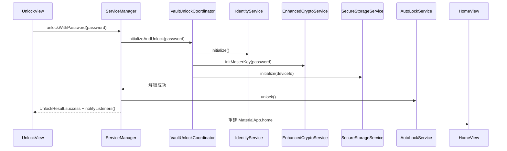
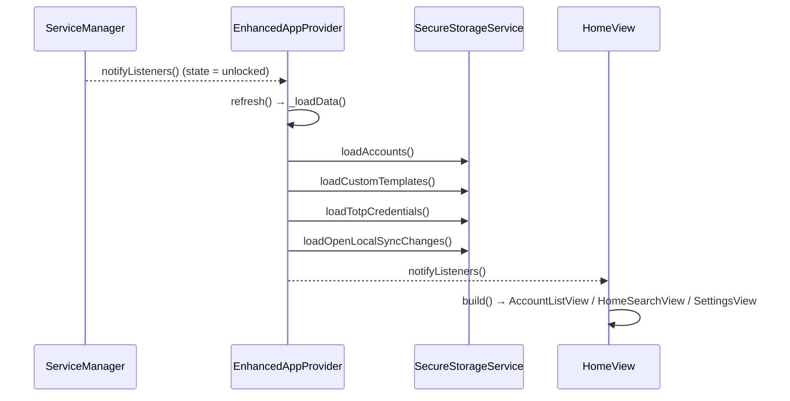
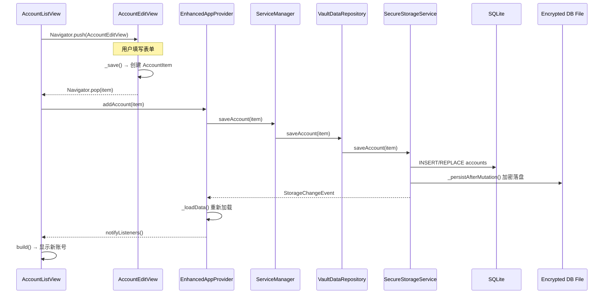
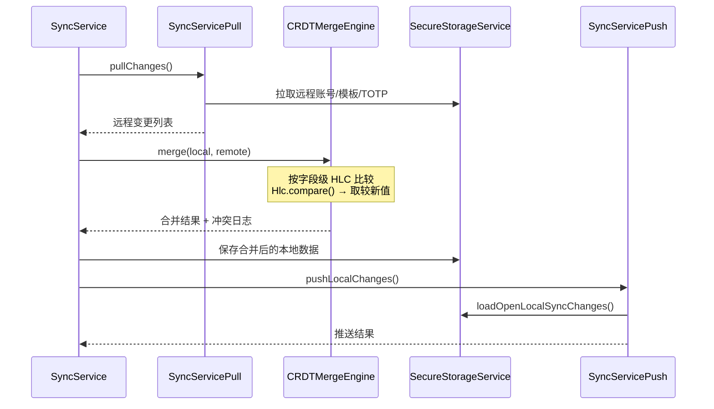
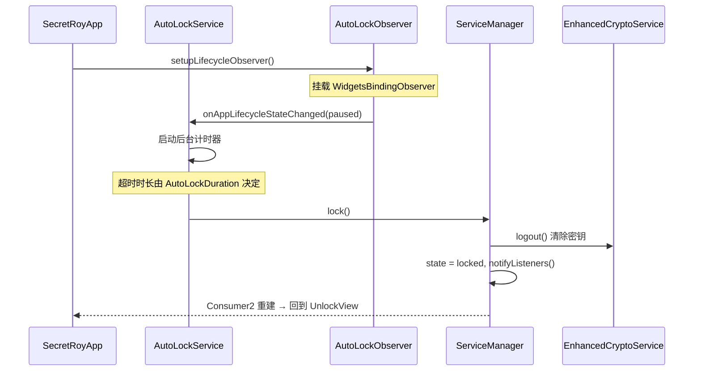

# SecretRoy 代码架构走读

> 目标读者：需要理解代码架构的新开发者  
> 阅读方式：跟随一次完整用户旅程，逐层打开关键代码  
> 版本：2026-05-16

---

## 总览：架构分层

```text
Views (lib/views/)
  ↓ watch/read
Providers (lib/providers/)
  ↓ 调用门面方法
ServiceManager (lib/services/service_manager.dart) + Coordinators (lib/system/)
  ↓ 调用具体服务
Services (lib/services/)
  ↓ 读写
SQLite Runtime DB ←→ Encrypted File (AES-GCM-256)
```

---

## 旅程 1：应用启动

### 起点：`lib/main.dart`

```dart
void main() async {
  WidgetsFlutterBinding.ensureInitialized();
  final prefs = await SharedPreferences.getInstance();
  await ServiceManager.instance.initialize();
  final notificationService = NotificationService(...);
  await notificationService.init();
  runApp(SecretRoyApp(prefs: prefs, notificationService: notificationService));
}
```

**关键步骤**：
1. `ensureInitialized()` — 初始化 Flutter 与原生平台通道。
2. `SharedPreferences.getInstance()` — 读取主题模式、种子色等轻量设置。
3. `ServiceManager.instance.initialize()` — 初始化 `AutoLockService`，将全局状态置为 `locked`。
4. `NotificationService.init()` — 初始化本地通知插件与时区。
5. `runApp()` — 构建 Widget 树。

### `SecretRoyApp` 生命周期

```dart
// initState
_serviceManager.setupLifecycleObserver();   // 挂载前后台监听，用于自动锁定

// build
MultiProvider(
  providers: [
    ChangeNotifierProvider.value(value: _serviceManager),
    ChangeNotifierProvider(create: (_) => EnhancedAppProvider(...)),
    ChangeNotifierProvider(create: (_) => NotificationProvider(...)),
    ChangeNotifierProvider(create: (_) => AppThemeProvider(widget.prefs)),
  ],
  child: Consumer2<ServiceManager, AppThemeProvider>(
    builder: (context, sm, theme, _) => MaterialApp(
      home: sm.state == ServiceManagerState.unlocked ? HomeView() : UnlockView(),
    ),
  ),
)

// dispose
_serviceManager.disposeLifecycleObserver();
```

**数据流向**：
- `ServiceManager.state` 初始为 `locked` → 显示 `UnlockView`。
- 解锁成功后 `notifyListeners()` → `Consumer2` 重建 → 切换到 `HomeView`。

> **想改启动逻辑 / 新增全局 Provider**：看 `lib/main.dart`

---

## 旅程 2：解锁流程

### 2.1 密码解锁



**关键类与方法**：

| 类 | 文件 | 关键方法 | 职责 |
|----|------|----------|------|
| `ServiceManager` | `lib/services/service_manager.dart` | `unlockWithPassword()` | 门面入口 |
| `VaultUnlockCoordinator` | `lib/system/service_manager/vault_unlock_coordinator.dart` | `initializeAndUnlock()` | 协调解锁链式调用 |
| `IdentityService` | `lib/services/identity_service.dart` | `initialize()` | 加载/生成 deviceId、vaultId、密钥 |
| `EnhancedCryptoService` | `lib/services/enhanced_crypto_service.dart` | `initMasterKey()` | PBKDF2 验证主密码，解锁数据库密钥 |
| `SecureStorageService` | `lib/services/secure_storage_service.dart` | `initialize(deviceId)` | 打开加密 SQLite 运行时数据库 |
| `AutoLockService` | `lib/services/auto_lock_service.dart` | `unlock()` | 标记已解锁，清除后台计时 |

**底层加密链**：
```text
主密码
  → PBKDF2-HMAC-SHA256 (100k 轮) → 包装密钥
    → 解密 envelope → 数据库文件密钥 (32 字节随机)
      → DatabaseFileCipher (AES-GCM-256) → 加解密运行时数据库文件
```

> **想改解锁流程 / 新增解锁方式**：看 `VaultUnlockCoordinator`、`ServiceManager._performUnlock()`
> **想改主密码验证逻辑**：看 `EnhancedCryptoService`、`DatabaseFileKeyManager`

### 2.2 生物识别解锁

```text
UnlockView
  → ServiceManager.unlockWithBiometric()
    → BiometricAuthService.unlockWithBiometric()
      → 返回解密后的主密码
    → 复用密码解锁的后续链式调用
```

> **想改生物识别行为**：看 `BiometricAuthService`、`lib/services/biometric_auth_service.dart`

---

## 旅程 3：主页加载

### 解锁成功后的数据加载



**关键类与方法**：

| 类 | 文件 | 关键方法 | 职责 |
|----|------|----------|------|
| `EnhancedAppProvider` | `lib/providers/enhanced_app_provider.dart` | `_loadData()` / `refresh()` | 加载全部业务数据到内存 |
| `SecureStorageService` | `lib/services/secure_storage_service.dart` | `loadAccounts()` / `loadCustomTemplates()` | 从 SQLite 读取数据 |

**`HomeView` 布局决策**：
```text
HomeView
  → AppLayoutBuilder
    → 屏宽 < 720px    → HomeViewMobile（底部 NavBar + IndexedStack）
    → 屏宽 >= 720px   → HomeViewDesktop（左侧 NavRail + IndexedStack）
```

`IndexedStack` 保持四个主页面状态，切换 tab 时不重建。

> **想改主页布局 / 导航**：看 `lib/views/home/home_view.dart`、`home_view_desktop.dart`、`home_view_mobile.dart`
> **想改数据加载时机**：看 `EnhancedAppProvider._loadData()`

---

## 旅程 4：创建账号（典型业务链路）

这是理解项目架构的最佳入口，覆盖 UI → Provider → Service → DB → UI 刷新的完整闭环。



**逐层拆解**：

### ① UI 层：`AccountListView` → `AccountEditView`

- **文件**：`lib/views/accounts/account_list_view.dart`、`account_edit_view.dart`
- 用户点击 `GreenAddButton` → `_openEditor(context)` → `Navigator.push(AccountEditView)`
- `AccountEditView` 根据模板动态生成字段输入框，保存时组装 `AccountItem`
- 保存后 `Navigator.pop(item)` 将结果返回列表页

### ② Provider 层：`EnhancedAppProvider`

```dart
Future<void> addAccount(AccountItem item) async {
  await _serviceManager.saveAccount(item);
  _accounts.insert(0, item);      // 乐观更新：立即插入内存列表
  notifyListeners();              // 触发 UI 刷新
}
```

- **文件**：`lib/providers/enhanced_app_provider.dart`
- Provider 是"前台数据管家"：不碰数据库细节，但维护 UI 要显示的内存列表

### ③ ServiceManager 门面：`ServiceManager.saveAccount()`

```dart
Future<void> saveAccount(AccountItem account) async {
  if (!isUnlocked) return;
  await _secureStorageService.saveAccount(account);
  await _syncService.markDirty();
  unawaited(_syncService.syncNow());   // 后台尝试同步
}
```

- **文件**：`lib/services/service_manager.dart`
- 门面方法确保"已解锁"前置条件，并串联"保存 → 标记脏数据 → 后台同步"

### ④ 数据仓库层：`VaultDataRepository`

- **文件**：`lib/system/service_manager/vault_data_repository.dart`
- 封装 Account/Template/TOTP 的持久化 + 同步变更箱记录（create/update/delete/togglePin）

### ⑤ 存储层：`SecureStorageService`

- **文件**：`lib/services/secure_storage_service.dart`
- `saveAccount()` 将 `AccountItem` → SQLite `accounts` 表行
- 写入后调用 `_persistAfterMutation()`：将运行时 SQLite 重新加密为 `secret_roy_vault.db.enc`
- 发出 `StorageChangeEvent`，`EnhancedAppProvider` 监听到后重新 `_loadData()`，保证内存与数据库一致

**数据映射**：
```text
AccountItem.name       → accounts.name
AccountItem.email      → accounts.email
AccountItem.templateId → accounts.template_id
AccountItem.data       → accounts.data (JSON 字符串)
AccountItem.syncStatus → accounts.sync_status
AccountItem.isDeleted  → accounts.is_deleted (软删除)
```

> **想改账号编辑表单**：看 `lib/views/accounts/account_edit_view.dart`
> **想改账号保存逻辑**：看 `VaultDataRepository.saveAccount()`、`SecureStorageService.saveAccount()`
> **想改列表展示**：看 `lib/views/accounts/account_list_view.dart`、`lib/widgets/account_list_tile.dart`

---

## 旅程 5：添加 TOTP（2FA）

### 5.1 手动输入 / URI 导入

```text
AccountEditView（点击"关联TOTP"）
  → Navigator.push(TotpCredentialEditView)
    → 用户输入 secret / issuer / account
      → TotpService.parseConfig(raw)        # 解析 JSON / otpauth URI / 纯 secret
      → TotpService.generate(config)        # 实时预览当前 TOTP 码
    → 保存
      → EnhancedAppProvider.addTotpCredential()
        → ServiceManager.saveTotpCredential()
          → SecureStorageService.saveTotpCredential()
```

### 5.2 扫码导入（移动端）

```text
TotpCredentialEditView（点击"扫码"）
  → Navigator.push(TotpQrScannerView)
    → MobileScanner 扫描二维码
      → TotpImportService.normalizeImportValue(raw)
        → TotpService.parseConfig()
    → 返回解析结果到编辑页
```

### 5.3 图片 QR 解码（桌面端/Web）

```text
TotpCredentialEditView（点击"粘贴二维码"）
  → TotpQrImageImportService.normalizeClipboardQrImage()
    → decodeQrImage() 使用 zxing2 解码
      → TotpImportService.normalizeImportValue()
        → TotpService.parseConfig()
```

**关键类**：

| 类 | 文件 | 职责 |
|----|------|------|
| `TotpService` | `lib/services/totp_service.dart` | RFC 6238 TOTP 生成、otpauth URI 解析、Base32 编解码 |
| `TotpImportService` | `lib/services/totp_import_service.dart` | 从文本/URI 提取标准化 TOTP 配置 |
| `TotpQrImageImportService` | `lib/services/totp_qr_image_import_service.dart` | 从剪贴板图片/字节流解码 QR |

> **想改 TOTP 生成逻辑**：看 `TotpService.generate()`、`TotpService.hotp()`
> **想改扫码流程**：看 `lib/views/accounts/totp_qr_scanner_view.dart`
> **想改 QR 图片解码**：看 `TotpQrImageImportService`

---

## 旅程 6：同步触发

### 6.1 手动触发即时同步

```text
SyncSettingsView（点击"即时同步"）
  → ServiceManager.syncNow()
    → SyncCoordinator.syncNow()
      → SyncService.syncNow()
        → Pull 阶段：拉取远程变更
        → CRDTMergeEngine.merge() 字段级合并
        → Push 阶段：推送本地变更箱
```

### 6.2 CRDT 合并与冲突处理



**关键类**：

| 类 | 文件 | 职责 |
|----|------|------|
| `SyncService` | `lib/sync/sync_service.dart` + `sync_service_pull.dart` + `sync_service_push.dart` + `sync_service_conflict.dart` | 同步主控、Pull、Push、冲突恢复 |
| `CRDTMergeEngine` | `lib/sync/crdt_merge_engine.dart` | 字段级 CRDT 自动合并 |
| `Hlc` | `lib/models/hlc.dart` | Hybrid Logical Clock 时间戳 |
| `SyncCoordinator` | `lib/system/service_manager/sync_coordinator.dart` | 封装连接/断开/同步拉取 + 服务器 URL |

**同步 Payload 安全**：
- 使用 `sroy-sync:` 前缀的 AES-256-GCM + HKDF 信封（`SyncPayloadCodec`）
- 篡改拒绝、Vault 隔离、旧格式兼容均有测试覆盖

> **想改同步协议**：看 `lib/sync/` 目录全部文件
> **想改冲突合并策略**：看 `CRDTMergeEngine`
> **想改同步服务器配置 UI**：看 `lib/views/sync_settings_view.dart`

---

## 旅程 7：自动锁定

### 生命周期监听与自动锁定



**关键类**：

| 类 | 文件 | 关键方法 | 职责 |
|----|------|----------|------|
| `AutoLockObserver` | `lib/services/auto_lock_service.dart` | `didChangeAppLifecycleState()` | 将生命周期事件转发给 AutoLockService |
| `AutoLockService` | `lib/services/auto_lock_service.dart` | `onAppLifecycleStateChanged()` / `lock()` | 管理锁定策略与状态 |
| `ServiceManager` | `lib/services/service_manager.dart` | `lock()` / `logout()` | 门面方法：锁定并清理密钥状态 |

> **想改自动锁定时长 / 策略**：看 `AutoLockService`、`SecuritySettingsView`

---

## 功能修改速查表

| 如果你想改… | 应该看这些文件 |
|-------------|----------------|
| 启动逻辑 / 新增全局 Provider | `lib/main.dart` |
| 解锁流程 / 主密码验证 | `VaultUnlockCoordinator`、`EnhancedCryptoService`、`DatabaseFileKeyManager` |
| 生物识别 | `BiometricAuthService`、`lib/services/biometric_auth_service.dart` |
| 主页布局 / 导航切换 | `lib/views/home/home_view.dart`、`home_view_desktop.dart`、`home_view_mobile.dart` |
| 账号列表展示 | `lib/views/accounts/account_list_view.dart`、`lib/widgets/account_list_tile.dart` |
| 账号编辑表单 | `lib/views/accounts/account_edit_view.dart`、`account_edit_widgets.dart` |
| 模板列表 / 模板编辑 | `lib/views/templates/template_list_view.dart`、`template_edit_view.dart` |
| TOTP 生成 / 解析 | `lib/services/totp_service.dart` |
| TOTP 扫码 / 图片解码 | `lib/views/accounts/totp_qr_scanner_view.dart`、`TotpQrImageImportService` |
| 同步协议 / CRDT 合并 | `lib/sync/sync_service*.dart`、`lib/sync/crdt_merge_engine.dart` |
| 同步设置 UI | `lib/views/sync_settings_view.dart` |
| 自动锁定 | `lib/services/auto_lock_service.dart`、`lib/views/security_settings_view.dart` |
| 主题 / 颜色 / 字体 | `lib/theme/` 全部文件、`lib/providers/theme_provider.dart` |
| 国际化文案 | `lib/l10n/app_zh.arb`（主模板）、`app_en.arb`（英文） |
| 新增业务数据类型（模型） | `lib/models/` + 对应 `test/models/` + JSON 序列化 |
| 密码生成 / 强度评估 | `EnhancedCryptoService.generatePassword()`、`PasswordGeneratorSheet` |
| 安全剪贴板复制 | `SensitiveClipboardService.copy()` |
| 保险库健康评分 | `VaultHealthCalculator`、`lib/views/settings/vault_health_view.dart` |
| 设备配对 / LAN 配对 | `VaultPairingCoordinator`、`LanPairingService`、`VaultPairingCrypto` |

---

## 数据流总结

用一句话概括 SecretRoy 的核心数据流：

> **用户操作 → View 收集输入 → Provider 乐观更新 → ServiceManager 门面校验 → Coordinator 协调 → SecureStorageService 写入 SQLite → 加密落盘 → StorageChangeEvent → Provider 重新加载 → UI 自动刷新。**

---

## 附录：相关文档索引

| 文档 | 说明 |
|------|------|
| [开发环境搭建](./development-setup.md) | 完整 Flutter 环境配置 |
| [新开发者速览](./new-developer-quickstart.md) | 10 分钟项目概览 |
| [测试指南](./testing-guide.md) | 测试策略与运行方式 |
| [系统架构概览](../architecture/00-executive-summary.md) | 高层架构决策与路线图 |
| [服务目录](../architecture/service-directory.md) | 18 个服务 + 10 个 Coordinator 全览 |
| [同步协议规范](../architecture/sync-protocol-updated.md) | 当前同步协议权威参考 |
| [安全实现](../security/security-features.md) | 已落地安全能力清单 |
| [本地数据库加密](../security/local-database-encryption.md) | 加密存储机制 |
| [业务规格](../product/business-specification.md) | 核心业务流程 |
| [迭代任务跟踪](../product/iteration-tasks.md) | T0-T18 执行状态
